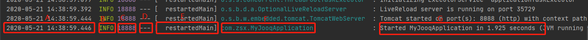

## 配置说明

### spring 默认配置：参考[链接](https://docs.spring.io/spring-boot/docs/current/reference/html/spring-boot-features.html#boot-features-logging)
* 
* A:日期和时间
* B:日志级别，分别有：ERROR、WARN、INFO、DEBUG、TRACE
* C:进程ID
* D 分隔符，后面的是日志消息
* E:线程的名称
* F:类名
* G:消息体
```
Date and Time: Millisecond precision and easily sortable.

Log Level: ERROR, WARN, INFO, DEBUG, or TRACE.

Process ID.

A --- separator to distinguish the start of actual log messages.

Thread name: Enclosed in square brackets (may be truncated for console output).

Logger name: This is usually the source class name (often abbreviated).

The log message.
```
* grok匹配
```
(?m)^%{TIMESTAMP_ISO8601:log_time}%{SPACE}%{LOGLEVEL:log_level}%{SPACE}%{NUMBER:pid}%{SPACE}---%{SPACE}%{SYSLOG5424SD:thread_name}%{SPACE}%{NOTSPACE:logger_name}%{SPACE}:%{SPACE}%{GREEDYDATA:log_msg}

(?m)^%{TIMESTAMP_ISO8601:log_time}%{SPACE}%{LOGLEVEL:log_level}%{SPACE}%{NUMBER:pid}%{SPACE}---%{SPACE}\[%{SPACE}%{USERNAME:thread_name}\]%{SPACE}%{USERNAME:logger_name}%{SPACE}:%{SPACE}%{GREEDYDATA:log_msg}
```


## 参考链接地址

### springboot
* [springboot](https://docs.spring.io/spring-boot/docs/current/reference/html/spring-boot-features.html#boot-features-logging)

### ELK
* [ELKStack](http://docs.flycloud.me/docs/ELKStack/index.html)

### grok
* [patterns](https://github.com/logstash-plugins/logstash-patterns-core/tree/master/patterns)
* [grok](https://logz.io/blog/logstash-grok/)
* [在线调试工具](http://grokdebug.herokuapp.com/)

* logstash
* [插件下载地址](https://rubygems.org/)


