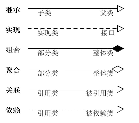
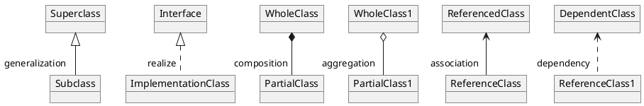
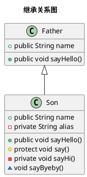

## UML

### 参考链接
* [参考链接](https://juejin.im/post/6844903795017646094)
* [uml_tutorial](https://www.w3cschool.cn/uml_tutorial/)
* [plantuml](https://plantuml.com/)

### 介绍
* 1997年，OMG 组织（Object Management Group对象管理组织）发布了统一建模语言（Unified Modeling Language，UML）
* UML 是一种编制软蓝图的标准化语言，它的目标之一就是为开发团队提供标准通用的设计语言来开发和构建计算机应用
* UML 提出了一套 IT 专业人员期待多年的统一的标准建模符号
* 通过使用UML，这些人员能够阅读和交流系统架构和设计规划
* UML支持面向对象的技术，能够准确的方便地表达面向对像的概念，体现面向对象的分析和设计风格.

### UML的模型构成
* 事物(Things)：UML模型中最基本的构成元素，是具有代表性的成分的抽象
* 关系(Relationships)：关系把事物紧密联系在一起
* 图(Diagrams )：图是事物和关系的可视化表示

### 主要模型
* 功能模型：从用户的角度展示系统的功能
    * 包括用例图
* 对象模型：采用对象、属性、操作、关联等概念展示系统的结构和基础
    * 包括类别图、对象图
* 动态模型：展现系统的内部行为
    * 包括序列图，活动图，状态图

### UML的特点
* 面向对象
* 可视化，表达能力强
* 独立于过程
* 独立于程序设计
* 容易掌握使用 

### UML2.2中一共定义了14种图示

#### 结构性图形（Structure diagrams）：强调的是系统式的建模：
* 静态图（static diagram)：包括类图、对象图、包图
* 实现图（implementation diagram）：包括组件图、部署图
* 剖面图
* 复合结构图

#### 行为式图形（Behavior diagrams）：强调系统模型中触发的事件
* 活动图
* 状态图
* 用例图

#### 交互性图形（Interaction diagrams）：属于行为图形的子集合，强调系统模型中的资料流程
* 通信图
* 交互概述图
* 时序图
* 时间图


### 类之间的关系
* 


#### 继承（generalization）
* 继承用一条带空心箭头的直接表示
* +代表public，#代表protected，-代表private，~代表default


#### 实现（realize）
* 实现关系用一条带空心箭头的虚线表示
```puml
Title "实现关系图"

abstract class AbstractList
interface List
List <|.. AbstractList
```

#### 组合（composition）
* 与聚合关系一样，组合关系同样表示整体由部分构成的语义
    * 比如公司由多个部门组成，但组合关系是一种强依赖的特殊聚合关系
    * 如果整体不存在了，则部分也不存在了
    * 例如，公司不存在了，部门也将不存在了
```puml
Title "组合关系图"

Company *-- Department
```

#### 聚合（aggregation）
* 聚合关系用于表示实体对象之间的关系，表示整体由部分构成的语义
    * 例如一个部门由多个员工组成
    * 与组合关系不同的是，整体和部分不是强依赖的，即使整体不存在了，部分仍然存在
    * 例如，部门撤销了，人员不会消失，他们依然存在
```puml
Title "聚合关系图"

Department o-- Staff
```

#### 关联（association）
* 关联关系是用一条直线表示的
    * 它描述不同类的对象之间的结构关系，它是一种静态关系， 通常与运行状态无关，一般由常识等因素决定的
    * 它一般用来定义对象之间静态的、天然的结构， 所以，关联关系是一种“强关联”的关系
    * 比如，乘车人和车票之间就是一种关联关系，学生和学校就是一种关联关系，关联关系默认不强调方向，表示对象间相互知道
    * 如果特别强调方向，使用直线带箭头
```puml
Title "关联关系图"

class Water
class Human
Human --> Water
```

#### 依赖（dependency）
* 依赖关系是用一套带箭头的虚线表示的
    * 如A依赖于B，他描述一个对象在运行期间会用到另一个对象的关系
    * 与关联关系不同的是，它是一种临时性的关系，通常在运行期间产生，并且随着运行时的变化，依赖关系也可能发生变化
    * 显然，依赖也有方向，双向依赖是一种非常糟糕的结构，我们总是应该保持单向依赖，杜绝双向依赖的产生
```puml
Title "依赖关系图"

Person ..> Cigarette
```

## 六大原则

### 开闭原则（Opened Closed Principle）
* 一个软件实体应当对扩展开放，对修改关闭
    * 即软件实体应尽量在不修改原有代码的情况下进行扩展

### 里氏替换原则（Liskov Substitution Principle）
* 所有引用基类对象的地方都能够透明地使用其子类的对象

### 依赖倒置原则（Dependency Inversion Principle）
* 抽象不应该依赖于具体类，具体类应当依赖于抽象
    * 换言之，要针对接口编程，而不是针对实现编程

### 单一职责原则（Single Responsibility Principle）
* 一个类只负责一个功能领域中的相应职责
    * 或者可以定义为：就一个类而言，应该只有一个引起它变化的原因

### 迪米特法则
* 一个软件实体应当尽可能少地与其他实体发生相互作用

### 接口分离原则（Interface Segregation Principle）
* 使用多个专门的接口，而不使用单一的总接口
    * 即客户端不应该依赖那些它不需要的接口


## 模式分类

### 创建型(Creational)

#### 1.简单工厂模式（Simple Factory Pattern）
#### 2.工厂方法模式（Factory Method Pattern）
#### 3.抽象工厂模式（Abstract Factory Pattern）
#### 4.单例模式（Singleton Pattern）
#### 5.建造者模式（Builder Pattern）

#### 6.原型模式（Prototype Pattern）

##### 包含角色
* 客户角色：客户类提出创建对象的请求
* 抽象原型角色：这是一个抽象角色，通常由一个java接口或抽象类实现，具体原型都需要实现该接口
* 具体原型角色：客户端所需要的被复制的对象


### 结构型(Structural)

####  1.外观模式(Facade Pattern)
####  2.适配器模式(Adapter Pattern)
####  3.桥接模式(Bridge Pattern)

#### 4.代理模式(Proxy Pattern)

##### 包含角色
* Subject（抽象主题角色）：定义代理类和真实主题的公共对外方法，也是代理类代理真实主题的方法
* RealSubject（真实主题角色）：真正实现业务逻辑的类
* Proxy（代理主题角色）：用来代理和封装真实主题


####  5.装饰器模式（Decorator Pattern）

##### 包含角色
* Component（抽象构件角色）：给出一个抽象接口，已规范准备接收附加责任的对象
* ConcreteComponent（具体构件角：定义一个将要接收附加责任的类
* Decorator（装饰角色）：持有一个构件对象的实例，并定义一个与抽象构件接口一致的接口
* ConcreteDecorator（具体装饰角色）：负责给构件对象贴上附加的责任


####  6.享元模式（Flyweight Pattern）


### 行为型(Behavioral)

#### 1.责任链模式（Chain of Responsibility Pattern）
#### 2.命令模式（Command Pattern）

#### 3.解释器模式（Interpreter Pattern）
* Expression（抽象表达式角色）：声明一个所有的具体表达式角色都需要实现的抽象接口
    * 这个接口主要是一个interpret()方法，称做解释操作
* Terminal Expression（终结符表达式角色）：实现了抽象表达式角色所要求的接口，主要是一个interpret()方法，文法中的每一个终结符都有一个具体终结表达式与之相对应
    * 比如有一个简单的公式R=R1+R2，在里面R1和R2就是终结符，对应的解析R1和R2的解释器就是终结符表达式
* Nonterminal Expression（非终结符表达式角色）：文法中的每一条规则都需要一个具体的非终结符表达式，非终结符表达式一般是文法中的运算符或者其他关键字
    * 比如公式R=R1+R2中，“+"就是非终结符，解析“+”的解释器就是一个非终结符表达式
* Context（环境角色）：这个角色的任务一般是用来存放文法中各个终结符所对应的具体值
    * 比如R=R1+R2，我们给R1赋值100，给R2赋值200。这些信息需要存放到环境角色中，很多情况下我们使用Map来充当环境角色就足够了


#### 4.迭代器模式（Iterator Pattern）

##### 包含角色
* Iterator（迭代器角色）：迭代器角色负责定义访问和遍历元素的接口
* Concrete Iterator（具体迭代器角色）：具体迭代器角色要实现迭代器接口，并要记录遍历中的当前位置
* Container（容器角色）：容器角色负责提供创建具体迭代器角色的接口
* Concrete Container（具体容器角色）：具体容器角色实现创建具体迭代器角色的接口


#### 5.中介者模式（Mediator Pattern）
#### 6.备忘录模式（Memento Pattern）

#### 7.观察者模式（Observer Pattern）

* Subject（抽象主题角色）：把所有观察者对象的引用保存在一个集合中，每个抽象主题角色都可以有任意数量的观察者，抽象主题提供一个接口，可以增加和删除观察者角色，一般用一个抽象类或接口来实现
* Observer（抽象观察者角色）：为所有具体的观察者定义一个接口，在得到主题的通知时更新自己
* Concrete Subject（具体主题角色）：在具体主题内部状态改变时，给所有登记过的观察者发出通知，具体主题角色通常用一个子类实现
* Concrete Observer（具体观察者角色）：该角色实现抽象观察者角色所要求的更新接口，以便使本身的状态与主题的状态相协调，如果需要，具体观察者角色可以有一个指向具体主题角色的引用，通常用一个子类实现

#### 8.状态模式（State Pattern）

* [example](https://refactoring.guru/design-patterns/state/java/example#example-0)

##### 包含角色
* Context（环境角色）：定义客户端所感兴趣的接口，并且保留一个具体状态类的实例，这个具体状态类的实例给出此环境对象的现有状态
* State（抽象状态角色）：定义一个接口，用以封装环境对象的一个特定的状态所对应的行为
* Concrete State（具体状态角色）：每一个具体状态类都实现了环境的一个状态所对应的行为

##### 与策略模式对比
* 状态模式可能看上去与策略模式相似，但有一个关键性的不同
    * 在状态模式中，特定状态知道其他所有状态的存在，且能触发从一个状态到另一个状态的转换；策略则几乎完全不知道其他策略的存在

#### 9.策略模式（Strategy Pattern）

##### 包含角色
* Context（环境类角色）：上层访问策略的入口，它持有抽象策略角色的引用
* Strategy（抽象策略角色）：提供接口或者抽象类，定义策略组必须拥有的方法和属性
* ConcreteStrategy（具体策略角色）：实现抽象策略，定义具体的算法逻辑


#### 10.模板模式（Template Pattern）

##### 包含角色
* Abstract Template（抽象模板角色）：定义一组基本方法供子类实现，定义并实现组合了基本方法的模板方法
* Concrete Template（具体模板角色）：实现抽象模板角色定义的基本方法


#### 11.访问者模式（Visitor Pattern）


