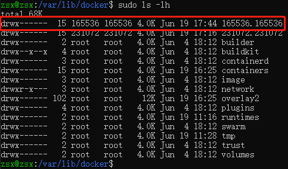
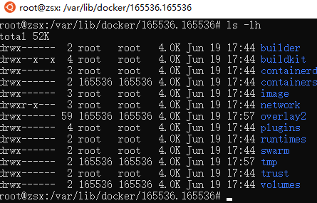

## 相关命令

### 从docker中拷贝文件(复制文件)到宿主机
* docker cp [OPTIONS] [CONTAINER_ID]:[SRC_PATH] [DEST_PATH]
* docker cp <container_id | container_name>:/xxx/xxx/xxx/common.log /home/yyy.log
* 例1： docker cp logstash:/usr/share/logstash/Gemfile d:/usr/local/opt/gem/Gemfile
* 例2： docker cp logstash:/usr/share/logstash/Gemfile.lock d:/usr/local/opt/gem/Gemfile.lock

### 查看容器日志
* docker logs -f --tail 10 container-name

### 取消容器总是重启
* docker update --restart=no <container_id>

### docker swarm初始化
* docker swarm init

### 增加节点
* docker swarm join-token manager

### 节点修改帮助
* docker node  update --help

### 停用节点，该节点上的容器会迁移到其他节点
* docker node  update --availability drain node1

### 将节点降级
* docker node demote node1

### 删除节点，只能删除worker下的节点
* docker node rm node1

### 查看节点
* docker node ls

### 删除那些已停止的容器、dangling 镜像、未被容器引用的network和构建过程中的cache(默认不会删除那些未被任何容器引用的数据卷)
* docker system prune

### 删除dangling或所有未被使用的镜像
* docker image prune 

### 删除所有退出状态的容器
* docker container prune 

### 删除未被使用的数据卷
* docker volume prune 

### network相关命令

#### 将容器连接到网络
* docker network connect

#### 创建网络
* docker network create [OPTIONS] NETWORK
* docker network create

#### 断开容器的网络
* docker network disconnect

#### 显示一个或多个网络的详细信息
* docker network inspect <network_name>

#### 查看网络
* docker network ls

#### 删除所有未使用的网络
* docker network prune

#### 删除网络（一个或多个）
* docker network rm

### 用户映射
* 1.切换为root用户：sudo -s
#### 手动创建一个用户：dockeruser
* 2.追加内容到/etc/subuid文件
    * echo dockeruser:165536:65536 >>/etc/subuid
* 3.追加内容到/etc/subgid文件
    * echo dockeruser:165536:65536 >>/etc/subgid
* 4.在/etc/docker/daemon.json文件中新增配置
```
{
  "userns-remap": "dockeruser"
}
```
#### 使用默认，上面的2.3.4可以省略，docker会默认创建一个dockremap用户
```
{
  "userns-remap": "default"
}
```
* 5.重启docker服务
    * sudo service docker restart
* 6.查看 /var/lib/docker目录下新建了一个165536.165536目录，该目录以该命名空间用户的UID和GID组成

    * 165536 是由用户 dockremap 映射出来的一个 uid
* 查看 165536.165536 目录的内容，

    * 与 /var/lib/docker 目录下的内容基本一致
    * 说明启用用户隔离后文件相关的内容都会放在新建的 165536.165536 目录下
* 7.注：如果通过容器创建目录时，会出现权限问题
    * 如果只是一级目录，此时需设置目录所属组为165536，该组拥有可读、可写、可执行权限，如：为775
    * 如果是多级目录，此时需设置目录权限为777
    * sudo chown zsx:165536 <dir_name>
    * sudo chmod 775 <dir_name>


### 注意：慎用，这个命令不仅会删除数据卷，而且连确认的过程都没有，使用--all参数后会删除所有未被引用的镜像，而不仅仅是dangling镜像
* docker system prune --all --force --volumes

## 参数说明
### 节点MANAGER STATUS列说明：显示节点是属于manager或者worker,没有值 表示不参与群管理的工作节点。
* Leader 意味着该节点是使得群的所有群管理和编排决策的主要管理器节点。
* Reachable 意味着节点是管理者节点正在参与Raft共识。如果领导节点不可用，则该节点有资格被选为新领导者。
* Unavailable 意味着节点是不能与其他管理器通信的管理器。如果管理器节点不可用，您应该将新的管理器节点加入群集，或者将工作器节点升级为管理器。

### 节点AVAILABILITY列说明：显示调度程序是否可以将任务分配给节点
* Active 意味着调度程序可以将任务分配给节点。
* Pause 意味着调度程序不会将新任务分配给节点，但现有任务仍在运行。
* Drain 意味着调度程序不会向节点分配新任务。调度程序关闭所有现有任务并在可用节点上调度它们。

### .env文件
* 设置环境变量的文件，docker会自动读取目录下的.env文件

### 环境变量优先级
* Compose file > Shell environment variables > Environment file > Dockerfile > Variable is not defined

## 参考资料

### 容器中的用户
[隔离docker容器中的用户](https://www.cnblogs.com/sparkdev/p/9614326.html)
[使用命名空间隔离容器](https://docs.docker.com/engine/security/userns-remap/)

### 非root用户运行docker守护程序
[rootless](https://docs.docker.com/engine/security/rootless/)

### dns
* [dns](https://docs.docker.com/config/containers/container-networking/)

### docker-compose
* [compose-file](https://docs.docker.com/compose/compose-file/)
* [docker-compose](https://github.com/docker/compose/releases/)

### 关于docker
* [articles-basics](https://www.bookstack.cn/read/docker-cn/articles-basics.md)