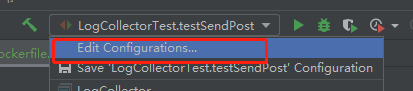
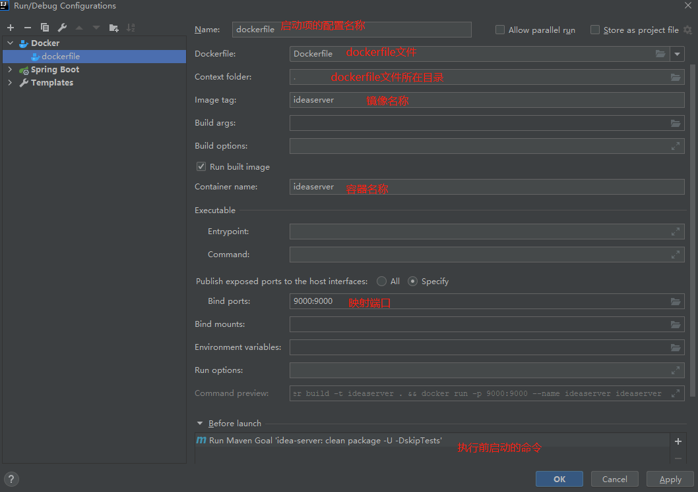
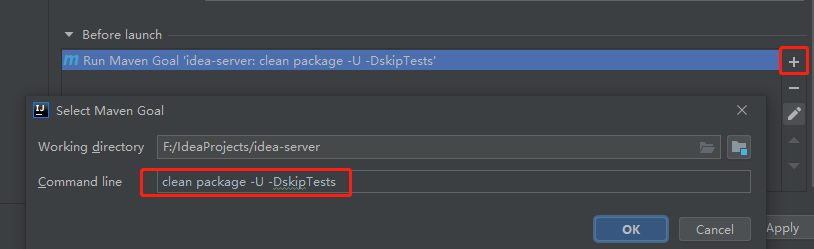
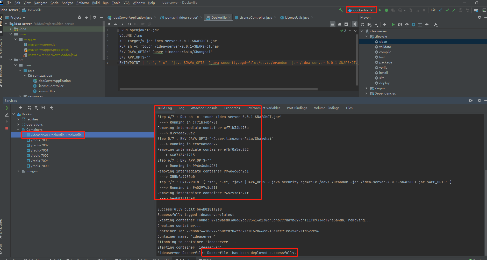
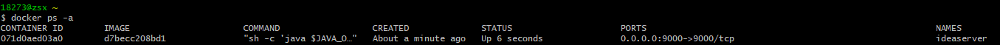

## 配置

### IDEA上配置dockerfile

#### 1.安装docker插件

#### 2.设置docker连接配置

#### 3.配置启动项
* [参考链接](https://blog.csdn.net/boling_cavalry/article/details/100051325)
* 1.选择Edit Configurations

* 2.添加docker配置项

* 3.配置选项

* 4.启动项执行前配置
    * clean package -U -DskipTests
    * 表示每次在构建镜像之前，都会将当前工程清理掉并且重新编译构建

* 5.配置完成后启动配置项

* 6.查看结果
    * docker ps -a



```Dockerfile
FROM openjdk:16-jdk
VOLUME /tmp
ADD target/*.jar idea-server-0.0.1-SNAPSHOT.jar
RUN sh -c 'touch /idea-server-0.0.1-SNAPSHOT.jar'
ENV JAVA_OPTS="-Duser.timezone=Asia/Shanghai"
ENV APP_OPTS=""
ENTRYPOINT [ "sh", "-c", "java $JAVA_OPTS -Djava.security.egd=file:/dev/./urandom -jar /idea-server-0.0.1-SNAPSHOT.jar $APP_OPTS" ]
```