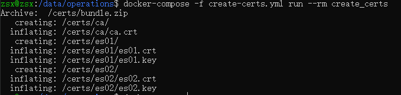
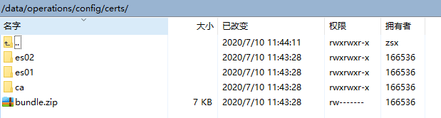
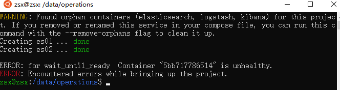
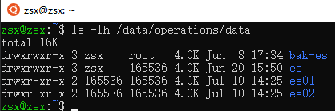
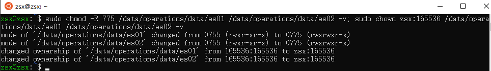

## 教程

### Docker配置Security认证
* [参考链接](https://www.elastic.co/guide/en/elasticsearch/reference/current/configuring-tls-docker.html)
* [参考链接](https://www.elastic.co/cn/blog/configuring-ssl-tls-and-https-to-secure-elasticsearch-kibana-beats-and-logstash#enable-tls-kibana)

* 1.在目录/data/operations下分别创建3个文件
    * 1.1 “.env”文件内容：
```.env
# Use an es_ prefix for all volumes and networks created by docker-compose
# COMPOSE_PROJECT_NAME=es
CERTS_DIR=/usr/share/elasticsearch/config/certificates 
ELASTIC_PASSWORD=123456
```
   * 1.2 create-certs.yml文件内容：
```create-certs.yml
version: '3'

services:
  create_certs:
    container_name: create_certs
    image: docker.elastic.co/elasticsearch/elasticsearch:7.7.0
    command: >
      bash -c '
        if [[ ! -f /certs/bundle.zip ]]; then
          bin/elasticsearch-certutil cert --silent --pem --in config/instances.yml -out /certs/bundle.zip;
          unzip /certs/bundle.zip -d /certs; 
        fi;
        chown -R 1000:0 /certs
      '
    user: "0"
    # working_dir: /usr/share/elasticsearch
    volumes: 
      - /data/operations/config/certs:/certs
      - /data/operations/config/instances.yml:/usr/share/elasticsearch/config/instances.yml

```
   * 1.3 es-docker-compose.yml文件内容：
```es-docker-compose.yml
version: '2.2'

services:
  es01:
    container_name: es01
    image: docker.elastic.co/elasticsearch/elasticsearch:7.7.0
    environment:
      - node.name=es01
      - discovery.seed_hosts=es01,es02
      - cluster.initial_master_nodes=es01,es02
      - ELASTIC_PASSWORD=$ELASTIC_PASSWORD 
      - "ES_JAVA_OPTS=-Xms512m -Xmx512m"
      - xpack.license.self_generated.type=trial 
      - xpack.security.enabled=true
      - xpack.security.http.ssl.enabled=true
      - xpack.security.http.ssl.key=$CERTS_DIR/es01/es01.key
      - xpack.security.http.ssl.certificate_authorities=$CERTS_DIR/ca/ca.crt
      - xpack.security.http.ssl.certificate=$CERTS_DIR/es01/es01.crt
      - xpack.security.transport.ssl.enabled=true
      - xpack.security.transport.ssl.verification_mode=certificate 
      - xpack.security.transport.ssl.certificate_authorities=$CERTS_DIR/ca/ca.crt
      - xpack.security.transport.ssl.certificate=$CERTS_DIR/es01/es01.crt
      - xpack.security.transport.ssl.key=$CERTS_DIR/es01/es01.key
    volumes: 
      - /data/operations/data/es01:/usr/share/elasticsearch/data
      - /data/operations/config/certs:$CERTS_DIR
    ports:
      - 9200:9200
    healthcheck:
      test: curl --cacert $CERTS_DIR/ca/ca.crt -s https://localhost:9200 >/dev/null; if [[ $$? == 52 ]]; then echo 0; else echo 1; fi
      interval: 30s
      timeout: 10s
      retries: 5

  es02:
    container_name: es02
    image: docker.elastic.co/elasticsearch/elasticsearch:7.7.0
    environment:
      - node.name=es02
      - discovery.seed_hosts=es01,es02
      - cluster.initial_master_nodes=es01,es02
      - ELASTIC_PASSWORD=$ELASTIC_PASSWORD
      - "ES_JAVA_OPTS=-Xms512m -Xmx512m"
      - xpack.license.self_generated.type=trial
      - xpack.security.enabled=true
      - xpack.security.http.ssl.enabled=true
      - xpack.security.http.ssl.key=$CERTS_DIR/es02/es02.key
      - xpack.security.http.ssl.certificate_authorities=$CERTS_DIR/ca/ca.crt
      - xpack.security.http.ssl.certificate=$CERTS_DIR/es02/es02.crt
      - xpack.security.transport.ssl.enabled=true
      - xpack.security.transport.ssl.verification_mode=certificate 
      - xpack.security.transport.ssl.certificate_authorities=$CERTS_DIR/ca/ca.crt
      - xpack.security.transport.ssl.certificate=$CERTS_DIR/es02/es02.crt
      - xpack.security.transport.ssl.key=$CERTS_DIR/es02/es02.key
    volumes: 
      - /data/operations/data/es02:/usr/share/elasticsearch/data
      - /data/operations/config/certs:$CERTS_DIR

  wait_until_ready:
    image: docker.elastic.co/elasticsearch/elasticsearch:7.7.0
    command: /usr/bin/true
    depends_on: {"es01": {"condition": "service_healthy"}}

```
* 注：docker compose 3不再支持下面写法
```
  wait_until_ready:
    image: docker.elastic.co/elasticsearch/elasticsearch:7.8.0
    command: /usr/bin/true
    depends_on: {"es01": {"condition": "service_healthy"}}
```
* docker-compose3.8版本
```es-docker-compose.yml
version: '3.8'

networks:
  es-shared:
    external:
      name: es-shared

services:
  es01:
    container_name: es01
    image: docker.elastic.co/elasticsearch/elasticsearch:7.7.0
    environment:
      - node.name=es01
      - discovery.seed_hosts=es01,es02
      - cluster.initial_master_nodes=es01,es02
      - ELASTIC_PASSWORD=$ELASTIC_PASSWORD 
      - "ES_JAVA_OPTS=-Xms512m -Xmx512m"
      # - xpack.license.self_generated.type=trial 
      - xpack.security.enabled=true
      - xpack.security.http.ssl.enabled=true
      - xpack.security.http.ssl.key=$CERTS_DIR/es01/es01.key
      - xpack.security.http.ssl.certificate_authorities=$CERTS_DIR/ca/ca.crt
      - xpack.security.http.ssl.certificate=$CERTS_DIR/es01/es01.crt
      - xpack.security.transport.ssl.enabled=true
      - xpack.security.transport.ssl.verification_mode=certificate 
      - xpack.security.transport.ssl.certificate_authorities=$CERTS_DIR/ca/ca.crt
      - xpack.security.transport.ssl.certificate=$CERTS_DIR/es01/es01.crt
      - xpack.security.transport.ssl.key=$CERTS_DIR/es01/es01.key
    volumes: 
      - /data/operations/data/es01:/usr/share/elasticsearch/data
      - /data/operations/config/certs:$CERTS_DIR
    ports:
      - 9200:9200
    networks:
      - es-shared
    healthcheck:
      test: curl --cacert $CERTS_DIR/ca/ca.crt -s https://localhost:9200 >/dev/null; if [[ $$? == 52 ]]; then echo 0; else echo 1; fi
      interval: 30s
      timeout: 10s
      retries: 5

  es02:
    container_name: es02
    image: docker.elastic.co/elasticsearch/elasticsearch:7.7.0
    environment:
      - node.name=es02
      - discovery.seed_hosts=es01,es02
      - cluster.initial_master_nodes=es01,es02
      - ELASTIC_PASSWORD=$ELASTIC_PASSWORD
      - "ES_JAVA_OPTS=-Xms512m -Xmx512m"
      # - xpack.license.self_generated.type=trial
      - xpack.security.enabled=true
      - xpack.security.http.ssl.enabled=true
      - xpack.security.http.ssl.key=$CERTS_DIR/es02/es02.key
      - xpack.security.http.ssl.certificate_authorities=$CERTS_DIR/ca/ca.crt
      - xpack.security.http.ssl.certificate=$CERTS_DIR/es02/es02.crt
      - xpack.security.transport.ssl.enabled=true
      - xpack.security.transport.ssl.verification_mode=certificate 
      - xpack.security.transport.ssl.certificate_authorities=$CERTS_DIR/ca/ca.crt
      - xpack.security.transport.ssl.certificate=$CERTS_DIR/es02/es02.crt
      - xpack.security.transport.ssl.key=$CERTS_DIR/es02/es02.key
    volumes: 
      - /data/operations/data/es02:/usr/share/elasticsearch/data
      - /data/operations/config/certs:$CERTS_DIR
    networks:
      - es-shared


  kibana:
    image: docker.elastic.co/kibana/kibana:7.7.0
    container_name: kibana01
    environment:
      elasticsearch.hosts: http://es01:9200
    ports:
      - 5601:5601
    networks:
      - es-shared

```

* 2.在目录/data/operations/config下创建instance.yml文件
    * 2.1 instance.yml文件内容
```instance.yml
instances:
  - name: es01
    dns:
      - es01 
      - localhost
    ip:
      - 127.0.0.1

  - name: es02
    dns:
      - es02
      - localhost
    ip:
      - 127.0.0.1
```

* 3.生成证书：
    * docker-compose -f create-certs.yml run --rm create_certs



* 4.创建并启动es容器
    * docker-compose -f es-docker-compose.yml up -d

* 5. 由于docker使用了namespace，可能产生权限问题，启动失败

* 5.1 查看日志
    * docker logs es01
```console
Created elasticsearch keystore in /usr/share/elasticsearch/config/elasticsearch.keystore
{"type": "server", "timestamp": "2020-07-10T06:26:05,267Z", "level": "ERROR", "component": "o.e.b.ElasticsearchUncaughtExceptionHandler", "cluster.name": "docker-cluster", "node.name": "es01", "message": "uncaught exception in thread [main]",
"stacktrace": ["org.elasticsearch.bootstrap.StartupException: ElasticsearchException[failed to bind service]; nested: AccessDeniedException[/usr/share/elasticsearch/data/nodes];",
"at org.elasticsearch.bootstrap.Elasticsearch.init(Elasticsearch.java:174) ~[elasticsearch-7.7.0.jar:7.7.0]",
"at org.elasticsearch.bootstrap.Elasticsearch.execute(Elasticsearch.java:161) ~[elasticsearch-7.7.0.jar:7.7.0]",
"at org.elasticsearch.cli.EnvironmentAwareCommand.execute(EnvironmentAwareCommand.java:86) ~[elasticsearch-7.7.0.jar:7.7.0]",
"at org.elasticsearch.cli.Command.mainWithoutErrorHandling(Command.java:127) ~[elasticsearch-cli-7.7.0.jar:7.7.0]",
"at org.elasticsearch.cli.Command.main(Command.java:90) ~[elasticsearch-cli-7.7.0.jar:7.7.0]",
"at org.elasticsearch.bootstrap.Elasticsearch.main(Elasticsearch.java:126) ~[elasticsearch-7.7.0.jar:7.7.0]",
"at org.elasticsearch.bootstrap.Elasticsearch.main(Elasticsearch.java:92) ~[elasticsearch-7.7.0.jar:7.7.0]",
"Caused by: org.elasticsearch.ElasticsearchException: failed to bind service",
"at org.elasticsearch.node.Node.<init>(Node.java:638) ~[elasticsearch-7.7.0.jar:7.7.0]",
"at org.elasticsearch.node.Node.<init>(Node.java:264) ~[elasticsearch-7.7.0.jar:7.7.0]",
"at org.elasticsearch.bootstrap.Bootstrap$5.<init>(Bootstrap.java:227) ~[elasticsearch-7.7.0.jar:7.7.0]",
"at org.elasticsearch.bootstrap.Bootstrap.setup(Bootstrap.java:227) ~[elasticsearch-7.7.0.jar:7.7.0]",
"at org.elasticsearch.bootstrap.Bootstrap.init(Bootstrap.java:393) ~[elasticsearch-7.7.0.jar:7.7.0]",
"at org.elasticsearch.bootstrap.Elasticsearch.init(Elasticsearch.java:170) ~[elasticsearch-7.7.0.jar:7.7.0]",
"... 6 more",
"Caused by: java.nio.file.AccessDeniedException: /usr/share/elasticsearch/data/nodes",
"at sun.nio.fs.UnixException.translateToIOException(UnixException.java:90) ~[?:?]",
"at sun.nio.fs.UnixException.rethrowAsIOException(UnixException.java:111) ~[?:?]",
"at sun.nio.fs.UnixException.rethrowAsIOException(UnixException.java:116) ~[?:?]",
"at sun.nio.fs.UnixFileSystemProvider.createDirectory(UnixFileSystemProvider.java:389) ~[?:?]",
"at java.nio.file.Files.createDirectory(Files.java:694) ~[?:?]",
"at java.nio.file.Files.createAndCheckIsDirectory(Files.java:801) ~[?:?]",
"at java.nio.file.Files.createDirectories(Files.java:787) ~[?:?]",
"at org.elasticsearch.env.NodeEnvironment.lambda$new$0(NodeEnvironment.java:274) ~[elasticsearch-7.7.0.jar:7.7.0]",
"at org.elasticsearch.env.NodeEnvironment$NodeLock.<init>(NodeEnvironment.java:211) ~[elasticsearch-7.7.0.jar:7.7.0]",
"at org.elasticsearch.env.NodeEnvironment.<init>(NodeEnvironment.java:271) ~[elasticsearch-7.7.0.jar:7.7.0]",
"at org.elasticsearch.node.Node.<init>(Node.java:284) ~[elasticsearch-7.7.0.jar:7.7.0]",
"at org.elasticsearch.node.Node.<init>(Node.java:264) ~[elasticsearch-7.7.0.jar:7.7.0]",
"at org.elasticsearch.bootstrap.Bootstrap$5.<init>(Bootstrap.java:227) ~[elasticsearch-7.7.0.jar:7.7.0]",
"at org.elasticsearch.bootstrap.Bootstrap.setup(Bootstrap.java:227) ~[elasticsearch-7.7.0.jar:7.7.0]",
"at org.elasticsearch.bootstrap.Bootstrap.init(Bootstrap.java:393) ~[elasticsearch-7.7.0.jar:7.7.0]",
"at org.elasticsearch.bootstrap.Elasticsearch.init(Elasticsearch.java:170) ~[elasticsearch-7.7.0.jar:7.7.0]",
"... 6 more"] }
uncaught exception in thread [main]
ElasticsearchException[failed to bind service]; nested: AccessDeniedException[/usr/share/elasticsearch/data/nodes];
Likely root cause: java.nio.file.AccessDeniedException: /usr/share/elasticsearch/data/nodes
        at java.base/sun.nio.fs.UnixException.translateToIOException(UnixException.java:90)
        at java.base/sun.nio.fs.UnixException.rethrowAsIOException(UnixException.java:111)
        at java.base/sun.nio.fs.UnixException.rethrowAsIOException(UnixException.java:116)
        at java.base/sun.nio.fs.UnixFileSystemProvider.createDirectory(UnixFileSystemProvider.java:389)
        at java.base/java.nio.file.Files.createDirectory(Files.java:694)
        at java.base/java.nio.file.Files.createAndCheckIsDirectory(Files.java:801)
        at java.base/java.nio.file.Files.createDirectories(Files.java:787)
        at org.elasticsearch.env.NodeEnvironment.lambda$new$0(NodeEnvironment.java:274)
        at org.elasticsearch.env.NodeEnvironment$NodeLock.<init>(NodeEnvironment.java:211)
        at org.elasticsearch.env.NodeEnvironment.<init>(NodeEnvironment.java:271)
        at org.elasticsearch.node.Node.<init>(Node.java:284)
        at org.elasticsearch.node.Node.<init>(Node.java:264)
        at org.elasticsearch.bootstrap.Bootstrap$5.<init>(Bootstrap.java:227)
        at org.elasticsearch.bootstrap.Bootstrap.setup(Bootstrap.java:227)
        at org.elasticsearch.bootstrap.Bootstrap.init(Bootstrap.java:393)
        at org.elasticsearch.bootstrap.Elasticsearch.init(Elasticsearch.java:170)
        at org.elasticsearch.bootstrap.Elasticsearch.execute(Elasticsearch.java:161)
        at org.elasticsearch.cli.EnvironmentAwareCommand.execute(EnvironmentAwareCommand.java:86)
        at org.elasticsearch.cli.Command.mainWithoutErrorHandling(Command.java:127)
        at org.elasticsearch.cli.Command.main(Command.java:90)
        at org.elasticsearch.bootstrap.Elasticsearch.main(Elasticsearch.java:126)
        at org.elasticsearch.bootstrap.Elasticsearch.main(Elasticsearch.java:92)
For complete error details, refer to the log at /usr/share/elasticsearch/logs/docker-cluster.log
```
* 5.2 查看数据目录权限
    * ls -lh /data/operations/data
```console
total 16K
drwxrwxr-x 3 zsx    root   4.0K Jun  8 17:34 bak-es
drwxrwxr-x 3 zsx    165536 4.0K Jun 20 15:50 es
drwxr-xr-x 2 165536 165536 4.0K Jul 10 14:25 es01
drwxr-xr-x 2 165536 165536 4.0K Jul 10 14:25 es02
```

* 5.3 修改权限
    * sudo chmod -R 775 /data/operations/data/es01 /data/operations/data/es02 -v; sudo chown zsx:165536 /data/operations/data/es01 /data/operations/data/es02 -v
    ```console
    mode of '/data/operations/data/es01' changed from 0755 (rwxr-xr-x) to 0775 (rwxrwxr-x)
    mode of '/data/operations/data/es02' changed from 0755 (rwxr-xr-x) to 0775 (rwxrwxr-x)
    changed ownership of '/data/operations/data/es01' from 165536:165536 to zsx:165536
    changed ownership of '/data/operations/data/es02' from 165536:165536 to zsx:165536
    ```
    
* 5.4 重新创建容器
    * docker-compose -f es-docker-compose.yml up -d
    ```console
    WARNING: Found orphan containers (elasticsearch, kibana, logstash) for this project. If you removed or renamed this service in your compose file, you can run this command with the --remove-orphans flag to clean it up.
    Starting es01 ... done
    Starting es02 ... done
    Creating operations_wait_until_ready_1 ... done
    ```
    [](../../img/elastic-stack/es/es-08.jpg)

* 6. 使用引导密码通过SSL/TLS访问Elasticsearch API：
    * docker run --rm -v /data/operations/config/certs:/certs --network=operations_default docker.elastic.co/elasticsearch/elasticsearch:7.7.0 curl --cacert /certs/ca/ca.crt -u elastic:123456 https://es01:9200
    ```
      % Total    % Received % Xferd  Average Speed   Time    Time     Time  Current
                                     Dload  Upload   Total   Spent    Left  Speed
    100   533  100   533    0     0   2739      0 --:--:-- --:--:-- --:--:--  2747
    {
      "name" : "es01",
      "cluster_name" : "docker-cluster",
      "cluster_uuid" : "HDHI1vHRRDSPAmORWGXbbA",
      "version" : {
        "number" : "7.7.0",
        "build_flavor" : "default",
        "build_type" : "docker",
        "build_hash" : "81a1e9eda8e6183f5237786246f6dced26a10eaf",
        "build_date" : "2020-05-12T02:01:37.602180Z",
        "build_snapshot" : false,
        "lucene_version" : "8.5.1",
        "minimum_wire_compatibility_version" : "6.8.0",
        "minimum_index_compatibility_version" : "6.0.0-beta1"
      },
      "tagline" : "You Know, for Search"
    }
    ```
    [](../../img/elastic-stack/es/es-09.jpg)

* 7.生成密码 
    * 7.1 生成随机密码
    * docker exec es01 /bin/bash -c "bin/elasticsearch-setup-passwords auto --batch --url https://localhost:9200"
    ```console
    Changed password for user apm_system
    PASSWORD apm_system = AT4ihuFJinzBAX3tqnAR
    
    Changed password for user kibana
    PASSWORD kibana = q4LHQGXOOD76GNxPVhvi
    
    Changed password for user logstash_system
    PASSWORD logstash_system = e6ovOQlAA6C6R1sJf9yV
    
    Changed password for user beats_system
    PASSWORD beats_system = gwGhjaHujR0uJlP0Hw8t
    
    Changed password for user remote_monitoring_user
    PASSWORD remote_monitoring_user = XWuPgEPBk4l6rTsdmmjD
    
    Changed password for user elastic
    PASSWORD elastic = 8FhZZnG8g56UkNPNbzJw
    ```
    * 7.2 手动指定密码
        * docker exec es01 bash
        * bin/elasticsearch-setup-passwords interactive --url https://localhost:9200
* 8.通过https访问：
    * https://zsx-2.local:9200/
        * 此时需要输入账号密码

### win10下配置Security认证

* 1.打开安全认证
```elasticsearch.yml
xpack.security.enabled: true
```
* 2.打开cmd或PowerShell命令窗口，切换到es目录下
* 3.生成X.509证书
    * bin/elasticsearch-certutil cert -out config/elastic-certificates.p12 -pass ""
    * 如果不给证书指定密码，直接按Enter回车键
    * 如果给证书指定了密码，则需添加密码到秘钥库
        * 加密集群中节点之间的通信
            * PKCS#12格式：
                * bin/elasticsearch-keystore add xpack.security.transport.ssl.keystore.secure_password
                * bin/elasticsearch-keystore add xpack.security.transport.ssl.truststore.secure_password
            * PEM格式：
                * bin/elasticsearch-keystore add xpack.security.transport.ssl.secure_key_passphrase
        * 加密HTTP客户端通信
            * PKCS#12格式：
                * bin/elasticsearch-keystore add xpack.security.http.ssl.keystore.secure_password
            * PEM格式：
                * bin/elasticsearch-keystore add xpack.security.http.ssl.secure_key_passphrase
    
* 4.添加xpack配置，添加后xpack部分显示如下
```elasticsearch.yml
xpack.security.enabled: true
xpack.security.transport.ssl.enabled: true
xpack.security.transport.ssl.verification_mode: certificate
xpack.security.transport.ssl.keystore.path: elastic-certificates.p12
xpack.security.transport.ssl.truststore.path: elastic-certificates.p12
```
* 5.另外打开窗口启动es
* 6.设置es密码（回到es目录下窗口）
    * 生成随机密码
        * bin/elasticsearch-setup-passwords auto
    * 手动指定密码
        * bin/elasticsearch-setup-passwords interactive
        


## 命令操作

### 获取所有模板
* GET _template

### 查看模板
* GET _/_template/<template_name>
* GET /_template/<template_name1,template_name2>

### 获取模板版本号
* GET /_template/<template_name>?filter_path=*.version

### 删除模板
* DELETE /_template/template_name

### 查看集群健康状况

#### https://www.elastic.co/guide/en/elasticsearch/reference/current/cluster-health.html
* GET /_cluster/health
* GET /_cluster/health?pretty
* GET /_cluster/health?wait_for_status=yellow&timeout=50s
* GET /_cluster/health/metricbeat-system-20200904?level=shards


#### https://www.elastic.co/guide/en/elasticsearch/reference/current/cat.html
* GET /_cat/health
* GET /_cat/master?help
* GET /_cat/nodes?h=ip,port,heapPercent,name
* GET /_cat/indices?bytes=b&s=store.size:desc&v
* GET _cat/templates?v&s=order:desc,index_patterns


### 删除索引
* curl -X DELETE http://localhost:9200/{indexName}

### 查看集群节点统计资料
* GET /_nodes/stats

### 查看集群详细信息
* http://localhost:9200/_cluster/stats

### 查看节点详细信息
* http://localhost:9200/_cat/nodes?v

### 查看节点
* http://localhost:9200/_cat/nodes

### 重命名索引
1.将原索引复制到新索引
```
POST /_reindex
{
  "source": {
    "index": "old_index"
  },
  "dest": {
    "index": "new_index"
  }
}
```
* 2.删除原索引：DELETE old_index

### 删除索引
* DELETE posts
```
{
  "acknowledged" : true
}
```


### 创建索引结构
```
PUT twitter
{
  "settings" : {
    "number_of_shards" : 1,
    "number_of_replicas" : 0
  },
  "mappings" : {
    "properties" : {
      "message" : { "type" : "text" }
    }
  },
  "aliases" : {
    "twitter_alias" : {}
  }
}
```
```result
{
  "acknowledged" : true,
  "shards_acknowledged" : true,
  "index" : "twitter"
}
```


### 根据id删除索引内容
* DELETE posts/_doc/2
```result
{
  "_index" : "posts",
  "_type" : "_doc",
  "_id" : "2",
  "_version" : 2,
  "result" : "deleted",
  "_shards" : {
    "total" : 2,
    "successful" : 1,
    "failed" : 0
  },
  "_seq_no" : 5,
  "_primary_term" : 1
}
```

### 创建索引
```command
PUT posts/_doc/1
{
  "user" : "zhangsan",
  "postDate" : "2020-06-30",
  "message" : "trying out Elasticsearch"
}
```
```result
{
  "_index" : "posts",
  "_type" : "_doc",
  "_id" : "1",
  "_version" : 1,
  "result" : "created",
  "_shards" : {
    "total" : 2,
    "successful" : 1,
    "failed" : 0
  },
  "_seq_no" : 0,
  "_primary_term" : 1
}

```


### 获取索引结构信息
* GET posts
```result
{
  "posts" : {
    "aliases" : { },
    "mappings" : {
      "properties" : {
        "message" : {
          "type" : "text",
          "fields" : {
            "keyword" : {
              "type" : "keyword",
              "ignore_above" : 256
            }
          }
        },
        "postDate" : {
          "type" : "date"
        },
        "user" : {
          "type" : "text",
          "fields" : {
            "keyword" : {
              "type" : "keyword",
              "ignore_above" : 256
            }
          }
        }
      }
    },
    "settings" : {
      "index" : {
        "creation_date" : "1593484585679",
        "number_of_shards" : "1",
        "number_of_replicas" : "1",
        "uuid" : "-Z-Sp41QSmOTU5VXV-RcAw",
        "version" : {
          "created" : "7070099"
        },
        "provided_name" : "posts"
      }
    }
  }
}

```

### 获取索引映射信息
* GET posts/_mapping
```result
{
  "posts" : {
    "mappings" : {
      "properties" : {
        "message" : {
          "type" : "text",
          "fields" : {
            "keyword" : {
              "type" : "keyword",
              "ignore_above" : 256
            }
          }
        },
        "postDate" : {
          "type" : "date"
        },
        "user" : {
          "type" : "text",
          "fields" : {
            "keyword" : {
              "type" : "keyword",
              "ignore_above" : 256
            }
          }
        }
      }
    }
  }
}

```

### 获取索引全部内容
* GET posts/_search
```result
{
  "took" : 0,
  "timed_out" : false,
  "_shards" : {
    "total" : 1,
    "successful" : 1,
    "skipped" : 0,
    "failed" : 0
  },
  "hits" : {
    "total" : {
      "value" : 1,
      "relation" : "eq"
    },
    "max_score" : 1.0,
    "hits" : [
      {
        "_index" : "posts",
        "_type" : "_doc",
        "_id" : "1",
        "_score" : 1.0,
        "_source" : {
          "user" : "zhangsan",
          "postDate" : "2020-06-30",
          "message" : "trying out Elasticsearch"
        }
      }
    ]
  }
}
```

### 根据id获取索引内容
* GET posts/_doc/1
```result
{
  "_index" : "posts",
  "_type" : "_doc",
  "_id" : "1",
  "_version" : 1,
  "_seq_no" : 0,
  "_primary_term" : 1,
  "found" : true,
  "_source" : {
    "user" : "zhangsan",
    "postDate" : "2020-06-30",
    "message" : "trying out Elasticsearch"
  }
}

```

### 根据id更新索引(修改索引)指定字段
```command
POST posts/_update/1
{
  "doc": {
    "user": "lisi"
  }
}
```
```result
{
  "_index" : "posts",
  "_type" : "_doc",
  "_id" : "1",
  "_version" : 2,
  "result" : "updated",
  "_shards" : {
    "total" : 2,
    "successful" : 1,
    "failed" : 0
  },
  "_seq_no" : 1,
  "_primary_term" : 1
}
```

### 全量更新索引
```command
PUT posts/_doc/1
{
  "user" : "lisi",
  "postDate" : "2020-06-30"
}
```
```result
{
  "_index" : "posts",
  "_type" : "_doc",
  "_id" : "1",
  "_version" : 3,
  "result" : "updated",
  "_shards" : {
    "total" : 2,
    "successful" : 1,
    "failed" : 0
  },
  "_seq_no" : 2,
  "_primary_term" : 1
}
```

### 获取es单个节点上的证书的信息
* GET /_ssl/certificates
```result
[
  {
    "path" : "elastic-certificates.p12",
    "format" : "PKCS12",
    "alias" : "instance",
    "subject_dn" : "CN=instance",
    "serial_number" : "ffbe21312d5d06f4fb6a592cadc8ab1a5bc3740c",
    "has_private_key" : true,
    "expiry" : "2023-07-09T11:08:46.000Z"
  },
  {
    "path" : "elastic-certificates.p12",
    "format" : "PKCS12",
    "alias" : "ca",
    "subject_dn" : "CN=Elastic Certificate Tool Autogenerated CA",
    "serial_number" : "ad459270ba228a61a4f11166e9054acbb453a2b5",
    "has_private_key" : false,
    "expiry" : "2023-07-09T11:08:46.000Z"
  },
  {
    "path" : "elastic-certificates.p12",
    "format" : "PKCS12",
    "alias" : "instance",
    "subject_dn" : "CN=Elastic Certificate Tool Autogenerated CA",
    "serial_number" : "ad459270ba228a61a4f11166e9054acbb453a2b5",
    "has_private_key" : false,
    "expiry" : "2023-07-09T11:08:46.000Z"
  }
]

```


## 相关信息

### 查看集群健康状态
* http://192.168.1.121:9200/_cat/health?v
```console
epoch      timestamp cluster status node.total node.data shards pri relo init unassign pending_tasks max_task_wait_time active_shards_percent
1594641112 11:51:52  es      green           2         2     10   5    0    0        0             0                  -                100.0%
```

* curl https://zsx-2.local:9201/_cluster/health?pretty -u kibana:123456


## es目录下操作

### 创建秘钥库
* bin/elasticsearch-keystore create

### 查看秘钥库中参数列表
* bin/elasticsearch-keystore list

### 添加字符串信息到秘钥库
* bin/elasticsearch-keystore add xpack.security.http.ssl.keystore.secure_password
* echo 1234 | bin/elasticsearch-keystore add --stdin xpack.security.http.ssl.keystore.secure_password

### 添加文件信息到秘钥库
* bin/elasticsearch-keystore add-file xpack.security.http.ssl.keystore.secure_password  /path/pwd.txt
* cat /path/pwd.txt | bin/elasticsearch-keystore add --stdin xpack.security.http.ssl.keystore.secure_password


### 从秘钥库中删除信息
* bin/elasticsearch-keystore remove xpack.security.http.ssl.keystore.secure_password

### 升级秘钥库
* bin/elasticsearch-keystore upgrade

### 生成证书
* bin/elasticsearch-certutil cert ca --pem --in config/instances.yml -out config/certs/test1.zip
* bin/elasticsearch-certutil cert --silent --pem --in config/instances.yml -out /certs/test2.zip

#### 1. Create a certificate authority for your Elasticsearch cluster
* bin/elasticsearch-certutil ca --days 1095
    * 证书文件：elastic-stack-ca.p12
    * 证书密码：es123456
```Terminal
zsx@zsx:~/elasticsearch-7.7.0$ bin/elasticsearch-certutil ca --days 1095
This tool assists you in the generation of X.509 certificates and certificate
signing requests for use with SSL/TLS in the Elastic stack.

The 'ca' mode generates a new 'certificate authority'
This will create a new X.509 certificate and private key that can be used
to sign certificate when running in 'cert' mode.

Use the 'ca-dn' option if you wish to configure the 'distinguished name'
of the certificate authority

By default the 'ca' mode produces a single PKCS#12 output file which holds:
    * The CA certificate
    * The CA's private key

If you elect to generate PEM format certificates (the -pem option), then the output will
be a zip file containing individual files for the CA certificate and private key

Please enter the desired output file [elastic-stack-ca.p12]:
Enter password for elastic-stack-ca.p12 :
```

#### 2. Generate a certificate and private key for each node in your cluster.
* bin/elasticsearch-certutil cert --ca --days 1095 elastic-stack-ca.p12
    * 证书文件：elastic-certificates.p12
    * 证书密码：es123456
```Terminal
zsx@zsx:~/elasticsearch-7.7.0$ bin/elasticsearch-certutil cert --ca elastic-stack-ca.p12
This tool assists you in the generation of X.509 certificates and certificate
signing requests for use with SSL/TLS in the Elastic stack.

The 'cert' mode generates X.509 certificate and private keys.
    * By default, this generates a single certificate and key for use
       on a single instance.
    * The '-multiple' option will prompt you to enter details for multiple
       instances and will generate a certificate and key for each one
    * The '-in' option allows for the certificate generation to be automated by describing
       the details of each instance in a YAML file

    * An instance is any piece of the Elastic Stack that requires an SSL certificate.
      Depending on your configuration, Elasticsearch, Logstash, Kibana, and Beats
      may all require a certificate and private key.
    * The minimum required value for each instance is a name. This can simply be the
      hostname, which will be used as the Common Name of the certificate. A full
      distinguished name may also be used.
    * A filename value may be required for each instance. This is necessary when the
      name would result in an invalid file or directory name. The name provided here
      is used as the directory name (within the zip) and the prefix for the key and
      certificate files. The filename is required if you are prompted and the name
      is not displayed in the prompt.
    * IP addresses and DNS names are optional. Multiple values can be specified as a
      comma separated string. If no IP addresses or DNS names are provided, you may
      disable hostname verification in your SSL configuration.

    * All certificates generated by this tool will be signed by a certificate authority (CA).
    * The tool can automatically generate a new CA for you, or you can provide your own with the
         -ca or -ca-cert command line options.

By default the 'cert' mode produces a single PKCS#12 output file which holds:
    * The instance certificate
    * The private key for the instance certificate
    * The CA certificate

If you specify any of the following options:
    * -pem (PEM formatted output)
    * -keep-ca-key (retain generated CA key)
    * -multiple (generate multiple certificates)
    * -in (generate certificates from an input file)
then the output will be be a zip file containing individual certificate/key files

Enter password for CA (elastic-stack-ca.p12) :
Please enter the desired output file [elastic-certificates.p12]:
Enter password for elastic-certificates.p12 :

Certificates written to /home/zsx/elasticsearch-7.7.0/elastic-certificates.p12

This file should be properly secured as it contains the private key for
your instance.

This file is a self contained file and can be copied and used 'as is'
For each Elastic product that you wish to configure, you should copy
this '.p12' file to the relevant configuration directory
and then follow the SSL configuration instructions in the product guide.

For client applications, you may only need to copy the CA certificate and
configure the client to trust this certificate.
```

#### 3. Generate additional certificates specifically for encrypting HTTP client communications.
* bin/elasticsearch-certutil http
    * 证书文件：elasticsearch-ssl-http.zip
    * 证书密码：es123456
```Terminal
zsx@zsx:~/elasticsearch-7.7.0$ bin/elasticsearch-certutil http

## Elasticsearch HTTP Certificate Utility

The 'http' command guides you through the process of generating certificates
for use on the HTTP (Rest) interface for Elasticsearch.

This tool will ask you a number of questions in order to generate the right
set of files for your needs.

## Do you wish to generate a Certificate Signing Request (CSR)?

A CSR is used when you want your certificate to be created by an existing
Certificate Authority (CA) that you do not control (that is, you don't have
access to the keys for that CA).

If you are in a corporate environment with a central security team, then you
may have an existing Corporate CA that can generate your certificate for you.
Infrastructure within your organisation may already be configured to trust this
CA, so it may be easier for clients to connect to Elasticsearch if you use a
CSR and send that request to the team that controls your CA.

If you choose not to generate a CSR, this tool will generate a new certificate
for you. That certificate will be signed by a CA under your control. This is a
quick and easy way to secure your cluster with TLS, but you will need to
configure all your clients to trust that custom CA.

Generate a CSR? [y/N]y

## Do you wish to generate one certificate per node?

If you have multiple nodes in your cluster, then you may choose to generate a
separate certificate for each of these nodes. Each certificate will have its
own private key, and will be issued for a specific hostname or IP address.

Alternatively, you may wish to generate a single certificate that is valid
across all the hostnames or addresses in your cluster.

If all of your nodes will be accessed through a single domain
(e.g. node01.es.example.com, node02.es.example.com, etc) then you may find it
simpler to generate one certificate with a wildcard hostname (*.es.example.com)
and use that across all of your nodes.

However, if you do not have a common domain name, and you expect to add
additional nodes to your cluster in the future, then you should generate a
certificate per node so that you can more easily generate new certificates when
you provision new nodes.

Generate a certificate per node? [y/N]n

## Which hostnames will be used to connect to your nodes?

These hostnames will be added as "DNS" names in the "Subject Alternative Name"
(SAN) field in your certificate.

You should list every hostname and variant that people will use to connect to
your cluster over http.
Do not list IP addresses here, you will be asked to enter them later.

If you wish to use a wildcard certificate (for example *.es.example.com) you
can enter that here.

Enter all the hostnames that you need, one per line.
When you are done, press <ENTER> once more to move on to the next step.


You did not enter any hostnames.
Clients are likely to encounter TLS hostname verification errors if they
connect to your cluster using a DNS name.

Is this correct [Y/n]y

## Which IP addresses will be used to connect to your nodes?

If your clients will ever connect to your nodes by numeric IP address, then you
can list these as valid IP "Subject Alternative Name" (SAN) fields in your
certificate.

If you do not have fixed IP addresses, or not wish to support direct IP access
to your cluster then you can just press <ENTER> to skip this step.

Enter all the IP addresses that you need, one per line.
When you are done, press <ENTER> once more to move on to the next step.


You did not enter any IP addresses.

Is this correct [Y/n]y

## Other certificate options

The generated certificate will have the following additional configuration
values. These values have been selected based on a combination of the
information you have provided above and secure defaults. You should not need to
change these values unless you have specific requirements.

Key Name: elasticsearch
Subject DN: CN=elasticsearch
Key Size: 2048

Do you wish to change any of these options? [y/N]n

## What password do you want for your private key(s)?

Your private key(s) will be stored as a PEM formatted file.
We recommend that you protect your private keys with a password

If you do not wish to use a password, simply press <enter> at the prompt below.
Provide a password for the private key:  [<ENTER> for none]
Repeat password to confirm:

## Where should we save the generated files?

A number of files will be generated including your private key(s),
certificate request(s), and sample configuration options for Elastic Stack products.

These files will be included in a single zip archive.

What filename should be used for the output zip file? [/home/zsx/elasticsearch-7.7.0/elasticsearch-ssl-http.zip]

Zip file written to /home/zsx/elasticsearch-7.7.0/elasticsearch-ssl-http.zip
```

#### 4. 
* bin/elasticsearch-certutil ca --days 1095 --pem --pass "es123456"
    * 证书文件：elastic-stack-ca.zip
    * 证书密码：es123456
```Terminal
zsx@zsx:~/elasticsearch-7.7.0$ bin/elasticsearch-certutil ca --days 1095 --pem --pass "es123456"
This tool assists you in the generation of X.509 certificates and certificate
signing requests for use with SSL/TLS in the Elastic stack.

The 'ca' mode generates a new 'certificate authority'
This will create a new X.509 certificate and private key that can be used
to sign certificate when running in 'cert' mode.

Use the 'ca-dn' option if you wish to configure the 'distinguished name'
of the certificate authority

By default the 'ca' mode produces a single PKCS#12 output file which holds:
    * The CA certificate
    * The CA's private key

If you elect to generate PEM format certificates (the -pem option), then the output will
be a zip file containing individual files for the CA certificate and private key

Please enter the desired output file [elastic-stack-ca.zip]:
zsx@zsx:~/elasticsearch-7.7.0$
```

#### 5. 
* bin/elasticsearch-certutil cert ca --days 1095 --pem --pass "es123456"
    * 证书文件：certificate-bundle.zip
    * 证书密码：es123456
```Terminal
zsx@zsx:~/elasticsearch-7.7.0$ bin/elasticsearch-certutil cert ca --days 1095 --pem --pass "es123456"
This tool assists you in the generation of X.509 certificates and certificate
signing requests for use with SSL/TLS in the Elastic stack.

The 'cert' mode generates X.509 certificate and private keys.
    * By default, this generates a single certificate and key for use
       on a single instance.
    * The '-multiple' option will prompt you to enter details for multiple
       instances and will generate a certificate and key for each one
    * The '-in' option allows for the certificate generation to be automated by describing
       the details of each instance in a YAML file

    * An instance is any piece of the Elastic Stack that requires an SSL certificate.
      Depending on your configuration, Elasticsearch, Logstash, Kibana, and Beats
      may all require a certificate and private key.
    * The minimum required value for each instance is a name. This can simply be the
      hostname, which will be used as the Common Name of the certificate. A full
      distinguished name may also be used.
    * A filename value may be required for each instance. This is necessary when the
      name would result in an invalid file or directory name. The name provided here
      is used as the directory name (within the zip) and the prefix for the key and
      certificate files. The filename is required if you are prompted and the name
      is not displayed in the prompt.
    * IP addresses and DNS names are optional. Multiple values can be specified as a
      comma separated string. If no IP addresses or DNS names are provided, you may
      disable hostname verification in your SSL configuration.

    * All certificates generated by this tool will be signed by a certificate authority (CA).
    * The tool can automatically generate a new CA for you, or you can provide your own with the
         -ca or -ca-cert command line options.

By default the 'cert' mode produces a single PKCS#12 output file which holds:
    * The instance certificate
    * The private key for the instance certificate
    * The CA certificate

If you specify any of the following options:
    * -pem (PEM formatted output)
    * -keep-ca-key (retain generated CA key)
    * -multiple (generate multiple certificates)
    * -in (generate certificates from an input file)
then the output will be be a zip file containing individual certificate/key files

Please enter the desired output file [certificate-bundle.zip]:

Certificates written to /home/zsx/elasticsearch-7.7.0/certificate-bundle.zip

This file should be properly secured as it contains the private key for
your instance.

After unzipping the file, there will be a directory for each instance.
Each instance has a certificate and private key.
For each Elastic product that you wish to configure, you should copy
the certificate, key, and CA certificate to the relevant configuration directory
and then follow the SSL configuration instructions in the product guide.

For client applications, you may only need to copy the CA certificate and
configure the client to trust this certificate.
```

#### 6. Convert a private key to PKCS#8 format using default parameters (AES with 256 bit key and hmacWithSHA256)
* openssl pkcs8 -in instance.key -topk8 -out instance.pem
    * 证书文件：instance.pem
    * 证书密码：es123456
```Terminal
zsx@zsx:~/instance$ openssl pkcs8 -in instance.key -topk8 -out instance.pem
Enter pass phrase for instance.key:
Enter Encryption Password:
Verifying - Enter Encryption Password:
```
* openssl pkcs8 -in instance.key -topk8 -nocrypt -out instance.pem


## 安全认证

### Configuring security in Elasticsearch

* 1.Verify that you are using a license that includes the specific security features you want.

* 2.Verify that the xpack.security.enabled setting is true on each node in your cluster.

* 3.If you plan to run Elasticsearch in a Federal Information Processing Standard (FIPS) 140-2 enabled JVM, see FIPS 140-2.

* 4.Configure Transport Layer Security (TLS/SSL) for internode-communication.

* 5.If it is not already running, start Elasticsearch.

* 6.Set the passwords for all built-in users.
    * bin/elasticsearch-setup-passwords interactive

* 7.Choose which types of realms you want to use to authenticate users.

* 8.Set up roles and users to control access to Elasticsearch.
```
curl -XPOST -u elastic 'localhost:9200/_security/role/events_admin' -H "Content-Type: application/json" -d '{
  "indices" : [
    {
      "names" : [ "events*" ],
      "privileges" : [ "all" ]
    },
    {
      "names" : [ ".kibana*" ],
      "privileges" : [ "manage", "read", "index" ]
    }
  ]
}'

curl -XPOST -u elastic 'localhost:9200/_security/user/johndoe' -H "Content-Type: application/json" -d '{
  "password" : "userpassword",
  "full_name" : "John Doe",
  "email" : "john.doe@anony.mous",
  "roles" : [ "events_admin" ]
}'
```

* 9.(Optional) Enable auditing to keep track of attempted and successful interactions with your Elasticsearch cluster
```
xpack.security.audit.enabled: true
```


### Encrypting communications in Elasticsearch

* 1.Verify that the xpack.security.enabled setting is true

* 2.Generate a private key and X.509 certificate

* 3.Configure each node to
    * Required: Enable TLS on the transport layer.
    * Recommended: Enable TLS on the HTTP layer.

* 4.If you are using Active Directory user authentication, encrypt communications between Elasticsearch and your Active Directory server.

* 5.If you are using LDAP user authentication, encrypt communications between Elasticsearch and your LDAP server.


### Encrypting communications between nodes in a cluster

* 1.Generate node certificates.

* 2.Enable TLS and specify the information required to access the node’s certificate
* 2.1 PKCS#12 format
```elasticsearch.yml
xpack.security.transport.ssl.enabled: true
xpack.security.transport.ssl.verification_mode: certificate 
xpack.security.transport.ssl.keystore.path: elastic-certificates.p12 
xpack.security.transport.ssl.truststore.path: elastic-certificates.p12
```

* 2.2 PEM format
```elasticsearch.yml
xpack.security.transport.ssl.enabled: true
xpack.security.transport.ssl.verification_mode: certificate
xpack.security.transport.ssl.certificate_authorities: ${CERTS_DIR_ES}/ca/ca.crt
xpack.security.transport.ssl.certificate: ${CERTS_DIR_ES}/instance/instance.crt
xpack.security.transport.ssl.key: ${CERTS_DIR_ES}/instance/instance.key
```

* 3.If you secured the node’s certificate with a password, add the password to your Elasticsearch keystore
```PKCS#12 format
bin/elasticsearch-keystore add xpack.security.transport.ssl.keystore.secure_password

bin/elasticsearch-keystore add xpack.security.transport.ssl.truststore.secure_password
```

```PEM format
bin/elasticsearch-keystore add xpack.security.transport.ssl.secure_key_passphrase
```

* 4.Restart Elasticsearch


### Encrypting HTTP client communications
* When security features are enabled, you can optionally use TLS to ensure that communication between HTTP clients and the cluster is encrypted.

* 1.If you have not done so already, generate node certificates.

* 2.Verify that you’ve copied the output files to the appropriate locations, as specified in the readme files.

* 3.Enable TLS and specify the information required to access the node’s certificate.
* 3.1 PKCS#12 format
```elasticsearch.yml
xpack.security.http.ssl.enabled: true
xpack.security.http.ssl.keystore.path: "http.p12"
```

* 3.2 PEM format
```elasticsearch.yml
xpack.security.http.ssl.enabled: true
xpack.security.http.ssl.key:  /home/es/config/node1_http.key 
xpack.security.http.ssl.certificate: /home/es/config/node1_http.crt 
xpack.security.http.ssl.certificate_authorities: [ "/home/es/config/ca.crt" ]
```
* 3.3 If you secured the keystore or the private key with a password, add that password to a secure setting in Elasticsearch.
```PKCS#12 format
bin/elasticsearch-keystore add xpack.security.http.ssl.keystore.secure_password

```

```PEM format
bin/elasticsearch-keystore add xpack.security.http.ssl.secure_key_passphrase
```

* 4. Optional: If you want to use Kibana, follow the instructions in the readme provided by the elasticsearch-certutil http command or see Encrypting communications in Kibana.

* 5.Restart Elasticsearch


### PKI authentication for clients connecting directly to Elasticsearch

* 1.Add a realm configuration for a pki realm to elasticsearch.yml under the xpack.security.authc.realms.pki namespace.

* 2.Optional: If you want to use something other than the CN of the Subject DN as the username, you can specify a regex to extract the desired username. 

* 3.Optional: If you want the same users to also be authenticated using certificates when they connect to Kibana, you must configure the Elasticsearch PKI realm to allow delegation. 

* 4.Restart Elasticsearch because realm configuration is not reloaded automatically.

* 5.Enable SSL/TLS.

* 6.Enable client authentication on the desired network layers (transport or http).

* 7.Map roles for PKI users.


## 集成

### springboot集成es
* [ESUtilsTest](../../../src/test/java/com/zsx/utils/ESUtilsTest.java)


## 参考链接

### springboot集成
* [java-rest-high-document](https://www.elastic.co/guide/en/elasticsearch/client/java-rest/current/java-rest-high-document-index.html)

### ip-filtering
* [ip-filtering](https://www.elastic.co/guide/en/elasticsearch/reference/current/ip-filtering.html)

### 使用环境变量
* [using-environ-vars](https://www.elastic.co/guide/en/beats/metricbeat/current/using-environ-vars.html)

### 集群节点统计资料
* [cluster-nodes-stats](https://www.elastic.co/guide/en/elasticsearch/reference/current/cluster-nodes-stats.html)

### 安全
* **[elasticsearch-tls](https://www.elastic.co/guide/en/elasticsearch/reference/current/configuring-tls.html)**
* [configuring-security](https://www.elastic.co/guide/en/elasticsearch/reference/current/configuring-security.html)
* [xpack](https://www.elastic.co/guide/en/x-pack/current/installing-xpack.html)
* [xpack](https://www.elastic.co/cn/blog/doubling-down-on-open)
* [security-getting-started](https://www.elastic.co/guide/en/elasticsearch/reference/current/security-getting-started.html)
* [security-settings](https://www.elastic.co/guide/en/elasticsearch/reference/current/security-settings.html)
* [elasticsearch-security](https://www.elastic.co/cn/blog/getting-started-with-elasticsearch-security)
* **[elasticsearch-tls-docker](https://www.elastic.co/guide/en/elasticsearch/reference/current/configuring-tls-docker.html)**
* [elasticsearch-security-tls-ssl-pki](https://www.elastic.co/cn/blog/elasticsearch-security-configure-tls-ssl-pki-authentication)
* [elasticsearch-ssl-tls](https://www.elastic.co/guide/en/elasticsearch/reference/current/ssl-tls.html)

#### ip筛选
* [ip-filtering](https://www.elastic.co/guide/en/elasticsearch/reference/current/ip-filtering.html)

### 第三方
* [secure-settings](https://learnku.com/docs/elasticsearch73/7.3/322-secure-settings/6591)
* [elasticsearch技术解析与实战(四) 聚合](https://pdf.us/2018/05/16/1050.html)
* [search-guard](https://docs.search-guard.com/latest/offline-tls-tool)


