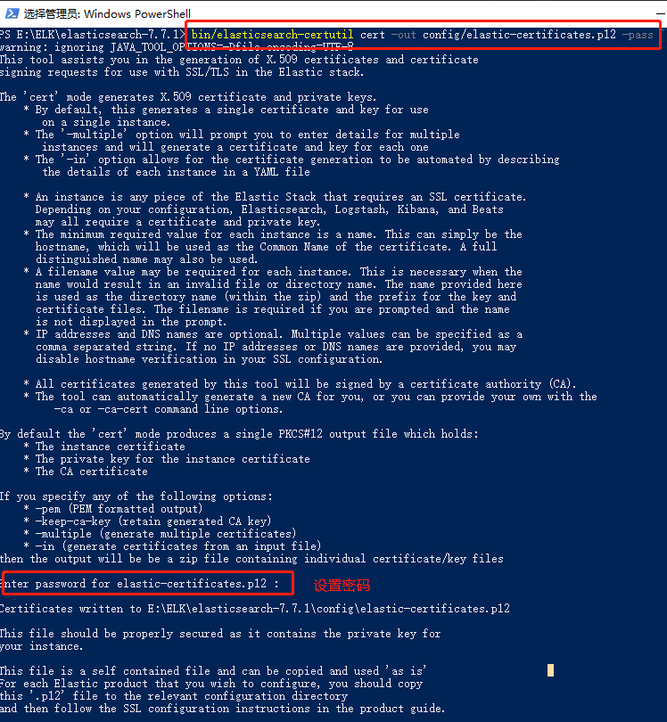
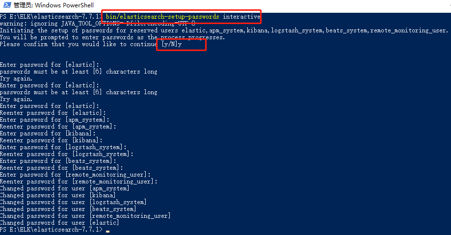

## 教程

### win10下配置Security

* 1.打开安全认证
```elasticsearch.yml
xpack.security.enabled: true
```
* 2.打开cmd或PowerShell命令窗口，切换到es目录下
* 3.生成X.509证书
    * bin/elasticsearch-certutil cert -out config/elastic-certificates.p12 -pass ""
    * 如果不给证书指定密码，直接按Enter回车键
    * 如果给证书指定了密码，则需添加密码到秘钥库
        * 加密集群中节点之间的通信
            * PKCS#12格式：
                * bin/elasticsearch-keystore add xpack.security.transport.ssl.keystore.secure_password
                * bin/elasticsearch-keystore add xpack.security.transport.ssl.truststore.secure_password
            * PEM格式：
                * bin/elasticsearch-keystore add xpack.security.transport.ssl.secure_key_passphrase
        * 加密HTTP客户端通信
            * PKCS#12格式：
                * bin/elasticsearch-keystore add xpack.security.http.ssl.keystore.secure_password
            * PEM格式：
                * bin/elasticsearch-keystore add xpack.security.http.ssl.secure_key_passphrase
    
* 4.添加xpack配置，添加后xpack部分显示如下
```elasticsearch.yml
xpack.security.enabled: true
xpack.security.transport.ssl.enabled: true
xpack.security.transport.ssl.verification_mode: certificate
xpack.security.transport.ssl.keystore.path: elastic-certificates.p12
xpack.security.transport.ssl.truststore.path: elastic-certificates.p12
```
* 5.另外打开窗口启动es
* 6.设置es密码（回到es目录下窗口）
    * 生成随机密码
        * bin/elasticsearch-setup-passwords auto
    * 手动指定密码
        * bin/elasticsearch-setup-passwords interactive
        


## 命令操作

### 删除索引
* curl -X DELETE http://localhost:9200/{indexName}


### 查看集群详细信息
* http://localhost:9200/_cluster/stats

### 查看节点详细信息
* http://localhost:9200/_cat/nodes?v

### 查看节点
* http://localhost:9200/_cat/nodes

### 重命名索引
1.将原索引复制到新索引
```
POST /_reindex
{
  "source": {
    "index": "old_index"
  },
  "dest": {
    "index": "new_index"
  }
}
```
* 2.删除原索引：DELETE old_index

### 删除索引
* DELETE posts
```
{
  "acknowledged" : true
}
```


### 创建索引结构
```
PUT twitter
{
  "settings" : {
    "number_of_shards" : 1,
    "number_of_replicas" : 0
  },
  "mappings" : {
    "properties" : {
      "message" : { "type" : "text" }
    }
  },
  "aliases" : {
    "twitter_alias" : {}
  }
}
```
```result
{
  "acknowledged" : true,
  "shards_acknowledged" : true,
  "index" : "twitter"
}
```


### 根据id删除索引内容
* DELETE posts/_doc/2
```result
{
  "_index" : "posts",
  "_type" : "_doc",
  "_id" : "2",
  "_version" : 2,
  "result" : "deleted",
  "_shards" : {
    "total" : 2,
    "successful" : 1,
    "failed" : 0
  },
  "_seq_no" : 5,
  "_primary_term" : 1
}
```

### 创建索引
```command
PUT posts/_doc/1
{
  "user" : "zhangsan",
  "postDate" : "2020-06-30",
  "message" : "trying out Elasticsearch"
}
```
```result
{
  "_index" : "posts",
  "_type" : "_doc",
  "_id" : "1",
  "_version" : 1,
  "result" : "created",
  "_shards" : {
    "total" : 2,
    "successful" : 1,
    "failed" : 0
  },
  "_seq_no" : 0,
  "_primary_term" : 1
}

```


### 获取索引结构信息
* GET posts
```result
{
  "posts" : {
    "aliases" : { },
    "mappings" : {
      "properties" : {
        "message" : {
          "type" : "text",
          "fields" : {
            "keyword" : {
              "type" : "keyword",
              "ignore_above" : 256
            }
          }
        },
        "postDate" : {
          "type" : "date"
        },
        "user" : {
          "type" : "text",
          "fields" : {
            "keyword" : {
              "type" : "keyword",
              "ignore_above" : 256
            }
          }
        }
      }
    },
    "settings" : {
      "index" : {
        "creation_date" : "1593484585679",
        "number_of_shards" : "1",
        "number_of_replicas" : "1",
        "uuid" : "-Z-Sp41QSmOTU5VXV-RcAw",
        "version" : {
          "created" : "7070099"
        },
        "provided_name" : "posts"
      }
    }
  }
}

```

### 获取索引映射信息
* GET posts/_mapping
```result
{
  "posts" : {
    "mappings" : {
      "properties" : {
        "message" : {
          "type" : "text",
          "fields" : {
            "keyword" : {
              "type" : "keyword",
              "ignore_above" : 256
            }
          }
        },
        "postDate" : {
          "type" : "date"
        },
        "user" : {
          "type" : "text",
          "fields" : {
            "keyword" : {
              "type" : "keyword",
              "ignore_above" : 256
            }
          }
        }
      }
    }
  }
}

```

### 获取索引全部内容
* GET posts/_search
```result
{
  "took" : 0,
  "timed_out" : false,
  "_shards" : {
    "total" : 1,
    "successful" : 1,
    "skipped" : 0,
    "failed" : 0
  },
  "hits" : {
    "total" : {
      "value" : 1,
      "relation" : "eq"
    },
    "max_score" : 1.0,
    "hits" : [
      {
        "_index" : "posts",
        "_type" : "_doc",
        "_id" : "1",
        "_score" : 1.0,
        "_source" : {
          "user" : "zhangsan",
          "postDate" : "2020-06-30",
          "message" : "trying out Elasticsearch"
        }
      }
    ]
  }
}
```

### 根据id获取索引内容
* GET posts/_doc/1
```result
{
  "_index" : "posts",
  "_type" : "_doc",
  "_id" : "1",
  "_version" : 1,
  "_seq_no" : 0,
  "_primary_term" : 1,
  "found" : true,
  "_source" : {
    "user" : "zhangsan",
    "postDate" : "2020-06-30",
    "message" : "trying out Elasticsearch"
  }
}

```

### 根据id更新索引(修改索引)指定字段
```command
POST posts/_update/1
{
  "doc": {
    "user": "lisi"
  }
}
```
```result
{
  "_index" : "posts",
  "_type" : "_doc",
  "_id" : "1",
  "_version" : 2,
  "result" : "updated",
  "_shards" : {
    "total" : 2,
    "successful" : 1,
    "failed" : 0
  },
  "_seq_no" : 1,
  "_primary_term" : 1
}
```

### 全量更新索引
```command
PUT posts/_doc/1
{
  "user" : "lisi",
  "postDate" : "2020-06-30"
}
```
```result
{
  "_index" : "posts",
  "_type" : "_doc",
  "_id" : "1",
  "_version" : 3,
  "result" : "updated",
  "_shards" : {
    "total" : 2,
    "successful" : 1,
    "failed" : 0
  },
  "_seq_no" : 2,
  "_primary_term" : 1
}
```

## es目录下操作

### 创建秘钥库
* bin/elasticsearch-keystore create

### 查看秘钥库中参数列表
* bin/elasticsearch-keystore list

### 添加字符串信息到秘钥库
* bin/elasticsearch-keystore add xpack.security.http.ssl.keystore.secure_password
* echo 1234 | bin/elasticsearch-keystore add --stdin xpack.security.http.ssl.keystore.secure_password

### 添加文件信息到秘钥库
* bin/elasticsearch-keystore add-file xpack.security.http.ssl.keystore.secure_password  /path/pwd.txt
* cat /path/pwd.txt | bin/elasticsearch-keystore add --stdin xpack.security.http.ssl.keystore.secure_password


### 从秘钥库中删除信息
* bin/elasticsearch-keystore remove xpack.security.http.ssl.keystore.secure_password

### 升级秘钥库
* bin/elasticsearch-keystore upgrade

## 集成

### springboot集成es
* [ESUtilsTest](../../../src/test/java/com/zsx/utils/ESUtilsTest.java)

## 参考链接

### springboot集成
* [java-rest-high-document](https://www.elastic.co/guide/en/elasticsearch/client/java-rest/current/java-rest-high-document-index.html)

### ip-filtering
* [ip-filtering](https://www.elastic.co/guide/en/elasticsearch/reference/current/ip-filtering.html)

### 使用环境变量
* [using-environ-vars](https://www.elastic.co/guide/en/beats/metricbeat/current/using-environ-vars.html)

### 安全
* **[elasticsearch-tls](https://www.elastic.co/guide/en/elasticsearch/reference/current/configuring-tls.html)**
* [configuring-security](https://www.elastic.co/guide/en/elasticsearch/reference/current/configuring-security.html)
* [xpack](https://www.elastic.co/guide/en/x-pack/current/installing-xpack.html)
* [xpack](https://www.elastic.co/cn/blog/doubling-down-on-open)
* [security-getting-started](https://www.elastic.co/guide/en/elasticsearch/reference/current/security-getting-started.html)
* [security-settings](https://www.elastic.co/guide/en/elasticsearch/reference/current/security-settings.html)
* [elasticsearch-security](https://www.elastic.co/cn/blog/getting-started-with-elasticsearch-security)
* **[elasticsearch-tls-docker](https://www.elastic.co/guide/en/elasticsearch/reference/current/configuring-tls-docker.html)**
* [elasticsearch-security-tls-ssl-pki](https://www.elastic.co/cn/blog/elasticsearch-security-configure-tls-ssl-pki-authentication)
* [elasticsearch-ssl-tls](https://www.elastic.co/guide/en/elasticsearch/reference/current/ssl-tls.html)

### 第三方
* [secure-settings](https://learnku.com/docs/elasticsearch73/7.3/322-secure-settings/6591)


