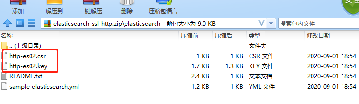
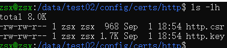
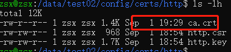
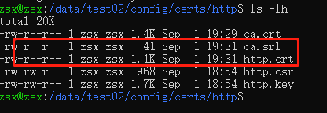
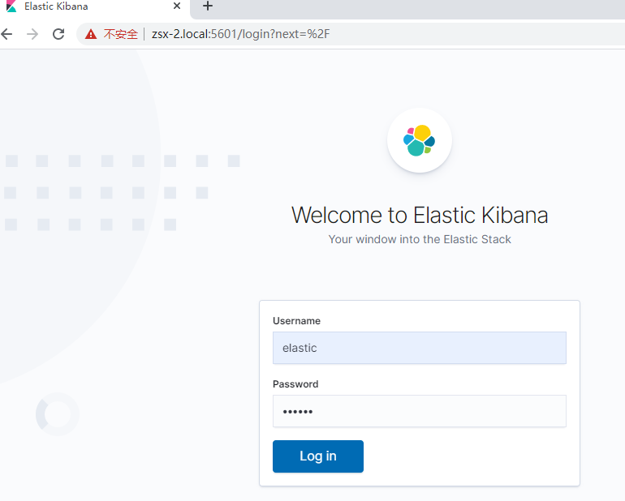

## Elastic Stack

### 简写
* ECS(Elastic Compute Service)
* PKI(Public key infrastructure)
* LDAP(Lightweight Directory Access Protocol)
* ILM(Index lifecycle management).
* DNs(Distinguished Names)
* ILM(Index lifecycle management)
* ICMP(Internet Control Message Protocol)

### 新增环境变量
```
CERTS_DIR_ES=/usr/share/elasticsearch/config/certs
CERTS_DIR_KIBANA=/usr/share/kibana/config/certs
CERTS_DIR_LOGSTASH=/usr/share/logstash/config/certs
CERTS_DIR_FILEBEAT=/usr/share/filebeat/config/certs
CERTS_DIR_METRICBEAT=/usr/share/metricbeat/config/certs
ELASTIC_PASSWORD=123456
PWD=/data/operations
```

### docker-compose.yml增加elastic stack的证书目录挂载

### 生成证书

#### 方法1：
* docker-compose -f create-certs.yml run --rm create_certs

####  方法2：
* 1.切换到elasticsearch安装目录
* 2.执行证书生成命令
    * bin/elasticsearch-certutil cert ca --days 1095 --pem -out /certs/bundle.zip
* 3.解压证书压缩文件
    * unzip /certs/bundle.zip
* 4.切换到证书私钥目录
* 5.将私钥转换成pkcs8格式
    * openssl pkcs8 -in instance.key -topk8 -nocrypt -out instance.pem

### 对elastic stack进行tsl/ssl的认证配置
* 1.es配置
```elasticsearch.yml
xpack.security.enabled: true
xpack.security.transport.ssl.enabled: true
xpack.security.transport.ssl.verification_mode: certificate
xpack.security.transport.ssl.certificate_authorities: ${CERTS_DIR_ES}/ca/ca.crt
xpack.security.transport.ssl.certificate: ${CERTS_DIR_ES}/instance/instance.crt
xpack.security.transport.ssl.key: ${CERTS_DIR_ES}/instance/instance.key
```
* 2.kibana配置
```kibana.yml
elasticsearch.username: "kibana"
elasticsearch.password: "123456"

# 配置ssl认证后，需使用https访问https://localhost:5601/
server.ssl.enabled: true
server.ssl.certificate: ${CERTS_DIR_KIBANA}/instance/instance.crt
server.ssl.key: ${CERTS_DIR_KIBANA}/instance/instance.key
# es配置了ssl认证后，需指定证书路径，此处指定用于 Elasticsearch 实例的 PEM 证书文件路径
elasticsearch.ssl.certificateAuthorities: ["${CERTS_DIR_KIBANA}/ca/ca.crt"]
```
* 3.logstash配置
```logstash.yml
monitoring.elasticsearch.username: "logstash_system"
monitoring.elasticsearch.password: "123456"
```
```logstash.conf
input {
    http {
        port => 8088
        codec => "json"
        add_field => {
            source => "http"
            from => "app"
        }
        # 自定义用户：拥有manage_index_templates、monitor、manage_ilm等权限
        user => "logstash_writer_user"
        password => "123456"
    }
    beats {
        port => 5044
        add_field => {
            source => "beats"
        }
        ssl => true
        # This key need to be in the PKCS8 format
        ssl_key => "${CERTS_DIR_LOGSTASH}/instance/instance.pem"
        ssl_certificate => "${CERTS_DIR_LOGSTASH}/instance/instance.crt"
        ssl_certificate_authorities => "${CERTS_DIR_LOGSTASH}/ca/ca.crt"
        ssl_verify_mode => "force_peer"
    }
    file {
        add_field => {
            source => "file"
            from => "spring"
        }
        path => ["/usr/share/logstash/logs/test.log"]
        sincedb_path => "NUL"
        start_position => "beginning"
    }
}

output {
    elasticsearch {
        hosts => ["http://es01:9200"]
        index => "%{[source]}-%{[from]}-%{+YYYYMMdd}"
        # 自定义用户：拥有manage_index_templates、monitor、manage_ilm等权限
        user => "logstash_writer_user"
        password => "123456"
        manage_template => false
    }
}

```
* 4.filebeat配置
```filebeat.yml
output.logstash:
  hosts: ["zsx-2.local:5044"]
  # The maximum number of events to bulk in a single Logstash request. The default is 2048.
  bulk_max_size: 1024
  ssl.certificate_authorities: ["${CERTS_DIR_FILEBEAT}/ca/ca.crt"]
  ssl.certificate: "${CERTS_DIR_FILEBEAT}/instance/instance.crt"
  ssl.key: "${CERTS_DIR_FILEBEAT}/instance/instance.key"
  ssl.verification_mode: none
```
* 5.metricbeat配置
```
output.logstash:
  hosts: ["zsx-2.local:5044"]
  ssl.certificate_authorities: ["${CERTS_DIR_METRICBEAT}/ca/ca.crt"]
  ssl.certificate: "${CERTS_DIR_METRICBEAT}/instance/instance.crt"
  ssl.key: "${CERTS_DIR_METRICBEAT}/instance/instance.key"
  ssl.verification_mode: none
```

### elastic stack启动配置
* 1.启动es容器
* 2.进入es容器内部，设置内置用户密码，该类用户在kibana.yml、logstash.yml中，以及登录kibana界面时有用到
    * docker exec -it es bash
    * bin/elasticsearch-setup-passwords interactive 
* 3.重启es容器
* 4.启动kibana容器
* 5.使用超级用户elastic登录kibana界面
* 6.在kibana管理界面中创建角色logstash_writer_role，赋予manage_index_templates、monitor、manage_ilm等权限
* 7.创建用户logstash_writer_user，赋予logstash_writer_role角色权限，该用户在logstash.conf中有用到
* 8.再依次启动logstash、filebeat、metricbeat


## 安全认证

### Mutual TLS authentication between Kibana and Elasticsearch

* 1.Set up Kibana to work with Elastic Stack security features with a username and password.

* 2.Set up TLS encryption between Kibana and Elasticsearch.
    * This entails generating a "server certificate" for Elasticsearch to use on the HTTP layer.

* 3.Obtain a client certificate and private key for Kibana.
    * Kibana must this "client certificate" and corresponding private key when connecting to Elasticsearch.

* 4.Obtain the certificate authority (CA) certificate chain for Kibana.

* 5.Configure Elasticsearch with a PKI realm and a native realm.
```elsticsearch.yml
xpack.security.authc.realms.pki.realm1.order: 1
xpack.security.authc.realms.pki.realm1.certificate_authorities: "/path/to/kibana-ca.crt"
xpack.security.authc.realms.native.realm2.order: 2
```

* 6.Configure Elasticsearch to request client certificates.
```elsticsearch.yml
xpack.security.http.ssl.client_authentication: "optional"

```

* 7.Restart Elasticsearch

* 8.Use Kibana to create a role mapping in Elasticsearch for the client certificate.

* 9.Configure Kibana to use the client certificate and private key.
```elsticsearch.yml
elasticsearch.ssl.certificate: "/path/to/kibana-client.crt"
elasticsearch.ssl.key: "/path/to/kibana-client.key"
```

* 10.Configure Kibana not to use a username and password for Elasticsearch.
    * You must remove the elasticsearch.username and elasticsearch.password settings from kibana.yml. 
    * If these are present, Kibana will attempt to use them to authenticate to Elasticsearch via the native realm.

* 11.Restart Kibana.


## Mutual TLS authentication between Kibana and Elasticsearch
* [主要参考链接](https://www.elastic.co/guide/en/kibana/current/elasticsearch-mutual-tls.html)
* [证书部分参考链接](https://segmentfault.com/a/1190000022102940)

### 一、生成证书
* 1.切换到ES安装目录
```console
cd E:\ELK\elasticsearch-7.7.1
```
* 2.执行生成证书命令
    * bin/elasticsearch-certutil http
```console
PS E:\ELK\elasticsearch-7.7.1> bin/elasticsearch-certutil http

## Elasticsearch HTTP Certificate Utility

The 'http' command guides you through the process of generating certificates
for use on the HTTP (Rest) interface for Elasticsearch.

This tool will ask you a number of questions in order to generate the right
set of files for your needs.

## Do you wish to generate a Certificate Signing Request (CSR)?

A CSR is used when you want your certificate to be created by an existing
Certificate Authority (CA) that you do not control (that is, you don't have
access to the keys for that CA).

If you are in a corporate environment with a central security team, then you
may have an existing Corporate CA that can generate your certificate for you.
Infrastructure within your organisation may already be configured to trust this
CA, so it may be easier for clients to connect to Elasticsearch if you use a
CSR and send that request to the team that controls your CA.

If you choose not to generate a CSR, this tool will generate a new certificate
for you. That certificate will be signed by a CA under your control. This is a
quick and easy way to secure your cluster with TLS, but you will need to
configure all your clients to trust that custom CA.

# 是否生成CSR证书
Generate a CSR? [y/N]y
```
* 3.上述输入y，生成CSR证书
```console
## Do you wish to generate one certificate per node?

If you have multiple nodes in your cluster, then you may choose to generate a
separate certificate for each of these nodes. Each certificate will have its
own private key, and will be issued for a specific hostname or IP address.

Alternatively, you may wish to generate a single certificate that is valid
across all the hostnames or addresses in your cluster.

If all of your nodes will be accessed through a single domain
(e.g. node01.es.example.com, node02.es.example.com, etc) then you may find it
simpler to generate one certificate with a wildcard hostname (*.es.example.com)
and use that across all of your nodes.

However, if you do not have a common domain name, and you expect to add
additional nodes to your cluster in the future, then you should generate a
certificate per node so that you can more easily generate new certificates when
you provision new nodes.

# 是否为每个节点生成证书
Generate a certificate per node? [y/N]y

```
* 3.上述输入y，为每个节点生成证书
```console
## What is the name of node #1?

This name will be used as part of the certificate file name, and as a
descriptive name within the certificate.

You can use any descriptive name that you like, but we recommend using the name
of the Elasticsearch node.

# 输入节点名
node #1 name: es02

## Which hostnames will be used to connect to es02?

These hostnames will be added as "DNS" names in the "Subject Alternative Name"
(SAN) field in your certificate.

You should list every hostname and variant that people will use to connect to
your cluster over http.
Do not list IP addresses here, you will be asked to enter them later.

If you wish to use a wildcard certificate (for example *.es.example.com) you
can enter that here.

Enter all the hostnames that you need, one per line.
When you are done, press <ENTER> once more to move on to the next step.

# 配置主机
es02
es01
kibana01

You entered the following hostnames.

 - es02
 - es01
 - kibana01

# 完成主机配置
Is this correct [Y/n]y

## Which IP addresses will be used to connect to es02?

If your clients will ever connect to your nodes by numeric IP address, then you
can list these as valid IP "Subject Alternative Name" (SAN) fields in your
certificate.

If you do not have fixed IP addresses, or not wish to support direct IP access
to your cluster then you can just press <ENTER> to skip this step.

Enter all the IP addresses that you need, one per line.
When you are done, press <ENTER> once more to move on to the next step.


You did not enter any IP addresses.

# 此处按ENTE键跳过，匹配所有IP，完成IP配置
Is this correct [Y/n]y

## Other certificate options

The generated certificate will have the following additional configuration
values. These values have been selected based on a combination of the
information you have provided above and secure defaults. You should not need to
change these values unless you have specific requirements.

# 配置节点完成后默认配置
Key Name: es02
Subject DN: CN=es02
Key Size: 2048

# 注意Subject DN，如果不匹配，需要修改，此处n不修改
Do you wish to change any of these options? [y/N]n

# 选择n不生成其他证书 
Generate additional certificates? [Y/n]n

## What password do you want for your private key(s)?

Your private key(s) will be stored as a PEM formatted file.
We recommend that you protect your private keys with a password

If you do not wish to use a password, simply press <enter> at the prompt below.

# 是否为私钥设置密码，此处不设置
Provide a password for the private key:  [<ENTER> for none]

## Where should we save the generated files?

A number of files will be generated including your private key(s),
certificate request(s), and sample configuration options for Elastic Stack products.

These files will be included in a single zip archive.

# 设置生成证书的压缩包文件名，此处选择默认
What filename should be used for the output zip file? [E:\ELK\elasticsearch-7.7.1\elasticsearch-ssl-http.zip]

Zip file written to E:\ELK\elasticsearch-7.7.1\elasticsearch-ssl-http.zip
PS E:\ELK\elasticsearch-7.7.1>
```
* 4.查看证书
    * 打开elasticsearch-ssl-http.zip文件，在elasticsearch目录下会生成两个证书文件
    * 
* 5.将证书复制到ubuntu系统下的/data/test02/config/certs/http目录下
    * http-es02.key重命名为http.key
    * http-es02.csr重命名为http.csr
* 6.在ubuntu系统下，切换到证书所在目录/data/test02/config/certs/http
    * 
* 7.根据私钥生成CA(certificate authority)证书
    * openssl req -new -x509 -key http.key -out ca.crt -days 3650
    * 
```console
zsx@zsx:/data/test02/config/certs/http$ openssl req -new -x509 -key http.key -out ca.crt -days 3650
You are about to be asked to enter information that will be incorporated
into your certificate request.
What you are about to enter is what is called a Distinguished Name or a DN.
There are quite a few fields but you can leave some blank
For some fields there will be a default value,
If you enter '.', the field will be left blank.
-----
Country Name (2 letter code) [AU]:ZH
State or Province Name (full name) [Some-State]:GD
Locality Name (eg, city) []:SZ
Organization Name (eg, company) [Internet Widgits Pty Ltd]:RYX
Organizational Unit Name (eg, section) []:YF
Common Name (e.g. server FQDN or YOUR name) []:ZSX.com
Email Address []:zsx@163.com
```
* 8.生成客户端证书
    * openssl x509 -req -days 3650 -in http.csr -CA ca.crt -CAkey http.key -CAcreateserial -out http.crt
    * 
```console
zsx@zsx:/data/test02/config/certs/http$ openssl x509 -req -days 3650 -in http.csr -CA ca.crt -CAkey http.key -CAcreateserial -out http.crt
Signature ok
subject=CN = es02
Getting CA Private Key
```
* CAcreateserial参数的作用是用来生成一个ca.srl文件
    * 这个文件的作用是记录当前CA生成的证书的序列号。
    * 如果再次在同样的位置进行命令，OpenSSL会去读取这个文件中的序列号，并自动+1作为下一个证书的序列号

### 二、ES配置

```es01.yml
cluster.name: es
node.name: node-1
network.host: 0.0.0.0
http.port: 9200
discovery.seed_hosts: ["es01", "es02"]
cluster.initial_master_nodes: ["node-1", "node-2"]
# 必须设置为true才能启用安全认证
xpack.security.enabled: true

# Enable TLS on the HTTP layer.
xpack.security.http.ssl.enabled: true
xpack.security.http.ssl.certificate_authorities: ${CERTS_DIR_ES}/http/ca.crt
xpack.security.http.ssl.key: ${CERTS_DIR_ES}/http/http.key
xpack.security.http.ssl.certificate: ${CERTS_DIR_ES}/http/http.crt

# Enable TLS on the transport layer.
xpack.security.transport.ssl.enabled: true
xpack.security.transport.ssl.verification_mode: certificate
xpack.security.transport.ssl.certificate_authorities: ${CERTS_DIR_ES}/ca/ca.crt
xpack.security.transport.ssl.certificate: ${CERTS_DIR_ES}/instance/instance.crt
xpack.security.transport.ssl.key: ${CERTS_DIR_ES}/instance/instance.key

```

```es02.yml
cluster.name: es
node.name: node-2
network.host: 0.0.0.0
http.port: 9200
discovery.seed_hosts: ["es01", "es02"]
cluster.initial_master_nodes: ["node-1", "node-2"]
# 必须设置为true才能启用安全认证
xpack.security.enabled: true

# Enable TLS on the HTTP layer.
xpack.security.http.ssl.enabled: true
xpack.security.http.ssl.certificate_authorities: ${CERTS_DIR_ES}/http/ca.crt
xpack.security.http.ssl.key: ${CERTS_DIR_ES}/http/http.key
xpack.security.http.ssl.certificate: ${CERTS_DIR_ES}/http/http.crt

# Enable TLS on the transport layer.
xpack.security.transport.ssl.enabled: true
xpack.security.transport.ssl.verification_mode: certificate
xpack.security.transport.ssl.certificate_authorities: ${CERTS_DIR_ES}/ca/ca.crt
xpack.security.transport.ssl.certificate: ${CERTS_DIR_ES}/instance/instance.crt
xpack.security.transport.ssl.key: ${CERTS_DIR_ES}/instance/instance.key

```


### 三、Kibana配置

```kibana01.yml
server.host: "0.0.0.0"
server.name: "kibana01"
# es配置了http.ssl认证后，此处需用https请求
elasticsearch.hosts: ["https://es02:9200"]
# es配置了transport.ssl认证后，此处需指定账号密码
elasticsearch.username: "elastic"
elasticsearch.password: "123456"


# 配置ssl认证后，需使用https访问https://localhost:5601/
# Configure Kibana to enable TLS for inbound connections.
# Encrypt traffic between the browser and Kibana
server.ssl.enabled: true
server.ssl.certificate: ${CERTS_DIR_KIBANA}/instance/instance.crt
server.ssl.key: ${CERTS_DIR_KIBANA}/instance/instance.key

# es配置了ssl认证后，需指定证书路径，此处指定用于 Elasticsearch 实例的 PEM 证书文件路径
# Configure Kibana to trust the Elasticsearch CA certificate chain for the HTTP layer
elasticsearch.ssl.certificateAuthorities: ["${CERTS_DIR_KIBANA}/http/ca.crt"]

```

### 四、重启容器es01、es02、kibana01
* docker restart es01 es02 kibana01

### 五、查看结果
* [kibana](https://zsx-2.local:5601/)
    * 


## 认证流程
* ES -> 浏览器
    * ES
        * key
        * certificate
    * 浏览器
        * certificate_authorities

* ES -> logstash
    * ES
        * key
        * certificate
    * logstash
        * certificate_authorities

* ES -> kibana
    * ES
        * key
        * certificate
    * kibana
        * certificate_authorities

* logstash -> ES
    * logstash
        * username
        * password
    * ES
        * 
* logstash -> beats
    * logstash
        * key
        * certificate
    * beats
        * certificate_authorities

* kibana -> ES
    * kibana
        * username
        * password
    * ES
        * 

* kibana -> 浏览器
    * kibana
        * key
        * certificate
    * 浏览器
        * certificate_authorities

* beats -> logstash
    * beats
        * key
        * certificate
    * logstash
        * certificate_authorities


## 告警

### metricbeat告警
* 配置
```
{
    "alert_id": "{{alertId}}",
    "alert_name": "{{alertName}}",
    "space_id": "{{spaceId}}",
    "tags": "{{tags}}",
    "alert_instance_id": "{{alertInstanceId}}",
    "context_message": "{{context.message}}",
    "context_title": "{{context.title}}",
    "context_group": "{{context.group}}",
    "context_date": "{{context.date}}",
    "context_value": "{{context.value}}"
}
```
* 创建索引alert-info
```
PUT alert-info
{
    "settings" : {
        "number_of_shards" : 1
    },
    "mappings" : {
      "properties" : {
          "@timestamp" : {"type" : "date" },
          "alert_id" : { "type" : "keyword" },
          "alert_name" : { "type" : "keyword" },
          "space_id" : { "type" : "keyword" },
          "tags" : { "type" : "keyword" },
          "alert_instance_id" : { "type" : "keyword" },
          "context_message": { "type" : "keyword" },
          "context_title" : { "type" : "keyword" },
          "context_group" : { "type" : "keyword" },
          "context_date" : { "type" : "date" },
          "context_value" : { "type" : "keyword" }

      }
    }
}
```
### heartbeat 告警
```
{
    "alert_id": "{{alertId}}",
    "alert_name": "{{alertName}}",
    "space_id": "{{spaceId}}",
    "tags": "{{tags}}",
    "alert_instance_id": "{{alertInstanceId}}",
    "context_message": "{{context.message}}",
    "context_down_monitors_with_geo": "{{context.downMonitorsWithGeo}}",
    "state_first_checked_at": "{{state.firstCheckedAt}}",
    "state_first_triggered_at": "{{state.firstTriggeredAt}}",
    "state_current_trigger_started": "{{state.currentTriggerStarted}}",
    "state_is_triggered": "{{state.isTriggered}}",
    "state_last_checked_at": "{{state.lastCheckedAt}}",
    "state_last_resolved_at": "{{state.lastResolvedAt}}",
    "state_last_triggered_at": "{{state.lastTriggeredAt}}"
}
```
* 创建索引down-alert-info
```
PUT down-alert-info
{
    "settings" : {
        "number_of_shards" : 1
    },
    "mappings" : {
      "properties" : {
          "@timestamp" : {"type" : "date" },
          "alert_id" : { "type" : "keyword" },
          "alert_name" : { "type" : "keyword" },
          "space_id" : { "type" : "keyword" },
          "tags" : { "type" : "keyword" },
          "alert_instance_id" : { "type" : "keyword" },
          "context_message": { "type" : "keyword" },
          "context_down_monitors_with_geo" : { "type" : "geo_point" },
          "state_first_checked_at" : { "type" : "date" },
          "state_first_triggered_at" : { "type" : "date" },
          "state_current_trigger_started" : { "type" : "date" },
          "state_is_triggered" : { "type" : "boolean" },
          "state_last_checked_at" : { "type" : "date" },
          "state_last_resolved_at" : { "type" : "date" },
          "state_last_triggered_at" : { "type" : "date" }
      }
    }
}
```

## 参考网站
* [get-started-docker](https://www.elastic.co/guide/en/elastic-stack-get-started/current/get-started-docker.html)
* [watcher-ui](https://www.elastic.co/guide/en/kibana/master/watcher-ui.html)