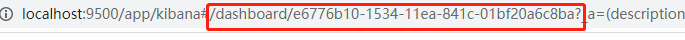

## 命令

### 查看服务状态
* curl -I http://localhost:5601/status


## Visualizations

### Visualizations修改
* https://zsx-2.local:5601/app/kibana#/management/kibana/objects/savedVisualizations/<Visualizations-ID>


## kibana界面的Dev Tools控制台进行增删改查

### 获取索引信息
* GET /{index_1}, {index_2}/_settings
    * 例：GET /test-spring-errors-20200602/_settings
    * 例：GET /test-spring-errors-20200602, test-spring-logs-20200602/_settings

### 获取所有索引信息
* GET /_all/_settings


### 插入索引信息
* (/{index}/_doc/{id}, /{index}/_doc, or /{index}/_create/{id})
* 已弃用：POST /library/books/1
* POST /library/_doc
* POST /library/_doc/1
* POST /library/_create/1
```
POST /library/_doc/1
{
  "title": "Elasticsearch : the definitive guide",
  "name": {
    "first": "Vineeth",
    "last": "Mohan"
  },
  "publish_date": "2015-02-06",
  "price":"35.99"
}
```

### 查询索引信息
* 已弃用：GET /library/books/1
* GET /library/_doc/1

### 更新索引信息
```
PUT /library/books/1
{
  "title": "Elasticsearch : the definitive guide",
  "name": {
    "first": "Vineeth",
    "last": "Mohan"
  },
  "publish_date": "2015-02-06",
  "price":"25.99"
}
```

### 更新单个字段
```
POST /library/books/1/_update
{
  "doc": {
    "price": 10
  }
}
```

### 删除索引信息
* 已弃用：DELETE /library/books/1
* DELETE /library/_doc/1

### 删除索引所有数据
```
POST indexName/_delete_by_query
{
  "query": { 
    "match_all": {
    }
  }
}
```

### 删除索引
* DELETE /library

### 合并请求
``` 已弃用，不建议在多个get请求中指定类型
GET /_mget
{
  "docs": [
      {
        "_index": "library",
        "_type": "_doc",
        "_id": 1
      },
      {
        "_index": "library",
        "_type": "_doc",
        "_id": 2
      },
      {
        "_index": "library",
        "_type": "_doc",
        "_id": 3
      }
    ]
}
```
```替换为
GET /_mget
{
  "docs": [
      {
        "_index": "library",
        "_type": "_doc",
        "_id": 1
      },
      {
        "_index": "library",
        "_type": "_doc",
        "_id": 2
      },
      {
        "_index": "library",
        "_type": "_doc",
        "_id": 3
      }
    ]
}
```

### 合并请求
```已弃用
GET /library/_doc/_mget
{
  "ids": ["1", "3"]
}
```
```替换为
GET /library/_mget
{
  "ids": ["1", "3"]
}
```

### 批量插入
```已弃用
POST /library/_doc/_bulk
{ "index": {"_id": 1}}
{ "title": "es-id-1","price":1}
{ "index": {"_id": 2}}
{ "title": "es-id-2","price":2}
{ "index": {"_id": 3}}
{ "title": "es-id-3","price":3}
```
```替换为
POST /library/_doc/_bulk
{ "index": {"_id": 1}}
{ "title": "es-id-1","price":1}
{ "index": {"_id": 2}}
{ "title": "es-id-2","price":2}
{ "index": {"_id": 3}}
{ "title": "es-id-3","price":3}
```

### 批量操作
```已弃用
POST /library/books/_bulk
{ "delete": {"_index":"library", "_type":"book", "_id":1}}
{ "create": {"_index":"music", "_type": "classical", "_id":1}}
{ "title": "Ave verum corpus"}
{ "index": {"_index": "music", "_type": "classical"}}
{ "title": "Litaniac de Venerabili Altaris Sacroments"}
{ "update": {"_index": "library", "_type": "books", "_id": "2"}}
{"doc":{"price":"18"}}
```
```替换为
POST /library/_bulk
{ "delete": {"_index":"library", "_type":"book", "_id":1}}
{ "create": {"_index":"music", "_type": "classical", "_id":1}}
{ "title": "Ave verum corpus"}
{ "index": {"_index": "music", "_type": "classical"}}
{ "title": "Litaniac de Venerabili Altaris Sacroments"}
{ "update": {"_index": "library", "_type": "books", "_id": "2"}}
{"doc":{"price":"18"}}
```

### 内部版本控制
* 1.获取if_seq_no和if_primary_term：GET /library/_doc/1
* 2.执行更新
```已弃用
POST /library/_doc/1/_update?if_seq_no=12&if_primary_term=1
{
  "doc": {
    "price": 15
  }
}
```
```替换为
POST /library/_update/1
{
  "doc": {
    "price": 25
  }
}

```

### 外部版本控制
* 1.查看version的值：GET /library/_doc/1
* 2.执行更新(注：100要大于原version值)
```
POST /library/_doc/1?version=100&version_type=external
{
  "doc": {
    "price": 20
  }
}
```

### 建立映射
```
POST /library/_doc
{
 "settings": {
   "number_of_shards": 5,
   "number_of_replicas": 1
 },
 "mappings": {
   "books": {
     "properties": {
       "title": {"type": "string"},
       "name": {"type":"string","index":"not_analyzed"},
       "publish_date": {"type":"date", "index":"not_analyzed"},
       "price": {"type":"double"},
       "number": {"type": "integer"}
     }
   }
 }
}
```

### 获取索引映射信息
* GET /library/_mapping

### 获取集群内的所有映射信息
* GET /_all/_mapping

### 删除映射
* DELETE /library/_doc/_mapping
* DELETE /library/_doc/_mapping?pretty=true


## 基本查询

### 合并查询
```
GET /library/_mget
{
  "ids": ["1","2","3","4","5","6","7"]
}
```
### 简单查询
* 带索引：GET /library/_search?q=title:elasticsearch
* 不带索引：GET /_search?q=title:elasticsearch


## term查询

### 查询某个字段里有某个关键词的文档
```
GET /library/_search
{
  "query": {
    "term": {
      "preview": "es"
    }
  }
}
```

### 查询某个字段里有多个关键词的文档
* minimum_should_match指定匹配数量
* minimum_should_match值为1，表示只要匹配一个
* minimum_should_match值为2，表示2个都要匹配
```
GET /library/_search
{
  "query": {
    "bool": {
      "minimum_should_match": 1,
      "should": [
        {
          "term": {
            "preview": "es"
           }
        },
        {
          "term": {
            "preview": "php"
          }
        }
      ]
    }
  },
  "highlight": {
    "fields": {
      "preview": {}
    }
  }
}
```

### 控制查询返回的数量
```
GET /library/_search
{
  "from": 1,
  "size": 2,
  "query": {
    "term": {
      "title": "elasticsearch"
    }
  }
}
```


## match查询
* match跟term区别是,match查询的时候,elasticsearch会根据你给定的字段提供合适的分析器,而term查询不会有分析器分析过程

### match
```
GET /library/_search
{
  "query": {
    "match": {
      "preview": "es"
    }
  }
}
```

### match_phrase查询
* slop表示关键词之间间隔多少个未知单词
``` 
GET /library/_search
{
  "query": {
    "match_phrase": {
      "preview": {
        "query": "es,1",
        "slop": 1
      }
    }
  }
}
```

### multi_match查询
* 例：查询title或preview这两个字段里包含php关键词的文档
```
GET /library/_search
{
  "query": {
    "multi_match": {
      "query": "php",
      "fields": ["title","preview"]
    }
  }
}
```

### _source指定返回的字段
```
GET /library/_search
{
  "_source": ["preview","title"],
  "query": {
    "match": {
      "preview": "es"
    }
  }
}
```

### stored_fields
```
GET /library/_search
{
  "stored_fields": ["preview","title"],
  "query": {
    "match": {
      "preview": "es"
    }
  }
}
```

### 控制加载字段
* 不使用通配符
```
GET /library/_search?_source_includes=title,price&_source_excludes=preview
{
  "query": {
    "match_all": {}
  }
}
```
* 使用通配符
```
GET /library/_search?_source_includes=tit*,pr*&_source_excludes=pre*
{
  "query": {
    "match_all": {}
  }
}
```

### sort排序
* desc降序、asc升序
```
GET /library/_search
{
  "query": {
    "match_all": {}
  },
  "sort": [
    {
      "price.keyword": {
        "order": "desc"
      }
    }
  ]
}
```

### prefix前缀匹配查询
```
GET /library/_search
{
  "query": {
    "prefix": {
      "title": {
        "value": "p"
      }
    }
  }
}

```

### range控制范围
* nclude_lower: 是否包含范围的左边界,默认是true
* include_upper: 是否包含范围的右边界,默认是true
```
GET /library/_search
{
  "query": {
    "range": {
      "price": {
        "from": "10",
        "to": "20",
        "include_lower": true,
        "include_upper": false
      }
    }
  }
}
```

### wildcard通配符查询
``` 带*匹配
GET /library/_search
{
  "query": {
    "wildcard": {
      "preview": "es*"
    }
  }
}
```
``` 带?匹配
GET /library/_search
{
  "query": {
    "wildcard": {
      "preview.keyword": "e?-1"
    }
  }
}
```

### fuzzy模糊查询
```
GET /library/_search
{
  "query": {
    "fuzzy": {
      "preview": "php"
    }
  }
}
```
* fuzziness（可选，字符串）匹配允许的最大编辑距离
* max_expansions（可选，整数）创建的最大变体数。默认为50
* 避免在max_expansions参数中使用较高的值，尤其是当prefix_length参数值为时0
* max_expansions由于检查的变量数量过多，参数中的高值 可能导致性能不佳。
* prefix_length（可选，整数）创建扩展时保留不变的开始字符数，默认为0
* transpositions（可选，布尔值）指示编辑是否包括两个相邻字符的变位（ab→ba），默认为true。
* rewrite（可选，字符串）用于重写查询的方法
```
GET /library/_search
{
  "query": {
    "fuzzy": {
      "preview": {
        "value": "php",
        "fuzziness": "AUTO",
        "max_expansions": 50,
        "prefix_length": 0,
        "transpositions": true,
        "rewrite": "constant_score"
      }
    }
  }
}
```

### 分组查询查看指定元素
```
GET /test-20200924/_search
{
  "_source": ["host.name"],
  "aggs": {
    "group_by_host_name": {
      "terms": {
          "field": "host.name"
      }
    }
  }
}
```


## 可视化操作

### Timelioe使用
* 数据比较
```Timelion expression
.es(index=test-facility-metrics-host-*,
    timefield='@timestamp',
    metric='avg:system.cpu.user.pct'),
.es(offset=-1h,             
    index=test-facility-metrics-host-*,
    timefield='@timestamp',
    metric='avg:system.cpu.user.pct')
```
* 添加标签名
```Timelion expression
.es(offset=-1h,index=metricbeat-*,
    timefield='@timestamp',
    metric='avg:system.cpu.user.pct').label('last hour'),
.es(index=metricbeat-*,
    timefield='@timestamp',
    metric='avg:system.cpu.user.pct').label('current hour')
```
* 添加标题
```Timelion expression
.es(offset=-1h,
    index=metricbeat-*,
    timefield='@timestamp',
    metric='avg:system.cpu.user.pct')
  .label('last hour'),
.es(index=metricbeat-*,
    timefield='@timestamp',
    metric='avg:system.cpu.user.pct')
  .label('current hour')
  .title('CPU usage over time')
```
* 改变图表类型
```Timelion expression
.es(offset=-1h,
    index=metricbeat-*,
    timefield='@timestamp',
    metric='avg:system.cpu.user.pct')
  .label('last hour')
  .lines(fill=1,width=0.5), 
.es(index=metricbeat-*,
    timefield='@timestamp',
    metric='avg:system.cpu.user.pct')
  .label('current hour')
  .title('CPU usage over time')
```
* 改变颜色
```Timelion expression
.es(offset=-1h,
    index=metricbeat-*,
    timefield='@timestamp',
    metric='avg:system.cpu.user.pct')
  .label('last hour')
  .lines(fill=1,width=0.5)
  .color(gray), 
.es(index=metricbeat-*,
    timefield='@timestamp',
    metric='avg:system.cpu.user.pct')
  .label('current hour')
  .title('CPU usage over time')
  .color(#1E90FF)
```
* 调整图表位置和样式
* nw:north west
```Timelion expression
.es(offset=-1h,
    index=metricbeat-*,
    timefield='@timestamp',
    metric='avg:system.cpu.user.pct')
  .label('last hour')
  .lines(fill=1,width=0.5)
  .color(gray),
.es(index=metricbeat-*,
    timefield='@timestamp',
    metric='avg:system.cpu.user.pct')
  .label('current hour')
  .title('CPU usage over time')
  .color(#1E90FF)
  .legend(columns=2, position=nw) 
```
* 使用数学函数创建可视化图表
```Timelion expression
.es(index=metricbeat*,
    timefield=@timestamp,
    metric=max:system.network.in.bytes)
```
* 绘制变化率
    * .derivative()
```Timelion expression
.es(index=metricbeat*,
    timefield=@timestamp,
    metric=max:system.network.in.bytes)
  .derivative()

```
   * .derivative()、multiply()
```
.es(index=metricbeat*,
    timefield=@timestamp,
    metric=max:system.network.in.bytes)
  .derivative(),
.es(index=metricbeat*,
    timefield=@timestamp,
    metric=max:system.network.out.bytes)
  .derivative()
  .multiply(-1) 
```
* 更改数据指标
    * .divide()
```Timelion expression
.es(index=metricbeat*,
    timefield=@timestamp,
    metric=max:system.network.in.bytes)
  .derivative()
  .divide(1048576),
.es(index=metricbeat*,
    timefield=@timestamp,
    metric=max:system.network.out.bytes)
  .derivative()
  .multiply(-1)
  .divide(1048576) 
```
* 自定义可视化格式
```Timelion expression
.es(index=metricbeat*,
    timefield=@timestamp,
    metric=max:system.network.in.bytes)
  .derivative()
  .divide(1048576)
  .lines(fill=2, width=1)
  .color(green)
  .label("Inbound traffic")         
  .title("Network traffic (MB/s)"), 
.es(index=metricbeat*,
    timefield=@timestamp,
    metric=max:system.network.out.bytes)
  .derivative()
  .multiply(-1)
  .divide(1048576)
  .lines(fill=2, width=1)           
  .color(blue)                      
  .label("Outbound traffic")
  .legend(columns=2, position=nw) 
```
* 使用条件逻辑创建可视化并跟踪趋势 

name | description
:----: | :----:
eq | equal
ne | not equal
lt | less than
lte | less than or equal to
gt | greater than
gte | greater than or equal to

* 定义函数
```Timelion expression
.es(index=metricbeat-*,
    timefield='@timestamp',
    metric='max:system.memory.actual.used.bytes')
```
* 跟踪使用的内存
```Timelion expression
.es(index=metricbeat-*,
    timefield='@timestamp',
    metric='max:system.memory.actual.used.bytes'),
.es(index=metricbeat-*,
    timefield='@timestamp',
    metric='max:system.memory.actual.used.bytes')
  .if(gt,                             
      11300000000,                    
      .es(index=metricbeat-*,
          timefield='@timestamp',
          metric='max:system.memory.actual.used.bytes'),
      null)
    .label('warning')
    .color('#FFCC11'),
.es(index=metricbeat-*,
    timefield='@timestamp',
    metric='max:system.memory.actual.used.bytes')
  .if(gt,
      11375000000,
      .es(index=metricbeat-*,
          timefield='@timestamp',
          metric='max:system.memory.actual.used.bytes'),
      null)
  .label('severe')
  .color('red')
```
* 确定趋势
```Timelion expression
.es(index=metricbeat-*,
    timefield='@timestamp',
    metric='max:system.memory.actual.used.bytes'),
.es(index=metricbeat-*,
    timefield='@timestamp',
    metric='max:system.memory.actual.used.bytes')
  .if(gt,11300000000,
      .es(index=metricbeat-*,
          timefield='@timestamp',
          metric='max:system.memory.actual.used.bytes'),
      null)
      .label('warning')
      .color('#FFCC11'),
.es(index=metricbeat-*,
    timefield='@timestamp',
    metric='max:system.memory.actual.used.bytes')
  .if(gt,11375000000,
      .es(index=metricbeat-*,
          timefield='@timestamp',
          metric='max:system.memory.actual.used.bytes'),
      null).
      label('severe')
      .color('red'),
.es(index=metricbeat-*,
    timefield='@timestamp',
    metric='max:system.memory.actual.used.bytes')
  .mvavg(10) 
```
* 自定义格式
```Timelion expression
.es(index=metricbeat-*,
    timefield='@timestamp',
    metric='max:system.memory.actual.used.bytes')
  .label('max memory')                    
  .title('Memory consumption over time'), 
.es(index=metricbeat-*,
    timefield='@timestamp',
    metric='max:system.memory.actual.used.bytes')
  .if(gt,
      11300000000,
      .es(index=metricbeat-*,
          timefield='@timestamp',
          metric='max:system.memory.actual.used.bytes'),
      null)
    .label('warning')
    .color('#FFCC11')                 
    .lines(width=5),                  
.es(index=metricbeat-*,
    timefield='@timestamp',
    metric='max:system.memory.actual.used.bytes')
  .if(gt,
      11375000000,
      .es(index=metricbeat-*,
          timefield='@timestamp',
          metric='max:system.memory.actual.used.bytes'),
      null)
    .label('severe')
    .color('red')
    .lines(width=5),
.es(index=metricbeat-*,
    timefield='@timestamp',
    metric='max:system.memory.actual.used.bytes')
  .mvavg(10)
  .label('mvavg')
  .lines(width=2)
  .color(#5E5E5E)
  .legend(columns=4, position=nw) 
```

### Timelion函数

```Timelion expression demo
.es(index=test-facility-metrics-host-*,
    q='event.dataset.keyword:system.cpu',
    timefield='@timestamp',
    metric='avg:system.cpu.user.pct')
.lines(width=1)
.fit(average)
.title('The percentage of CPU time spent in user space')
.label('last hour')
```

#### 可视化效果类
* .bars($width): 用柱状图展示数组
* .lines($width, $fill, $show, $steps): 用折线图展示数组
    * width: 边框宽度
    * fill: 填充级别
* .points(): 用散点图展示数组
* .color("#c6c6c6"): 改变颜色
* .hide(): 隐藏该数组
* .label("change from %s"): 标签
* .legend($position, $column): 图例位置
* .static(value=1024, label="1k", offset="-1d", fit="scale")：在图形上绘制一个固定值
* .value()：.static() 的简写
* .title(title="qps")：图表标题
* .trend(mode="linear", start=0, end=-10)：采用 linear 或 log 回归算法绘制趋势图
* .yaxis($yaxis_number, $min, $max, $position): 设置 Y 轴属性，.yaxis(2) 表示第二根 Y 轴

#### 数据运算类
* .abs(): 对整个数组元素求绝对值
* .precision($number): 浮点数精度
* .cusum($base): 数组元素之和，再加上 $base
* .derivative(): 对数组求导数
* .divide($divisor): 数组元素除法
* .multiply($multiplier): 数组元素乘法
* .subtract($term): 数组元素减法
* .sum($term): 数组元素加法
* .add(): 同 .sum()
* .plus(): 同 .sum()
* .first(): 返回第一个元素
* .movingaverage($window): 用指定的窗口大小计算移动平均值
* .mvavg(): .movingaverage() 的简写
* .movingstd($window): 用指定的窗口大小计算移动标准差
* .mvstd(): .movingstd() 的简写
* .fit($mode)：使用指定的 fit 函数填充空值。可选项有：average, carry, nearest, none, scale
* .holt(alpha=0.5, beta=0.5, gamma=0.5, season="1w", sample=2)：即 Elasticsearch 的 pipeline aggregation 所支持的 holt-winters 算法
* .log(base=10)：对数
* .max()：最大值
* .min()：最小值
* .props()：附加额外属性，比如 .props(label=bears!)
* .range(max=10, min=1)：保持形状的前提下修改最大值最小值
* .scale_interval(interval="1s")：在新间隔下再次统计，比如把一个原本 5min 间隔的 date_histogram 改为每秒的结果
* .trim(start=1, end=-1)：裁剪序列值

#### 逻辑运算类
* .condition(operator="eq", if=100, then=200)：支持 eq、ne、lt、gt、lte、gte 等操作符，以及 if、else、then 赋值
* .if()：.condition() 的简写

#### 数据源设定类
* .elasticsearch(): 从 ES 读取数据
* .es(q="querystring", metric="cardinality:uid", index="logstash-*", offset="-1d"): .elasticsearch() 的简写
* .graphite(metric="path.to.*.data", offset="-1d"): 从 graphite 读取数据
* .quandl(): 从 quandl.com 读取 quandl 码
* .worldbank_indicators(): 从 worldbank.org 读取国家数据
* .wbi(): .worldbank_indicators() 的简写
* .worldbank(): 从 worldbank.org 读取数据
* .wb(): .worldbanck() 的简写


## kibana目录下操作

### 创建秘钥库
* bin/kibana-keystore create

### 添加es用户名和密码信息到秘钥库
* bin/kibana-keystore add elasticsearch.name
* bin/kibana-keystore add elasticsearch.password

### 从秘钥库删除信息
* bin/kibana-keystore remove elasticsearch.name


## 图表


### dashboard

#### 跳转到另一个dashboard
* 1.新建Markdown格式的Visualization图表
* 2.浏览器上打开需要跳转到的dashboard，查看浏览器导航地址
    * 
* 3.将导航地址部分的内容按照markdown风格编写进Visualization图表
    * [Metricbeat AWS](#dashboard/e6776b10-1534-11ea-841c-01bf20a6c8ba)


## 安全认证


### Configure security in Kibana

* 1.Configure security in Elasticsearch.

* 2.Configure Kibana to use the appropriate built-in user
    * es配置了transport.ssl认证后，此处需指定账号密码
```kibana.yml
elasticsearch.username: "elastic"
elasticsearch.password: "123456"
```
* 3. Set the xpack.security.encryptionKey property in the kibana.yml configuration file
    * An arbitrary string of 32 characters or more that is used to encrypt credentials in a cookie.
    * It is crucial that this key is not exposed to users of Kibana.
    * By default, a value is automatically generated in memory.
    * If you use that default behavior, all sessions are invalidated when Kibana restarts.
```kibana.yml
xpack.security.encryptionKey: "9993cdc9-883c-404a-9309-d54824fc8eac"
```

* 4.Optional: Set a timeout to expire idle sessions.
    * By default, a session stays active until the browser is closed.
    * The idle timeout is formatted as a duration of <count>[ms|s|m|h|d|w|M|Y] (e.g. 70ms, 5s, 3d, 1Y). 
```kibana.yml
xpack.security.session.idleTimeout: "30d"
```

* 5.Optional: Change the maximum session duration or "lifespan" — also known as the "absolute timeout". 
    * By default, a session stays active until the browser is closed.
    * The lifespan is formatted as a duration of <count>[ms|s|m|h|d|w|M|Y] (e.g. 70ms, 5s, 3d, 1Y).
```kibana.yml
xpack.security.session.lifespan: "8h"
```

* 6.Optional: Configure Kibana to encrypt communications.

* 7.Optional: Configure Kibana to authenticate to Elasticsearch with a client certificate.

* 8.Restart Kibana.

* 9.Choose an authentication mechanism and grant users the privileges they need to use Kibana.
```
POST /_security/user/jacknich
{
  "password" : "t0pS3cr3t",
  "roles" : [ "kibana_admin" ]
}
```

* 10.Grant users access to the indices that they will be working with in Kibana.

* 11.Verify that you can log in as a user.
    * https://localhost:5601


### Encrypt communications in Kibana

#### -------------------- Encrypt traffic between the browser and Kibana --------------------
* 配置ssl认证后，需使用https访问，如 https://localhost:5601/

* 1.Obtain a server certificate and private key for Kibana

* 2.Configure Kibana to access the server certificate and private key.
```kibana.yml
server.ssl.certificate: ${CERTS_DIR_KIBANA}/instance/instance.crt
server.ssl.key: ${CERTS_DIR_KIBANA}/instance/instance.key
```

* 3.Configure Kibana to enable TLS for inbound connections.
```kibana.yml
server.ssl.enabled: true
```

* 4.Restart Kibana.


#### -------------------- Encrypt traffic between Kibana and Elasticsearch --------------------

* 1.Enable TLS on the HTTP layer in Elasticsearch.

* 2.Obtain the certificate authority (CA) certificate chain for Elasticsearch.

* 3.Configure Kibana to trust the Elasticsearch CA certificate chain for the HTTP layer.
```kibana.yml
elasticsearch.ssl.certificateAuthorities: ["${CERTS_DIR_KIBANA}/tsl_ssl/ca.crt"]
```

* 4.Configure Kibana to enable TLS for outbound connections to Elasticsearch
    * es配置了http.ssl认证后，此处需用https请求
```kibana.yml
elasticsearch.hosts: ["https://es02:9200"]
```


### PKI authentication for clients connecting to Kibana


## 参考文档

### 教程

#### 官方
* [introduction](https://www.elastic.co/guide/cn/kibana/current/introduction.html)
* [timelion](https://www.elastic.co/guide/en/kibana/7.7/timelion.html)
* [timelion](https://www.elastic.co/cn/blog/timelion-tutorial-from-zero-to-hero)

#### 第三方
* [timelion](https://blog.csdn.net/qq_16077957/article/details/80023060)
* [timelion](http://docs.flycloud.me/docs/ELKStack/kibana/v5/timelion.html)

#### painless script
* [painless-guide](https://www.elastic.co/guide/en/elasticsearch/painless/master/painless-guide.html)
* [modules-scripting](https://www.elastic.co/guide/en/elasticsearch/reference/current/modules-scripting.html)

### features
* [features](https://www.elastic.co/cn/kibana/features)

### 映射
* [removal-of-types](https://www.elastic.co/guide/en/elasticsearch/reference/7.7/removal-of-types.html)

### 查询
* [query-dsl](https://www.elastic.co/guide/en/elasticsearch/reference/current/query-dsl.html)

### 告警
* [watcher-ui](https://www.elastic.co/guide/en/kibana/current/watcher-ui.html)
* [alerting](https://www.elastic.co/guide/en/kibana/current/alerting-getting-started.html)
* [Alerting and action settings](https://www.elastic.co/guide/en/kibana/current/alert-action-settings-kb.html#general-alert-action-settings)

### Kibana可视化中的JSON输入(JSON Input in Kibana Visualization)
* [JSON Input in Kibana Visualization](https://discuss.elastic.co/t/json-input-in-kibana-visualization/217723)
* [参考案例](https://www.elastic.co/guide/zh-CN/kibana/current/field-filter.html#filter-edit)
* [术语汇总文档](https://www.elastic.co/guide/en/elasticsearch/reference/current/search-aggregations-bucket-terms-aggregation.html#_shard_size_3)

### KQL(keyword-query-language)语法
[keyword-query-language](https://docs.microsoft.com/zh-cn/sharepoint/dev/general-development/keyword-query-language-kql-syntax-reference)

### 可视化
* [aggregations](https://www.elastic.co/guide/en/kibana/current/supported-aggregations.html)
* [可视化](https://www.elastic.co/cn/kibana/features#--)
* [指标可视化](https://www.elastic.co/guide/en/kibana/current/most-frequent.html)
* **[datavisualizer](http://localhost:9500/app/ml#/datavisualizer)**
* [timelines-ui](https://www.elastic.co/guide/en/siem/guide/current/siem-ui-overview.html#timelines-ui)
* **[visualize-data](https://qbox.io/blog/how-to-use-elasticsearch-to-visualize-data?utm_source=qbox.io&utm_medium=article&utm_campaign=monitoring-docker-containers-with-metricbeat-elasticsearch-and-kibana)**
* **[visualize](https://www.elastic.co/guide/en/kibana/current/visualize.html)**
* [visualize](https://www.elastic.co/guide/cn/kibana/current/visualize.html)

### 同类型可视化工具
* [grafana](https://grafana.com/docs/grafana/latest/getting-started/)

### 插件
* [plugins](https://www.elastic.co/guide/cn/kibana/current/known-plugins.html)
* [Timelion](https://github.com/Fermium/mathlion)

### lucene语法
* [lucene查询语法](https://segmentfault.com/a/1190000002972420)

### 安全
* [kibana-authentication](https://www.elastic.co/guide/en/kibana/current/kibana-authentication.html)
* [secure-cluster](https://www.elastic.co/guide/en/elasticsearch/reference/current/secure-cluster.html)
* [security-settings-kb](https://www.elastic.co/guide/en/kibana/current/security-settings-kb.html)

### 导入导出数据
* [import](https://www.elastic.co/guide/en/kibana/current/dashboard-import-api.html)
* [export](https://www.elastic.co/guide/en/kibana/current/saved-objects-api-export.html)


