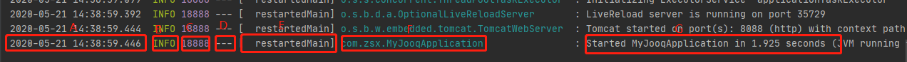

## 配置说明

### spring 默认配置：参考[链接](https://docs.spring.io/spring-boot/docs/current/reference/html/spring-boot-features.html#boot-features-logging)
* 
* A:日期和时间
* B:日志级别，分别有：ERROR、WARN、INFO、DEBUG、TRACE
* C:进程ID
* D 分隔符，后面的是日志消息
* E:线程的名称
* F:类名
* G:消息体
```
Date and Time: Millisecond precision and easily sortable.

Log Level: ERROR, WARN, INFO, DEBUG, or TRACE.

Process ID.

A --- separator to distinguish the start of actual log messages.

Thread name: Enclosed in square brackets (may be truncated for console output).

Logger name: This is usually the source class name (often abbreviated).

The log message.
```
* grok匹配
```
(?m)^%{TIMESTAMP_ISO8601:log_time}%{SPACE}%{LOGLEVEL:log_level}%{SPACE}%{NUMBER:pid}%{SPACE}---%{SPACE}%{SYSLOG5424SD:thread_name}%{SPACE}%{NOTSPACE:logger_name}%{SPACE}:%{SPACE}%{GREEDYDATA:log_msg}

(?m)^%{TIMESTAMP_ISO8601:log_time}%{SPACE}%{LOGLEVEL:log_level}%{SPACE}%{NUMBER:pid}%{SPACE}---%{SPACE}\[%{SPACE}%{USERNAME:thread_name}\]%{SPACE}%{USERNAME:logger_name}%{SPACE}:%{SPACE}%{GREEDYDATA:log_msg}
```


## ssl/tsl认证：

### 新建文件
* 1.在目录D:\usr\local\etc\elasticsearch\ssl-tls下分别创建4个文件
    * instance.yml
    * .env”
    * create-certs.yml
    * docker-compose.yml
* 2.instance.yml文件内容：
```
instances:
  - name: 'node1'
    dns: [ 'node1.elastic.test.com' ]
  - name: "node2"
    dns: [ 'node2.elastic.test.com' ]
  - name: 'my-kibana'
    dns: [ 'kibana.local' ]
  - name: 'logstash'
    dns: [ 'logstash.local' ]
```
* 2.1 [dns详细说明](https://docs.docker.com/config/containers/container-networking/)
* 2.2 dns配置(hosts文件：windows在C:\Windows\System32\drivers\etc目录下，Linux在/etc目录下)
```
127.0.0.1 kibana.local logstash.local
192.168.0.2 node1.elastic.test.com node1
192.168.0.3 node2.elastic.test.com node2
```
* 3.“.env”文件内容：
```
COMPOSE_PROJECT_NAME=es 
CERTS_DIR=/usr/share/elasticsearch/config/certificates 
ELASTIC_PASSWORD=1234
```
* 4.create-certs.yml文件内容：
```
version: '2.2'

services:
  create_certs:
    container_name: create_certs
    image: docker.elastic.co/elasticsearch/elasticsearch:7.7.0
    command: >
      bash -c '
        if [[ ! -f /certs/bundle.zip ]]; then
          bin/elasticsearch-certutil cert --silent --pem --in config/certificates/instances.yml -out /certs/bundle.zip;
          unzip /certs/bundle.zip -d /certs; 
        fi;
        chown -R 1000:0 /certs
      '
    user: "0"
    working_dir: /usr/share/elasticsearch
    volumes: ['certs:/certs', '.:/usr/share/elasticsearch/config/certificates']

volumes: {"certs"}
```
* 5.docker-compose.yml文件内容：
```
version: '2.2'

services:
  es01:
    container_name: es01
    image: docker.elastic.co/elasticsearch/elasticsearch:7.7.0
    environment:
      - node.name=es01
      - discovery.seed_hosts=es01,es02
      - cluster.initial_master_nodes=es01,es02
      - ELASTIC_PASSWORD=$ELASTIC_PASSWORD 
      - "ES_JAVA_OPTS=-Xms512m -Xmx512m"
      - xpack.license.self_generated.type=trial 
      - xpack.security.enabled=true
      - xpack.security.http.ssl.enabled=true
      - xpack.security.http.ssl.key=$CERTS_DIR/es01/es01.key
      - xpack.security.http.ssl.certificate_authorities=$CERTS_DIR/ca/ca.crt
      - xpack.security.http.ssl.certificate=$CERTS_DIR/es01/es01.crt
      - xpack.security.transport.ssl.enabled=true
      - xpack.security.transport.ssl.verification_mode=certificate 
      - xpack.security.transport.ssl.certificate_authorities=$CERTS_DIR/ca/ca.crt
      - xpack.security.transport.ssl.certificate=$CERTS_DIR/es01/es01.crt
      - xpack.security.transport.ssl.key=$CERTS_DIR/es01/es01.key
    volumes: ['data01:/usr/share/elasticsearch/data', 'certs:$CERTS_DIR']
    ports:
      - 9200:9200
    healthcheck:
      test: curl --cacert $CERTS_DIR/ca/ca.crt -s https://localhost:9200 >/dev/null; if [[ $$? == 52 ]]; then echo 0; else echo 1; fi
      interval: 30s
      timeout: 10s
      retries: 5

  es02:
    container_name: es02
    image: docker.elastic.co/elasticsearch/elasticsearch:7.7.0
    environment:
      - node.name=es02
      - discovery.seed_hosts=es01,es02
      - cluster.initial_master_nodes=es01,es02
      - ELASTIC_PASSWORD=$ELASTIC_PASSWORD
      - "ES_JAVA_OPTS=-Xms512m -Xmx512m"
      - xpack.license.self_generated.type=trial
      - xpack.security.enabled=true
      - xpack.security.http.ssl.enabled=true
      - xpack.security.http.ssl.key=$CERTS_DIR/es02/es02.key
      - xpack.security.http.ssl.certificate_authorities=$CERTS_DIR/ca/ca.crt
      - xpack.security.http.ssl.certificate=$CERTS_DIR/es02/es02.crt
      - xpack.security.transport.ssl.enabled=true
      - xpack.security.transport.ssl.verification_mode=certificate 
      - xpack.security.transport.ssl.certificate_authorities=$CERTS_DIR/ca/ca.crt
      - xpack.security.transport.ssl.certificate=$CERTS_DIR/es02/es02.crt
      - xpack.security.transport.ssl.key=$CERTS_DIR/es02/es02.key
    volumes: ['data02:/usr/share/elasticsearch/data', 'certs:$CERTS_DIR']

  wait_until_ready:
    image: docker.elastic.co/elasticsearch/elasticsearch:7.7.0
    command: /usr/bin/true
    depends_on: {"es01": {"condition": "service_healthy"}}

volumes: {"data01", "data02", "certs"}
```
* 6.生成证书：docker-compose -f create-certs.yml run --rm create_certs


Markdown[^1]