# <h1 style="text-align: center;"> ----------**问题集合**---------- </h1>


## <h2 style="text-align: center;"> ------------------**CURL**------------------ </h2>

### 问题：Perl: curl: (1) Protocol 'http not supported or disabled in libcurl
* 背景：在cmd命令窗口中，执行命令curl -XGET 'http://localhost:9200/metricbeat-*/_search?pretty'查看数据时报错
* 原因：windows中命令不支持单引号
* [参考链接](https://stackoverflow.com/questions/6684235/perl-curl-1-protocol-http-not-supported-or-disabled-in-libcurl)
* 解决：修改单引号为双引号
    * 执行命令curl -XGET "http://localhost:9200/metricbeat-*/_search?pretty"


## <h2 style="text-align: center;"> ------------------**CYGWIN**------------------ </h2>

### 问题： /bin/sh: pkg-config: 未找到命令
* 背景：cygwin下执行命令make && make install安装redis报错
* 解决：通过启动setup-x86_64.exe执行文件安装pkg-config


## <h2 style="text-align: center;"> ------------------**DOCKER**------------------ </h2>

### 问题：400 Bad Request 'json' or 'msgpack' parameter is required
* 背景：执行curl命令时报错
* 原因：win10下curl命令无法识别单引号
* 解决：
```
curl -X POST -d 'json={"json":"message"}' http://localhost:9880/sample.test
```
命令修改为(将单引号改为双引号，单引号内的双引号通过反斜杠\转义)
```
curl -X POST --data "json={\"msgpack\":\"message\"}" http://localhost:9880/sample.test
或
curl -X POST --header "Content-Type:application/json" --data-raw "{\"json\":{\"msgpack\": \"message\"}}" http://localhost:9880/sample.test
```

### 问题： Attempted to resurrect connection to dead ES instance, but got an error. {:url=>"http://127.0.0.1:9200/", :error_type=>LogStash::Outputs::ElasticSearch::HttpClient::Pool::HostUnreachableError, :error=>"Elasticsearch Unreachable: [http://127.0.0.1:9200/][Manticore::SocketException] Connection refused (Connection refused)"}
* 背景：win10下docker容器运行logstash镜像报错
* 原因：logstash.conf配置hosts地址错误
```logstash.conf
input { stdin { } }
output {
	elasticsearch { 
		hosts => ["127.0.0.1:9200"] 
		index => "zsx"  
		}
	stdout { codec => rubydebug }
}
```
* 解决方法：修改logstash.conf中hosts配置
```logstash.conf
input { stdin { } }
output {
	elasticsearch { 
        # 应该配置宿主机IP
		hosts => ["192.168.1.110:9200"] 
		index => "zsx"  
		}
	stdout { codec => rubydebug }
}
```

### 问题：Attempted to resurrect connection to dead ES instance, but got an error. {:url=>"http://elasticsearch:9200/", :error_type=>LogStash::Outputs::ElasticSearch::HttpClient::Pool::HostUnreachableError, :error=>"Elasticsearch Unreachable: [http://elasticsearch:9200/][Manticore::ResolutionFailure] elasticsearch: Name or service not known"}
* 背景：win10下docker容器运行logstash镜像报错
```docker
docker run --rm -it -v /d/usr/share/logstash/pipeline:/usr/share/logstash/pipeline -p 9600:9600 -p 5044:5044 logstash:7.6.2
```
* 原因：logstash镜像中logstash.yml默认配置为
```logstash.yml
http.host: "0.0.0.0"
xpack.monitoring.elasticsearch.hosts: [ "http://elasticsearch:9200" ]
```
* 解决：
    * 通过挂载修改容器logstash.yml文件配置
```logstash.yml
   http.host: "0.0.0.0"
```
    * 执行命令
```docker
docker run --rm -it -v /d/usr/share/logstash/config/logstash.yml:/usr/share/logstash/config/logstash.yml -v /d/usr/share/logstash/pipeline:/usr/share/logstash/pipeline -p 9600:9600 -p 5044:5044 logstash:7.6.2
```


### 问题： Error response from daemon: network redis-net not found
* 背景：通过shell脚本创建redis集群时报错[redis-node-start](../docker/cluster/redis/redis-node-start.sh)
* 解决：
    * 添加创建网络命令：docker network create redis-net


### 问题：Error response from daemon: Cannot restart container 2ce6c5824ea5: OCI runtime create failed: container with id exists: 2ce6c5824ea58491f9bcd4782d00061fb01bd2c1e51af3d4d3d52aa679b5cee5: unknown
* 背景：wsl2重启电脑后重启容器报错
* 解决：重启wsl2


### 问题：Error response from daemon: dial unix /mnt/wsl/docker-desktop/shared-sockets/guest-services/docker.sock: connect: no such file or directory
* 背景：wsl2中执行docker ps命令报错
* 解决：
    * 1.查看服务状态：sudo service docker status
    * 2.启动docker服务：sudo service docker start
* [参考链接](https://forums.docker.com/t/cannot-connect-to-the-docker-daemon-at-unix-var-run-docker-sock/80886/3)
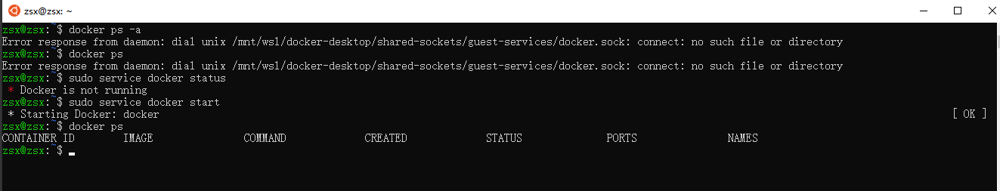


### 问题：Error response from daemon: Get https://registry-1.docker.io/v2/: net/http: request canceled while waiting for connection (Client.Timeout exceeded while awaiting headers)
* 背景：wsl2中docker拉取镜像时报错
* 解决：重启docker for windows


### 问题：Got permission denied while trying to connect to the Docker daemon socket at unix:///var/run/docker.sock
* 背景：win10下docker拉取镜像报错
* 原因：缺少权限
* 解决方法：sudo chmod 666 /var/run/docker.sock


### 问题：WSL distro stopped while waiting for Lifecycle server.
* 背景：win10开机启动docker for windows时报错
* 错误详情
```
WSL distro stopped while waiting for Lifecycle server.
  >Stdout:

  >Stderr:
2020/06/13 00:50:40 resolving /mnt/host/c/Program Files/Docker/Docker/resources/wsl/docker-wsl-cli.iso...
Error: mounting wslCLIDest: stat /mnt/host/c/Program Files/Docker/Docker/resources/wsl/docker-wsl-cli.iso: no such file or directory
2020/06/13 00:50:40 stat /mnt/host/c/Program Files/Docker/Docker/resources/wsl/docker-wsl-cli.iso: no such file or directory
mounting wslCLIDest
main.doRun
	/go/src/github.com/docker/pinata/linuxkit/pkg/wsl-bootstrap/main.go:224
main.run.func1
	/go/src/github.com/docker/pinata/linuxkit/pkg/wsl-bootstrap/main.go:83
github.com/docker/pinata/vendor/github.com/spf13/cobra.(*Command).execute
	/go/src/github.com/docker/pinata/vendor/github.com/spf13/cobra/command.go:762
github.com/docker/pinata/vendor/github.com/spf13/cobra.(*Command).ExecuteC
	/go/src/github.com/docker/pinata/vendor/github.com/spf13/cobra/command.go:852
github.com/docker/pinata/vendor/github.com/spf13/cobra.(*Command).Execute
	/go/src/github.com/docker/pinata/vendor/github.com/spf13/cobra/command.go:800
main.main
	/go/src/github.com/docker/pinata/linuxkit/pkg/wsl-bootstrap/main.go:25
runtime.main
	/usr/local/go/src/runtime/proc.go:203
runtime.goexit
	/usr/local/go/src/runtime/asm_amd64.s:1357
```
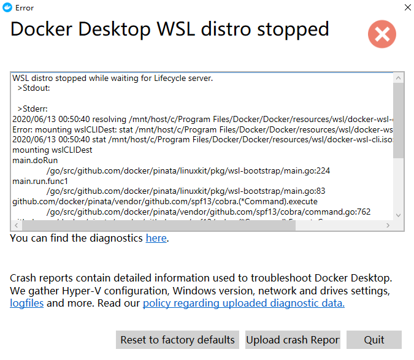
    * [参考链接](https://github.com/docker/for-win/issues/6812)
    * [参考链接](https://github.com/docker/for-win/issues/6822)
* 可能的解决：
    * In my case the problem was caused because the HyperV VM "DockerDesktopVM" was running. After shutting down the Docker Desktop VM works properly again through WSL2.


## <h2 style="text-align: center;"> ------------------**ES**------------------ </h2>


### caught exception while handling client http traffic, closing connection Netty4HttpChannel{localAddress=/192.168.1.110:9200, remoteAddress=/192.168.1.110:55185}
* 详情
```console
[2020-07-07T09:20:23,467][WARN ][o.e.h.AbstractHttpServerTransport] [node-1] caught exception while handling client http traffic, closing connection Netty4HttpChannel{localAddress=/192.168.1.110:9200, remoteAddress=/192.168.1.110:55185}
java.io.IOException: 杩滅▼涓绘満寮鸿揩鍏抽棴浜嗕竴涓幇鏈夌殑杩炴帴銆?
        at sun.nio.ch.SocketDispatcher.read0(Native Method) ~[?:?]
        at sun.nio.ch.SocketDispatcher.read(SocketDispatcher.java:43) ~[?:?]
        at sun.nio.ch.IOUtil.readIntoNativeBuffer(IOUtil.java:276) ~[?:?]
        at sun.nio.ch.IOUtil.read(IOUtil.java:233) ~[?:?]
        at sun.nio.ch.IOUtil.read(IOUtil.java:223) ~[?:?]
        at sun.nio.ch.SocketChannelImpl.read(SocketChannelImpl.java:358) ~[?:?]
        at org.elasticsearch.transport.CopyBytesSocketChannel.readFromSocketChannel(CopyBytesSocketChannel.java:141) ~[transport-netty4-client-7.7.1.jar:7.7.1]
        at org.elasticsearch.transport.CopyBytesSocketChannel.doReadBytes(CopyBytesSocketChannel.java:126) ~[transport-netty4-client-7.7.1.jar:7.7.1]
        at io.netty.channel.nio.AbstractNioByteChannel$NioByteUnsafe.read(AbstractNioByteChannel.java:148) [netty-transport-4.1.45.Final.jar:4.1.45.Final]
        at io.netty.channel.nio.NioEventLoop.processSelectedKey(NioEventLoop.java:714) [netty-transport-4.1.45.Final.jar:4.1.45.Final]
        at io.netty.channel.nio.NioEventLoop.processSelectedKeysPlain(NioEventLoop.java:615) [netty-transport-4.1.45.Final.jar:4.1.45.Final]
        at io.netty.channel.nio.NioEventLoop.processSelectedKeys(NioEventLoop.java:578) [netty-transport-4.1.45.Final.jar:4.1.45.Final]
        at io.netty.channel.nio.NioEventLoop.run(NioEventLoop.java:493) [netty-transport-4.1.45.Final.jar:4.1.45.Final]
        at io.netty.util.concurrent.SingleThreadEventExecutor$4.run(SingleThreadEventExecutor.java:989) [netty-common-4.1.45.Final.jar:4.1.45.Final]
        at io.netty.util.internal.ThreadExecutorMap$2.run(ThreadExecutorMap.java:74) [netty-common-4.1.45.Final.jar:4.1.45.Final]
        at java.lang.Thread.run(Thread.java:834) [?:?]
```
* 背景：重启metricbeat服务时，es报错
* 原因：重启过程中连接中断


### 问题：ElasticsearchStatusException[Elasticsearch exception [type=resource_not_found_exception, reason=Document not found [posts]/[_doc]/[1]]]
* 背景：junit5下运行整个测试类[ESUtilsTest](../../../src/test/java/com/zsx/utils/ESUtilsTest.java)，testGetIndexSourceDataById()方法报错
* 详情：
```console
ElasticsearchStatusException[Elasticsearch exception [type=resource_not_found_exception, reason=Document not found [posts]/[_doc]/[1]]
]
	at org.elasticsearch.rest.BytesRestResponse.errorFromXContent(BytesRestResponse.java:177)
	at org.elasticsearch.client.RestHighLevelClient.parseEntity(RestHighLevelClient.java:1897)
	at org.elasticsearch.client.RestHighLevelClient.parseResponseException(RestHighLevelClient.java:1867)
	at org.elasticsearch.client.RestHighLevelClient.internalPerformRequest(RestHighLevelClient.java:1624)
	at org.elasticsearch.client.RestHighLevelClient.performRequest(RestHighLevelClient.java:1596)
	at org.elasticsearch.client.RestHighLevelClient.performRequestAndParseEntity(RestHighLevelClient.java:1563)
	at org.elasticsearch.client.RestHighLevelClient.getSource(RestHighLevelClient.java:941)
	at com.zsx.utils.ESUtils.getIndexSourceDataById(ESUtils.java:300)
	at com.zsx.utils.ESUtilsTest.testGetIndexSourceDataById(ESUtilsTest.java:217)
	at java.base/jdk.internal.reflect.NativeMethodAccessorImpl.invoke0(Native Method)
	at java.base/jdk.internal.reflect.NativeMethodAccessorImpl.invoke(NativeMethodAccessorImpl.java:62)
	at java.base/jdk.internal.reflect.DelegatingMethodAccessorImpl.invoke(DelegatingMethodAccessorImpl.java:43)
	at java.base/java.lang.reflect.Method.invoke(Method.java:564)
	at org.junit.platform.commons.util.ReflectionUtils.invokeMethod(ReflectionUtils.java:686)
	at org.junit.jupiter.engine.execution.MethodInvocation.proceed(MethodInvocation.java:60)
	at org.junit.jupiter.engine.execution.InvocationInterceptorChain$ValidatingInvocation.proceed(InvocationInterceptorChain.java:131)
	at org.junit.jupiter.engine.extension.TimeoutExtension.intercept(TimeoutExtension.java:149)
	at org.junit.jupiter.engine.extension.TimeoutExtension.interceptTestableMethod(TimeoutExtension.java:140)
	at org.junit.jupiter.engine.extension.TimeoutExtension.interceptTestMethod(TimeoutExtension.java:84)
	at org.junit.jupiter.engine.execution.ExecutableInvoker$ReflectiveInterceptorCall.lambda$ofVoidMethod$0(ExecutableInvoker.java:115)
	at org.junit.jupiter.engine.execution.ExecutableInvoker.lambda$invoke$0(ExecutableInvoker.java:105)
	at org.junit.jupiter.engine.execution.InvocationInterceptorChain$InterceptedInvocation.proceed(InvocationInterceptorChain.java:106)
	at org.junit.jupiter.engine.execution.InvocationInterceptorChain.proceed(InvocationInterceptorChain.java:64)
	at org.junit.jupiter.engine.execution.InvocationInterceptorChain.chainAndInvoke(InvocationInterceptorChain.java:45)
	at org.junit.jupiter.engine.execution.InvocationInterceptorChain.invoke(InvocationInterceptorChain.java:37)
	at org.junit.jupiter.engine.execution.ExecutableInvoker.invoke(ExecutableInvoker.java:104)
	at org.junit.jupiter.engine.execution.ExecutableInvoker.invoke(ExecutableInvoker.java:98)
	at org.junit.jupiter.engine.descriptor.TestMethodTestDescriptor.lambda$invokeTestMethod$6(TestMethodTestDescriptor.java:212)
	at org.junit.platform.engine.support.hierarchical.ThrowableCollector.execute(ThrowableCollector.java:73)
	at org.junit.jupiter.engine.descriptor.TestMethodTestDescriptor.invokeTestMethod(TestMethodTestDescriptor.java:208)
	at org.junit.jupiter.engine.descriptor.TestMethodTestDescriptor.execute(TestMethodTestDescriptor.java:137)
	at org.junit.jupiter.engine.descriptor.TestMethodTestDescriptor.execute(TestMethodTestDescriptor.java:71)
	at org.junit.platform.engine.support.hierarchical.NodeTestTask.lambda$executeRecursively$5(NodeTestTask.java:135)
	at org.junit.platform.engine.support.hierarchical.ThrowableCollector.execute(ThrowableCollector.java:73)
	at org.junit.platform.engine.support.hierarchical.NodeTestTask.lambda$executeRecursively$7(NodeTestTask.java:125)
	at org.junit.platform.engine.support.hierarchical.Node.around(Node.java:135)
	at org.junit.platform.engine.support.hierarchical.NodeTestTask.lambda$executeRecursively$8(NodeTestTask.java:123)
	at org.junit.platform.engine.support.hierarchical.ThrowableCollector.execute(ThrowableCollector.java:73)
	at org.junit.platform.engine.support.hierarchical.NodeTestTask.executeRecursively(NodeTestTask.java:122)
	at org.junit.platform.engine.support.hierarchical.NodeTestTask.execute(NodeTestTask.java:80)
	at java.base/java.util.ArrayList.forEach(ArrayList.java:1510)
	at org.junit.platform.engine.support.hierarchical.SameThreadHierarchicalTestExecutorService.invokeAll(SameThreadHierarchicalTestExecutorService.java:38)
	at org.junit.platform.engine.support.hierarchical.NodeTestTask.lambda$executeRecursively$5(NodeTestTask.java:139)
	at org.junit.platform.engine.support.hierarchical.ThrowableCollector.execute(ThrowableCollector.java:73)
	at org.junit.platform.engine.support.hierarchical.NodeTestTask.lambda$executeRecursively$7(NodeTestTask.java:125)
	at org.junit.platform.engine.support.hierarchical.Node.around(Node.java:135)
	at org.junit.platform.engine.support.hierarchical.NodeTestTask.lambda$executeRecursively$8(NodeTestTask.java:123)
	at org.junit.platform.engine.support.hierarchical.ThrowableCollector.execute(ThrowableCollector.java:73)
	at org.junit.platform.engine.support.hierarchical.NodeTestTask.executeRecursively(NodeTestTask.java:122)
	at org.junit.platform.engine.support.hierarchical.NodeTestTask.execute(NodeTestTask.java:80)
	at java.base/java.util.ArrayList.forEach(ArrayList.java:1510)
	at org.junit.platform.engine.support.hierarchical.SameThreadHierarchicalTestExecutorService.invokeAll(SameThreadHierarchicalTestExecutorService.java:38)
	at org.junit.platform.engine.support.hierarchical.NodeTestTask.lambda$executeRecursively$5(NodeTestTask.java:139)
	at org.junit.platform.engine.support.hierarchical.ThrowableCollector.execute(ThrowableCollector.java:73)
	at org.junit.platform.engine.support.hierarchical.NodeTestTask.lambda$executeRecursively$7(NodeTestTask.java:125)
	at org.junit.platform.engine.support.hierarchical.Node.around(Node.java:135)
	at org.junit.platform.engine.support.hierarchical.NodeTestTask.lambda$executeRecursively$8(NodeTestTask.java:123)
	at org.junit.platform.engine.support.hierarchical.ThrowableCollector.execute(ThrowableCollector.java:73)
	at org.junit.platform.engine.support.hierarchical.NodeTestTask.executeRecursively(NodeTestTask.java:122)
	at org.junit.platform.engine.support.hierarchical.NodeTestTask.execute(NodeTestTask.java:80)
	at org.junit.platform.engine.support.hierarchical.SameThreadHierarchicalTestExecutorService.submit(SameThreadHierarchicalTestExecutorService.java:32)
	at org.junit.platform.engine.support.hierarchical.HierarchicalTestExecutor.execute(HierarchicalTestExecutor.java:57)
	at org.junit.platform.engine.support.hierarchical.HierarchicalTestEngine.execute(HierarchicalTestEngine.java:51)
	at org.junit.platform.launcher.core.DefaultLauncher.execute(DefaultLauncher.java:248)
	at org.junit.platform.launcher.core.DefaultLauncher.lambda$execute$5(DefaultLauncher.java:211)
	at org.junit.platform.launcher.core.DefaultLauncher.withInterceptedStreams(DefaultLauncher.java:226)
	at org.junit.platform.launcher.core.DefaultLauncher.execute(DefaultLauncher.java:199)
	at org.junit.platform.launcher.core.DefaultLauncher.execute(DefaultLauncher.java:132)
	at com.intellij.junit5.JUnit5IdeaTestRunner.startRunnerWithArgs(JUnit5IdeaTestRunner.java:69)
	at com.intellij.rt.junit.IdeaTestRunner$Repeater.startRunnerWithArgs(IdeaTestRunner.java:33)
	at com.intellij.rt.junit.JUnitStarter.prepareStreamsAndStart(JUnitStarter.java:230)
	at com.intellij.rt.junit.JUnitStarter.main(JUnitStarter.java:58)
	Suppressed: org.elasticsearch.client.ResponseException: method [GET], host [http://zsx-2.local:9200], URI [/posts/_source/1?routing=routing&realtime=false&_source_includes=message%2C*Date&preference=preference], status line [HTTP/1.1 404 Not Found]
{"error":{"root_cause":[{"type":"resource_not_found_exception","reason":"Document not found [posts]/[_doc]/[1]"}],"type":"resource_not_found_exception","reason":"Document not found [posts]/[_doc]/[1]"},"status":404}
		at org.elasticsearch.client.RestClient.convertResponse(RestClient.java:283)
		at org.elasticsearch.client.RestClient.performRequest(RestClient.java:261)
		at org.elasticsearch.client.RestClient.performRequest(RestClient.java:235)
		at org.elasticsearch.client.RestHighLevelClient.internalPerformRequest(RestHighLevelClient.java:1611)
		... 68 more
``` 
* 原因：在构建GetSourceRequest时，设置了realtime为false，禁用了实时获取数据
    * getSourceRequest.realtime(false);
    * In order to disable realtime GET, the realtime parameter can be set to false
* [realtime参考链接](https://www.elastic.co/guide/en/elasticsearch/reference/current/docs-get.html)
* 解决：取消realtime设置


### 问题：has been blocked by CORS policy: No 'Access-Control-Allow-Origin' header is present on the requested resource.
* 背景：elasticsearch无法连接到http://localhost:9200
* 解决：elasticsearch的配置文件elasticsearch.yml中新增配置
```
# elasticsearch-head插件访问需要配置
http.cors.enabled: true
http.cors.allow-origin: "*"
```
* 参考链接：[链接](https://github.com/mobz/elasticsearch-head#enable-cors-in-elasticsearch)


### 问题：max virtual memory areas vm.max_map_count [65530] is too low, increase to at least [262144]
* 背景：ubuntu下elasticsearch容器启动后自动退出
* 解决：
    * 1.在/etc/sysctl.conf文件中添加vm.max_map_count=262144
    * 2.执行命令重新加载配置：sudo sysctl --system


### 问题：vendor.js:7829 POST http://localhost:9200/_all/_search 406 (Not Acceptable)
* 背景：elasticsearch-head查看数据时报406错误码
* 解决
```
1、进入head安装目录；docker exec -it elasticsearch-head bash
2、打开文件夹_site，cd _site/
3、编辑vendor.js  共有两处
* 6886行   contentType: "application/x-www-form-urlencoded
改成
contentType: "application/json;charset=UTF-8"
* 7573行 var inspectData = s.contentType === "application/x-www-form-urlencoded" &&
改成
var inspectData = s.contentType === "application/json;charset=UTF-8" &&
```


## <h2 style="text-align: center;"> ------------------**IDEA**------------------ </h2>

### 问题：
* 详情：Passed value of header "Host" is not allowed. Please contact your license server administrator.
* 原因：That's because the license server is running behind a reverse proxy. Please configure virtual hosts using the JLS_VIRTUAL_HOSTS variable.


## <h2 style="text-align: center;"> ------------------**JDK**------------------ </h2>

### 问题：Could not target platform: 'Java SE 14' using tool chain: 'JDK 11 (11)'.
* 解决方法：
    * [步骤一](../img/jdk/jdk-setting-1.jpg)
    * [步骤二](../img/jdk/jdk-setting-2.jpg)
    * [步骤三](../img/jdk/jdk-setting-3.jpg)
    * [步骤四](../img/jdk/jdk-setting-4.jpg)


### 问题： Process 'command 'E:\jdk\jdk-14.0.1\bin\java.exe'' finished with non-zero exit value -1
* 原因：配置了properties属性
```
jdbc {
    driver = 'org.postgresql.Driver'
    url = 'jdbc:postgresql://localhost:5432/my-jooq'
    user = 'postgres'
    password = '1234'
    properties {
        property {
            key = 'ssl'
            value = 'true'
        }
    }
}
```
* 解决方法：移除该属性值配置
```
jdbc {
    driver = 'org.postgresql.Driver'
    url = 'jdbc:postgresql://localhost:5432/my-jooq'
    user = 'postgres'
    password = '1234'
}
```


## <h2 style="text-align: center;"> ------------------**JOOQ**------------------ </h2>

### 问题：Could not get unknown property 'generateMyJooqSchemaSource' for task set of type org.gradle.api.internal.tasks.DefaultTaskContainer
* 任务名称不正确，修改为跟jooq插件名称一致
* [任务名称不正确](../img/jooq-1.jpg)


## <h2 style="text-align: center;"> ------------------**JUNIT**------------------ </h2>

### 问题：Found multiple occurrences of org.json.JSONObject on the class path
* 背景：junit测试时报错
* 详情
```console
Found multiple occurrences of org.json.JSONObject on the class path:

	jar:file:/E:/gradle/gradle-5.6.4/caches/modules-2/files-2.1/org.json/json/20200518/41a767de4bde8f01d53856b905c49b2db8862f13/json-20200518.jar!/org/json/JSONObject.class
	jar:file:/E:/gradle/gradle-5.6.4/caches/modules-2/files-2.1/com.vaadin.external.google/android-json/0.0.20131108.vaadin1/fa26d351fe62a6a17f5cda1287c1c6110dec413f/android-json-0.0.20131108.vaadin1.jar!/org/json/JSONObject.class

You may wish to exclude one of them to ensure predictable runtime behavior
```
* 解决：
```build.gradle
testCompile("org.springframework.boot:spring-boot-starter-test") {
    exclude group: "com.vaadin.external.google", module:"android-json"
}
```

### 问题：java.lang.NoClassDefFoundError: org/junit/platform/commons/util/ClassNamePatternFilterUtils
* 背景：junit5测试时报错
* 详情
```console
java.lang.NoClassDefFoundError: org/junit/platform/commons/util/ClassNamePatternFilterUtils

	at org.junit.jupiter.engine.config.DefaultJupiterConfiguration.getExecutionConditionFilter(DefaultJupiterConfiguration.java:86)
	at org.junit.jupiter.engine.config.CachingJupiterConfiguration.lambda$getExecutionConditionFilter$5(CachingJupiterConfiguration.java:79)
	at java.base/java.util.concurrent.ConcurrentHashMap.computeIfAbsent(ConcurrentHashMap.java:1708)
	at org.junit.jupiter.engine.config.CachingJupiterConfiguration.getExecutionConditionFilter(CachingJupiterConfiguration.java:78)
	at org.junit.jupiter.engine.execution.ConditionEvaluator.evaluate(ConditionEvaluator.java:54)
	at org.junit.jupiter.engine.descriptor.JupiterTestDescriptor.shouldBeSkipped(JupiterTestDescriptor.java:202)
	at org.junit.jupiter.engine.descriptor.JupiterTestDescriptor.shouldBeSkipped(JupiterTestDescriptor.java:57)
	at org.junit.platform.engine.support.hierarchical.NodeTestTask.lambda$checkWhetherSkipped$2(NodeTestTask.java:115)
	at org.junit.platform.engine.support.hierarchical.ThrowableCollector.execute(ThrowableCollector.java:73)
	at org.junit.platform.engine.support.hierarchical.NodeTestTask.checkWhetherSkipped(NodeTestTask.java:115)
	at org.junit.platform.engine.support.hierarchical.NodeTestTask.execute(NodeTestTask.java:77)
	at java.base/java.util.ArrayList.forEach(ArrayList.java:1510)
	at org.junit.platform.engine.support.hierarchical.SameThreadHierarchicalTestExecutorService.invokeAll(SameThreadHierarchicalTestExecutorService.java:38)
	at org.junit.platform.engine.support.hierarchical.NodeTestTask.lambda$executeRecursively$5(NodeTestTask.java:139)
	at org.junit.platform.engine.support.hierarchical.ThrowableCollector.execute(ThrowableCollector.java:73)
	at org.junit.platform.engine.support.hierarchical.NodeTestTask.lambda$executeRecursively$7(NodeTestTask.java:125)
	at org.junit.platform.engine.support.hierarchical.Node.around(Node.java:135)
	at org.junit.platform.engine.support.hierarchical.NodeTestTask.lambda$executeRecursively$8(NodeTestTask.java:123)
	at org.junit.platform.engine.support.hierarchical.ThrowableCollector.execute(ThrowableCollector.java:73)
	at org.junit.platform.engine.support.hierarchical.NodeTestTask.executeRecursively(NodeTestTask.java:122)
	at org.junit.platform.engine.support.hierarchical.NodeTestTask.execute(NodeTestTask.java:80)
	at org.junit.platform.engine.support.hierarchical.SameThreadHierarchicalTestExecutorService.submit(SameThreadHierarchicalTestExecutorService.java:32)
	at org.junit.platform.engine.support.hierarchical.HierarchicalTestExecutor.execute(HierarchicalTestExecutor.java:57)
	at org.junit.platform.engine.support.hierarchical.HierarchicalTestEngine.execute(HierarchicalTestEngine.java:51)
	at org.junit.platform.launcher.core.DefaultLauncher.execute(DefaultLauncher.java:248)
	at org.junit.platform.launcher.core.DefaultLauncher.lambda$execute$5(DefaultLauncher.java:211)
	at org.junit.platform.launcher.core.DefaultLauncher.withInterceptedStreams(DefaultLauncher.java:226)
	at org.junit.platform.launcher.core.DefaultLauncher.execute(DefaultLauncher.java:199)
	at org.junit.platform.launcher.core.DefaultLauncher.execute(DefaultLauncher.java:132)
	at com.intellij.junit5.JUnit5IdeaTestRunner.startRunnerWithArgs(JUnit5IdeaTestRunner.java:69)
	at com.intellij.rt.junit.IdeaTestRunner$Repeater.startRunnerWithArgs(IdeaTestRunner.java:33)
	at com.intellij.rt.junit.JUnitStarter.prepareStreamsAndStart(JUnitStarter.java:230)
	at com.intellij.rt.junit.JUnitStarter.main(JUnitStarter.java:58)
Caused by: java.lang.ClassNotFoundException: org.junit.platform.commons.util.ClassNamePatternFilterUtils
	at java.base/jdk.internal.loader.BuiltinClassLoader.loadClass(BuiltinClassLoader.java:602)
	at java.base/jdk.internal.loader.ClassLoaders$AppClassLoader.loadClass(ClassLoaders.java:178)
	at java.base/java.lang.ClassLoader.loadClass(ClassLoader.java:522)
	... 33 more
```
* [参考链接](https://github.com/junit-team/junit5/issues/1773)
* 原因：引入的包冲突
* 解决：
    * 依赖
```build.gradle
testImplementation group: 'org.junit.jupiter', name: 'junit-jupiter-engine', version: '5.7.0-M1'
testImplementation group: 'org.junit.vintage', name: 'junit-vintage-engine', version: '5.7.0-M1'
testImplementation group: 'org.junit.jupiter', name: 'junit-jupiter-api', version: '5.7.0-M1'
testImplementation group: 'org.junit.jupiter', name: 'junit-jupiter-params', version: '5.7.0-M1'
testImplementation group: 'junit', name: 'junit', version: '4.13'
testImplementation group: 'org.junit.platform', name: 'junit-platform-launcher', version: '1.7.0-M1'
```
* 替换为
```build.gradle
testImplementation group: 'org.junit.jupiter', name: 'junit-jupiter', version: '5.7.0-M1'
```


## <h2 style="text-align: center;"> ------------------**KAFKA**------------------ </h2>

### 问题：this node is not a swarm manager. Use "docker swarm init" or "docker swarm join" to connect this node to swarm and try again
* 背景：使用docker-compose命令启动kafka集群报错
* 解决：docker swarm init


## <h2 style="text-align: center;"> ------------------**KIBANA**------------------ </h2>

### 问题：FATAL  Error: [config validation of [elasticsearch].url]: definition for this key is missing
* 背景：启动kibana报错
* 原因：elasticsearch.url已改名为elasticsearch.hosts


### 问题：FATAL CLI ERROR YAMLException: can not read a block mapping entry; a multiline key may not be an implicit key at line 13, column 41
* 背景：kibana配置x-pack，通过docker-compose创建kibana时报错
* 详情：
```log
FATAL CLI ERROR YAMLException: can not read a block mapping entry; a multiline key may not be an implicit key at line 13, column 41:
     ... earch.ssl.certificateAuthorities: ["${CERTS_DIR_KIBANA}/ca/ca.crt"]
                                         ^
    at generateError (/usr/share/kibana/node_modules/js-yaml/lib/js-yaml/loader.js:167:10)
    at throwError (/usr/share/kibana/node_modules/js-yaml/lib/js-yaml/loader.js:173:9)
    at readBlockMapping (/usr/share/kibana/node_modules/js-yaml/lib/js-yaml/loader.js:1073:9)
    at composeNode (/usr/share/kibana/node_modules/js-yaml/lib/js-yaml/loader.js:1359:12)
    at readDocument (/usr/share/kibana/node_modules/js-yaml/lib/js-yaml/loader.js:1519:3)
    at loadDocuments (/usr/share/kibana/node_modules/js-yaml/lib/js-yaml/loader.js:1575:5)
    at load (/usr/share/kibana/node_modules/js-yaml/lib/js-yaml/loader.js:1596:19)
    at safeLoad (/usr/share/kibana/node_modules/js-yaml/lib/js-yaml/loader.js:1618:10)
    at readYaml (/usr/share/kibana/src/core/server/config/read_config.js:34:47)
    at getConfigFromFiles (/usr/share/kibana/src/core/server/config/read_config.js:66:18)
    at RawConfigService.loadConfig (/usr/share/kibana/src/core/server/config/raw_config_service.js:51:70)
    at bootstrap (/usr/share/kibana/src/core/server/bootstrap.js:61:20)
    at Command.<anonymous> (/usr/share/kibana/src/cli/serve/serve.js:195:33)
    at Command.<anonymous> (/usr/share/kibana/src/cli/command.js:111:20)
    at Command.listener (/usr/share/kibana/node_modules/commander/index.js:291:8)
    at Command.emit (events.js:198:13)

```
* 解决：重启kibana容器
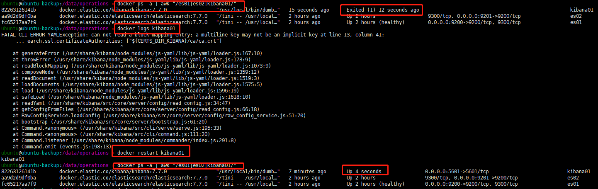

### 问题：Kibana server is not ready yet
* 背景：通过浏览器查看kibana时报错
* 原因1：浏览器没有缓过来
    * 解决：刷新浏览器
* 原因2：kibana.yml中的elasticsearch.hosts配置错误，默认为http://elasticsearch:9200
    * 解决：
        * 修改正确配置
        * http://{ip}:9200
* 原因3：es配置了http.ssl认证，kibana未指定用于 Elasticsearch 实例的 PEM 证书文件路径
    * elasticsearch.ssl.certificateAuthorities: ["${CERTS_DIR_KIBANA}/ca/ca.crt"]

### 问题：No cached mapping for this field / refresh of fields not working
* 解决：
    * 进入[kibana管理界面](http://localhost:5601/)
    * 选择Management-》Index Patterns-》从列表中选择index pattern-》点击refresh按钮
    * 


### 问题：Timelion不再出现在侧面导航中编辑
* 解决
    * 影响：要创建Timelion可视化，请转到“可视化”，然后从可视化类型中选择“ Timelion ”
    * 如果想在侧面导航中重新添加Timelion，在kibana.yml文件中设置timelion.ui.enabled为true
* 参考：https://www.elastic.co/guide/en/kibana/7.x/breaking-changes-7.0.html


### 问题：Timelion not showing any data
```原配置
.es(index=test-facility-metrics-host-*,
    timefield=@timestamp,
    metric=max:system.network.in.bytes)
```
* 参考：https://discuss.elastic.co/t/timelion-not-displaying/115503
* 原因：默认图表中的线需要两个点，每个线段一个起点，一个终点。 
    * 如果9:26-9:28存储桶中有数据，而9:28-9:30存储桶中没有数据，则timelion无法画线
* 解决：添加.fit(mode = nearest)
```修改后配置
.es(index=test-facility-metrics-host-*,
    timefield=@timestamp,
    metric=max:system.network.in.bytes)
.fit(mode = nearest)
```

## <h2 style="text-align: center;"> ------------------**LOG**------------------ </h2>

### 问题
* 详情：You might be seeing this error because you're using the wrong Compose file version
```
ERROR: Version in ".\create-certs.yml" is unsupported. You might be seeing this error because you're using the wrong Compose file version. Either specify a supported version (e.g "2.2"
 or "3.3") and place your service definitions under the `services` key, or omit the `version` key and place your service definitions at the root of the file to use version 1.
For more on the Compose file format versions, see https://docs.docker.com/compose/compose-file/
```
* 背景：win10下使用docker-compose3.8版本报错
    * Docker version 19.03.8,
    * docker-compose version 1.25.4
* 原因：docker-compose版本等级不够，注：docker 19.03.0+、docker-compose 1.25.5+
* 解决：升级docker-compose到1.25.5
    * 1. 打开PowerShell
    * 2. 执行命令：
    ```
    Invoke-WebRequest "https://github.com/docker/compose/releases/download/1.25.5/docker-compose-Windows-x86_64.exe" -UseBasicParsing -OutFile $Env:ProgramFiles\Docker\Docker\resources\bin\docker-compose.exe
    ```
* 参考：
    * [docker-version](https://docs.docker.com/compose/compose-file/#volume-configuration-reference)
    * [docker-compose-version](https://github.com/docker/compose/releases/)


## <h2 style="text-align: center;"> ------------------**LOGSTASH**------------------ </h2>

### 问题：Could not execute action: PipelineAction::Create
* 问题详情：
```
][ERROR][logstash.agent           ] Failed to execute action {:id=>:main, :action_type=>LogStash::ConvergeResult::FailedAction, :message=>"Could not execu
te action: PipelineAction::Create<main>, action_result: false", :backtrace=>nil}
```
* 问题背景：logstash用filebeat收集日志时，logstash.conf文件中配置了codec为多行，logstash启动后自动退出
```
beats {
    port => 5044
    type => "filebeat"
    codec => multiline {
        pattern => "^(%{TIMESTAMP_ISO8601})"
        negate => true
        what => "previous"
    }
}
```
* 解决：注释掉logstash.conf文件中的codec配置，在filebeat.yml中添加多行匹配
```
filebeat.inputs:
- type: log
  enabled: true
  paths:
    - /usr/share/filebeat/logs/*.log
  # 自定义属性
  fields:
    env: test
  # 设置为true，则自定义env字段将作为顶级字段存储在输出文档中，而不是分组在fields子词典下
  fields_under_root: true
  
  # 多行合并参数，正则表达式，匹配时间格式：2020-05-25 03:39:08.167
  multiline.pattern: '^\d{4}-\d{2}-\d{2}\s\d{2}:\d{2}:\d{2}.\d{3}'
  # true 或 false；默认是false，匹配pattern的行合并；true，不匹配pattern的行合并
  multiline.negate: true
  # after 或 before，合并到上一行的末尾或下一行的开头
  multiline.match: after
```


### 问题： Don't know how to handle `Java::JavaLang::IllegalStateException
* 问题详情
```
[FATAL][logstash.runner          ] An unexpected error occurred! {:error=>#<LogStash::Error: Don't know how to handle `Java::JavaLang::IllegalStateException` for `PipelineAction::C
reate<main>`>, :backtrace=>["org/logstash/execution/ConvergeResultExt.java:109:in `create'", "org/logstash/execution/ConvergeResultExt.java:37:in `add'", "/usr/share/logstash/logstash-core/lib/logstash/age
nt.rb:339:in `block in converge_state'"]}
```
* 问题背景：在logstash.conf中添加了filter功能后，重启logstash失败
```
filter {
   multiline {
      pattern => "^(%{TIMESTAMP_ISO8601})"
      negate => true
      what => "previous"
   }
   grok {
      # Do multiline matching with (?m) as the above mutliline filter may add newlines to the log messages.
      match => [ "message", "(?m)^%{TIMESTAMP_ISO8601:log_time}%{SPACE}%{LOGLEVEL:log_level}%{SPACE}%{NUMBER:pid}%{SPACE}---%{SPACE}%{SYSLOG5424SD:thread_name}%{SPACE}%{NOTSPACE:logger_name}%{SPACE}:%{SPACE}%{GREEDYDATA:log_msg}" ]
   }
}
```
* 原因：logstash容器没有安装logstash-filter-multiline插件
* 解决：
    * 安装logstash-filter-multiline插件：logstash-plugin install logstash-filter-multiline


### 问题：Logstash not reading file in windows
* 参考地址：[链接](https://discuss.elastic.co/t/logstash-not-reading-file-in-windows/41723 "链接")


### 问题：Logstash接收不到udp/tcp发送的数据
* 背景：用python脚本编写了udp/tcp服务器端与客户端，并启动了服务器端与客户端
* 原因：消息优先被发送到服务端了，Logstash监听的端口无法收到数据
* 解决：只能启动客户端，不能启动服务端


## <h2 style="text-align: center;"> ------------------**METRICBEAT**------------------ </h2>

### 问题：ERROR: for metricbeat  Cannot create container for service metricbeat: dial unix /mnt/wsl/docker-desktop/shared-sockets/guest-services/docker.sock: connect: no such file or directory
* 背景：ws2下通过shell脚本执行docker-compose.yml文件启动metricbeat容器时报错
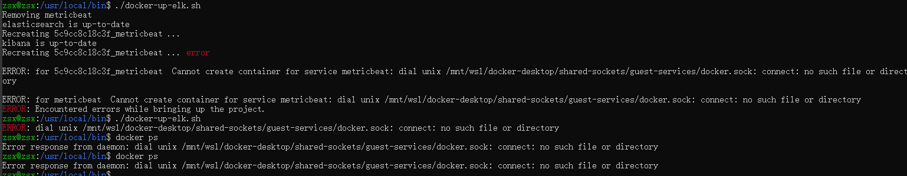
* 解决：
    * 步骤1：修复docker
        * 由于此处使用的docker for windows作为wsl2的docker容器，从图片当中可以看出此处docker命令已经失效，
            * 首先尝试重启docker for windows
            * 其次尝试重启wsl2后，再重启docker for windows
            * 最后再尝试重启电脑
        * 如果此处使用的是wsl2中单独安装的docker容器，那么此处重启wsl2中的docker服务
    * 步骤2：以root用户执行shell脚本
        * sudo -S ./docker-up.sh


### 问题：ERROR: for metricbeat  Cannot start service metricbeat: cgroups: cannot find cgroup mount destination: unknown
* 背景：ws2下通过shell脚本执行docker-compose.yml文件启动metricbeat容器时报错
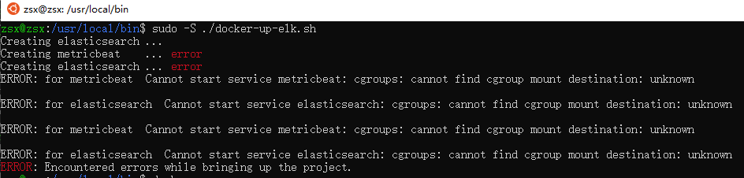
* [参考链接](https://github.com/microsoft/WSL/issues/4189)
* 解决：
    * sudo mkdir /sys/fs/cgroup/systemd
    * sudo mount -t cgroup -o none,name=systemd cgroup /sys/fs/cgroup/systemd


### 问题：Error in modules manager: modules management requires 'metricbeat.config.modules.path' setting
* 进入metricbeat容器内部，执行命令metricbeat modules list查看启用和禁用的模块时报错
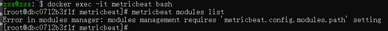


### 问题：Exiting: 1 error: metricset 'system/load' not found
* 背景：win10下运行metricbeat后自动停止
* 原因： on Windows the system/load metricset is not supported
* 解决：取消 system/load 指标数据收集


### 问题：Exiting: error loading config file: config file ("metricbeat.yml") must be owned by the user identifier (uid=0) or root
* 背景：docker容器启动metricbeat时报错
* 原因：文件拥有者的问题
* [参考链接](https://www.elastic.co/guide/en/beats/libbeat/7.8/config-file-permissions.html)
* 解决：
    * 方法1：直接修改配置文件metricbeat.yml权限拥有者为root用户
    * 方法2：禁用严格权限检查（一般不推荐）
        * command: ["--strict.perms=false"]


### 问题：Exiting: error loading config file: config file ("metricbeat.yml") can only be writable by the owner but the permissions are "-rwxrwxr-x" (to fix the permissions use: 'chmod go-w /usr/share/metricbeat/metricbeat.yml')
* 背景：docker容器启动metricbeat时报错
* 原因：文件写的权限问题
* [参考链接](https://www.elastic.co/guide/en/beats/libbeat/7.8/config-file-permissions.html)
* 解决：
    * 方法1：直接修改配置文件metricbeat.yml读写权限，只让拥有者有写的权限
    * 方法2：禁用严格权限检查（一般不推荐）
        * command: ["--strict.perms=false"]


### 问题：Exiting: no metricsets configured for module 'http'
* 背景：wsl2中使用docker启动metricbeat的http模块时报错
* 原因：metricbeat的http模块在modules.d中默认是被禁用的
    * but you won’t be able to use the modules command to enable and disable configurations because the command requires the modules.d layout
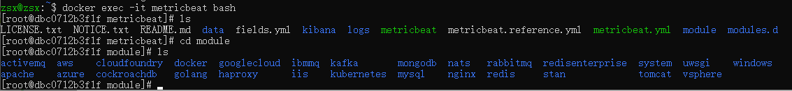
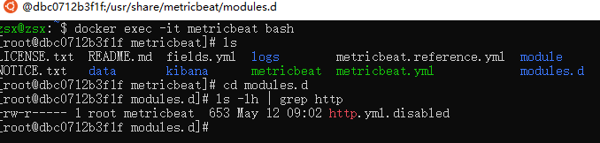
* 解决：添加收集指标配置
```
  - module: http
    period: 10s
    hosts: ["localhost:8000"]
    namespace: "json_namespace"
    path: "/api"
```
* 修改为
```
  - module: http
    metricsets:
     - json
    period: 10s
    hosts: ["localhost:8000"]
    namespace: "json_namespace"
    path: "/api"
```


### 问题：Got permission denied while trying to connect to the Docker daemon socket at unix:///var/run/docker.sock: Get http://%2Fvar%2Frun%2Fdocker.sock/v1.24/info: dial unix /var/run/docker.sock: connect: permission denied
* 背景：metricbeat收集docker容器指标时提示错误
* [参考链接](https://discuss.elastic.co/t/how-to-use-metricbeat-docker-module-in-docker-swarm/103019/3)
* [参考链接](https://discuss.elastic.co/t/trouble-running-metricbeat-5-3-0-with-docker-module/82204)
* [参考链接](https://discuss.elastic.co/t/issue-with-metricbeat-docker-container/109525)
* [参考链接](https://github.com/elastic/beats/issues/7526)
* 解决：
    * 方法1：使用文件系统ACL对Metricbeat用户授予的显式访问权限(未验证成功)
        * setfacl -m u:1000:rw /var/run/docker.sock
        * 1.查看文件系统(从图片可以看出为ext4文件系统，支持ACL):
            * df -T
        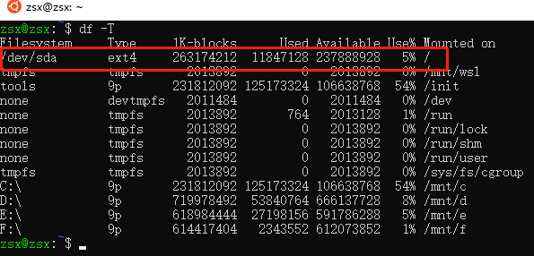
        * 2.查看是否支持ACL: 
            * sudo tune2fs -l /dev/sda* |grep "Default mount options:"
        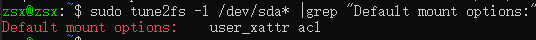
        * 3.切换为root用户: 
            * sudo -s
        * 4.查看文件系统信息：
            * dumpe2fs -h /dev/sda*
        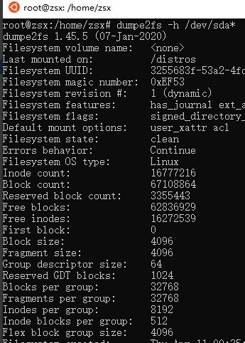
        * 5.获取文件或目录的ACL设置信息:
            * getfacl /var/run/docker.sock
        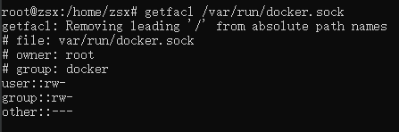
        * 6.设置文件或目录的ACL设置信息:
            * setfacl -m u:123:rw /var/run/docker.sock
        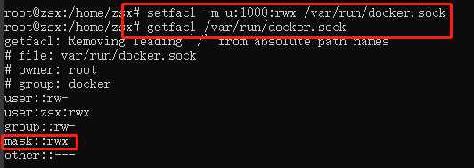
        * 7.重启容器
            * docker restart metricbeat
    * 方法2：修改权限
        * sudo chmod 666 /var/run/docker.sock
    * 方法3：给容器指定root用户
```docker-compose.yml修改前
version: '3'

services:
  metricbeat:
    image: elastic/metricbeat:7.7.0
    container_name: metricbeat
    command: ["--strict.perms=false"]
    volumes:
      - ${PWD}/config/metricbeat.yml:/usr/share/metricbeat/metricbeat.yml
      - /var/run/docker.sock:/var/run/docker.sock:ro
      - /sys/fs/cgroup:/hostfs/sys/fs/cgroup:ro
      - /proc:/hostfs/proc:ro
      - /:/hostfs:ro
      - /etc/timezone:/etc/timezone:ro
      - /etc/localtime:/etc/localtime:ro
```
```docker-compose.yml修改后
version: '3'

services:
  metricbeat:
    image: elastic/metricbeat:7.7.0
    user: root
    container_name: metricbeat
    command: ["--strict.perms=false"]
    volumes:
      - ${PWD}/config/metricbeat.yml:/usr/share/metricbeat/metricbeat.yml
      - /var/run/docker.sock:/var/run/docker.sock:ro
      - /sys/fs/cgroup:/hostfs/sys/fs/cgroup:ro
      - /proc:/hostfs/proc:ro
      - /:/hostfs:ro
      - /etc/timezone:/etc/timezone:ro
      - /etc/localtime:/etc/localtime:ro
```

### 问题：failed to get docker stats: Got permission denied while trying to connect to the Docker daemon socket at unix:///var/run/docker.sock: Get http://%2Fvar%2Frun%2Fdocker.sock/v1.24/containers/json?limit=0: dial unix /var/run/docker.sock: connect: permission denied
* 背景：由于docker使用了命名空间管理，已经在docker-compose.yml文件中配置了root用户，metricbeat收集docker容器指标时仍提示错误
* 原因：进入metricbeat容器内部，查看/var/run/docker.sock权限不属于root
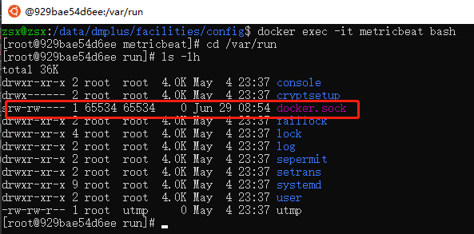
* 解决
    * 方法1：修改/var/run/docker.sock权限为666，重启容器metricbeat
    * 方法2：修改/var/run/docker.sock拥有者为165536，重启容器metricbeat
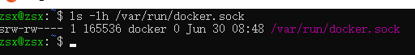
        * 再次进入容器内部查看
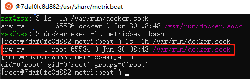


### 问题：Start-Service : 由于以下错误无法启动服务“metricbeat (metricbeat)”: 无法启动计算机“.”上的服务 metricbeat。
* 背景：win10下使用PowerShell设置metricbeat为服务后，使用命令Start-Service metricbeat启动metricbeat报错
* 详情：
```console
Start-Service : 由于以下错误无法启动服务“metricbeat (metricbeat)”: 无法启动计算机“.”上的服务 metricbeat。
所在位置 行:1 字符: 1
+ Start-Service metricbeat
+ ~~~~~~~~~~~~~~~~~~~~~~~~
    + CategoryInfo          : OpenError: (System.ServiceProcess.ServiceController:ServiceController) [Start-Service],
   ServiceCommandException
    + FullyQualifiedErrorId : CouldNotStartService,Microsoft.PowerShell.Commands.StartServiceCommand
```
* 解决：
    * 重新执行命令：Start-Service metricbeat
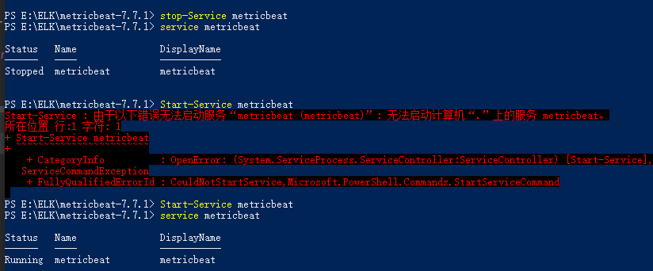


## <h2 style="text-align: center;"> ------------------**PYTHON**------------------ </h2>

### 问题
* 详情
```
b'A request was sent to this URL (http://localhost:8088/user) but a redirect was issued automatically by the routing system to "http://localhost:8088/user/".  The URL was defined with a trailing slash so Flask will automatically redirect to the URL with the trailing slash if it was accessed without one.  Make sure to directly send your POST-request to this URL since we can\'t make browsers or HTTP clients redirect with form data reliably or without user interaction.\n\nNote: this exception is only raised in debug mode'
```
* 背景：通过postman，执行http://localhost:8088/user发送post请求时报错
* 解决(注：末尾斜杠)：http://localhost:8088/user/


## <h2 style="text-align: center;"> ------------------**POSTGRES**------------------ </h2>


### 问题：Error: You must install at least one postgresql-client-<version> package
* 背景：使用psql命令连接postgres数据库时报错
* 解决：
    * 不指定版本安装：sudo apt install postgresql-client


### 问题：FATAL:  data directory "/var/lib/postgresql/data" has wrong ownership
* 详情：
```log
2020-05-28 03:49:42.637 UTC [82] HINT:  The server must be started by the user that owns the data directory.
postgres   | child process exited with exit code 1
postgres   | initdb: removing contents of data directory "/var/lib/postgresql/data"
postgres exited with code 1

```
* 背景：win10下docker 启动postgres容器报错
```docker-compose-postgres.yml
version: '3.1'

services:
  # 服务器名
  db:
    image: postgres:13
    container_name: postgres
    # restart: always
    command: -c 'config_file=/etc/postgresql/postgresql.conf'
    volumes:
        - /d/usr/share/postgresql/data:/var/lib/postgresql/data
        - /d/usr/share/postgresql/log:/var/log/postgresql
        # # 配置文件默认路径 /var/lib/postgresql/data/postgresql.conf
        - /d/usr/share/postgresql/my-postgres.conf:/etc/postgresql/postgresql.conf
    environment:
      POSTGRES_USER: test
      POSTGRES_PASSWORD: test
      # POSTGRES_DB: test
    ports:
      - 5433:5432
      
  adminer:
    image: adminer:4.7.7-standalone
    container_name: adminer
    # restart: always
    ports:
      - 8080:8080
volumes:
  pgdata:
     external: true

```
* 原因：postgres必须以目录的所有者身份运行（无论读写是否成功），并且不能以root身份运行
* 解决：
    * 1.手动创建数据卷：docker volume create --name=pgdata
    * 2.挂载数据卷部分修改
    ```
    - /d/usr/share/postgresql/data:/var/lib/postgresql/data
    修改为：
    - pgdata:/var/lib/postgresql/data
    ```
    * 3.文件末尾部分声明数据卷外部可用
    ```
    volumes:
      pgdata:
         external: true
    ```
    * 修改后的文件内容如下
    ``` docker-compose-postgres.yml
    version: '3.1'
    
    services:
      # 服务器名
      db:
        image: postgres:13
        container_name: postgres
        # restart: always
        command: -c 'config_file=/etc/postgresql/postgresql.conf'
        volumes:
            - pgdata:/var/lib/postgresql/data
            - /d/usr/share/postgresql/log:/var/log/postgresql
            # # 配置文件默认路径 /var/lib/postgresql/data/postgresql.conf
            - /d/usr/share/postgresql/my-postgres.conf:/etc/postgresql/postgresql.conf
        environment:
          POSTGRES_USER: test
          POSTGRES_PASSWORD: test
          # POSTGRES_DB: test
        ports:
          - 5433:5432
          
      adminer:
        image: adminer:4.7.7-standalone
        container_name: adminer
        # restart: always
        ports:
          - 8080:8080
    volumes:
      pgdata:
         external: true
    
    ```
* 参考
    * [链接1](https://forums.docker.com/t/data-directory-var-lib-postgresql-data-pgdata-has-wrong-ownership/17963)
    * [链接2](https://github.com/graphprotocol/graph-node/issues/755)


### 问题：ERROR: Named volume "pgdata:/var/lib/postgresql/data:rw" is used in service "db" but no declaration was found in the volumes section.
* 背景：win10下docker 启动postgres容器报错
```docker-compose-postgres.yml
version: '3.1'

services:
  # 服务器名
  db:
    image: postgres:13
    container_name: postgres
    # restart: always
    command: -c 'config_file=/etc/postgresql/postgresql.conf'
    volumes:
        - pgdata:/var/lib/postgresql/data
        - /d/usr/share/postgresql/log:/var/log/postgresql
        # # 配置文件默认路径 /var/lib/postgresql/data/postgresql.conf
        - /d/usr/share/postgresql/my-postgres.conf:/etc/postgresql/postgresql.conf
    environment:
      POSTGRES_USER: test
      POSTGRES_PASSWORD: test
      # POSTGRES_DB: test
    ports:
      - 5433:5432
```
* 原因：缺少数据声明外部可用
* 解决：
    * 文件末尾部分声明数据卷外部可用
    ```
    volumes:
      pgdata:
         external: true
    ```

### 问题：QueryStats: failed to query database: pq: relation "pg_stat_statements" does not exist
* 背景：使用metricbeat收集postgresql的statement指标时，收集到的指标报错
* [参考链接](https://stackoverflow.com/questions/31021174/pg-stat-statements-enabled-but-the-table-does-not-exist)
* 解决：
* 1.查看是否安装了扩展
```postgresql
SELECT * 
FROM pg_available_extensions 
WHERE 
    name = 'pg_stat_statements' AND 
    installed_version IS NOT NULL;
```
* 2.如果表为空，则说明未安装，需要创建扩展
```postgresql
CREATE EXTENSION pg_stat_statements;
-- CREATE EXTENSION pg_stat_statements SCHEMA public;
```
* 3.重启数据库
* 4.如果还报问题中错误
    * 猜想原因：metricbeat获取statement数据指标时，查询语句省略了默认设置的search_path部分
        * 如：SELECT * FROM pg_stat_statements;
        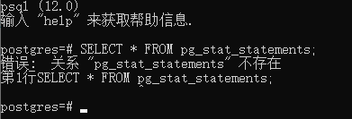
        * 实际应为：SELECT * FROM public.pg_stat_statements;
        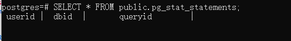
     * 查看search_path
        * SHOW search_path;
        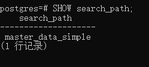
* 4.1 方法1：
```metricbeat.yml
- module: postgresql
  metricsets:
   - database
   - bgwriter
   - activity
   - statement
  period: 10s
  hosts: ["postgres://localhost:5432?sslmode=disable"]
  username: postgres
  # password: 1234
```
* 添加search_path配置
```metricbeat.yml
- module: postgresql
  metricsets:
   - database
   - bgwriter
   - activity
   - statement
  period: 10s
  hosts: ["postgres://localhost:5432?sslmode=disable&search_path=public"]
  username: postgres
  # password: 1234
```
* 4.2 方法2：
    * 设置search_path
    * SET search_path TO postgres, public;
        * The first element specifies that a schema with the same name as the current user is to be searched. 
            * If no such schema exists, the entry is ignored. 
        * The second element refers to the public schema that we have seen already.


### 问题：QueryStats: failed to query database: pq: pg_stat_statements must be loaded via shared_preload_libraries
* 背景：使用metricbeat收集postgresql的statement指标时，收集到的指标报错
* [参考链接](https://dba.stackexchange.com/questions/124054/pg-stat-statements-not-found-even-with-shared-preload-libraries-pg-stat-stat)
* 解决：新增配置
    * 查看配置文件所在位置，连接数据库后执行命令：
        * SHOW config_file
```postgresql.conf
shared_preload_libraries = 'pg_stat_statements'
```

## <h2 style="text-align: center;"> ------------------**RUBY**------------------ </h2>

### 问题：RuboCop: Carriage return character missing. [Layout/EndOfLine]
* 背景：win10下ruby文件提示语法警告
解决：
    * 方法1：
        * window下要选择文本格式为CRLF-window，Linux下选择LF-Unix，如：[ruby-01.jpg](../../my-ruby/ruby-01.jpg)
    * 方法2：E:\Ruby27-x64\lib\ruby\gems\2.7.0\gems\rubocop-0.83.0\config\default.yml文件修改如下配置
    ```
    Style/EndOfLine:
       # 注：Linux为lf，windows为crlf
       EnforcedStyle: lf
    ```
  * 文件末尾要空一行


### 问题：RuboCop: Missing frozen string literal comment. [Style/FrozenStringLiteralComment]
* 背景：win10下ruby文件提示语法警告
* 解决：文件添加内容行：# frozen_string_literal: true


### 问题：RuboCop: The name of this source file (`first-ruby.rb`) should use snake_case. [Naming/FileName]
* 背景：win10下ruby文件提示语法警告
* 解决：修改文件名：其中“-”修改为"_"


## <h2 style="text-align: center;"> ------------------**REDIS**------------------ </h2>

### 问题：Could not connect to Redis at 192.168.1.110:7000: Connection refused
* 背景：wsl2中使用shell脚本创建redis集群时报错
* 解决：使用wsl2自身的ip
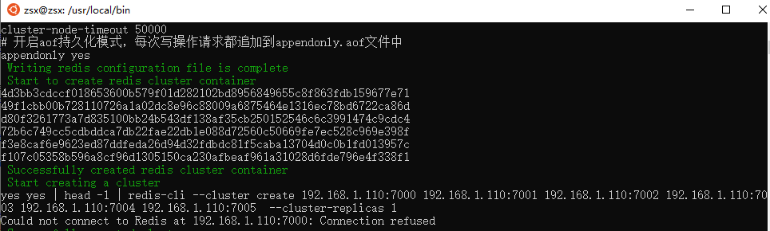


### 问题：(error) MOVED 8223 172.18.0.1:7001
* 背景：通过redis-cli -p 7002命令连接redis集群，设置值时报错
* 原因：连接命令缺少-c
* 解决：
    使用正确连接：redis-cli -c -p 7002
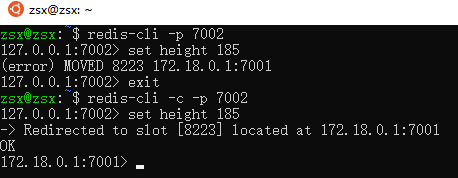


### 问题：Error response from daemon: OCI runtime create failed: container_linux.go
* 问题详情
```
docker: Error response from daemon: OCI runtime create failed: container_linux.go:349: starting container process caused "process_linux.go:449: container init caused \"write sysctl key net.core.somaxconn: open /proc/sys/net/core/somaxconn: no such file or directory\"": unknown.
```
* 背景：wsl2中使用命名空间隔离容器后，通过shell脚本创建redis集群时报错，容器创建成功，但是不能正常启动
* 解决：移除net.core.somaxconn的设置
```修改前
createRedisClusterContainer() {
  # 设置绿色字体echo -e "\033[32m 绿色字 \033[0m"
  echo -e "\033[32m Start to create redis cluster container \033[0m"
  # 注：此处redis.conf文件如果不存在，会默认创建名为redis.conf的文件夹
  for port in ${ports}; do
    docker run -d -it \
      -p "${port}":"${port}" \
      -p 1"${port}":1"${port}" \
      -v ${config_dir}/"${port}"/redis.conf:/usr/local/etc/redis/redis.conf \
      -v ${data_dir}/"${port}":/data \
      --name redis-"${port}" \
      --net ${net_name} \
      --sysctl net.core.somaxconn=1024 \
      redis:buster \
      redis-server /usr/local/etc/redis/redis.conf
  done
  echo -e "\033[32m Successfully created redis cluster container \033[0m"
}
```
```修改后
createRedisClusterContainer() {
  # 设置绿色字体echo -e "\033[32m 绿色字 \033[0m"
  echo -e "\033[32m Start to create redis cluster container \033[0m"
  # 注：此处redis.conf文件如果不存在，会默认创建名为redis.conf的文件夹
  for port in ${ports}; do
    docker run -d -it \
      -p "${port}":"${port}" \
      -p 1"${port}":1"${port}" \
      -v ${config_dir}/"${port}"/redis.conf:/usr/local/etc/redis/redis.conf \
      -v ${data_dir}/"${port}":/data \
      --name redis-"${port}" \
      --net ${net_name} \
      redis:buster \
      redis-server /usr/local/etc/redis/redis.conf
  done
  echo -e "\033[32m Successfully created redis cluster container \033[0m"
}
```


### 问题： Not all 16384 slots are covered by nodes
* 背景：创建redis集群，分配节点时报错


### 问题：Node zsx-2.local:7000 is not empty.
* 背景：创建redis集群，分配节点时报错
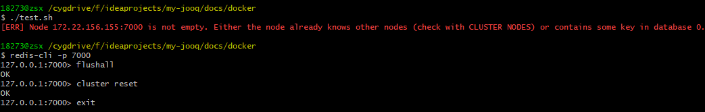
* 解决：
    * 1.redis-cli -p 7000
    * 2.flushall
    * 3.cluster reset
    * 4.exit


### 问题：OCI runtime exec failed: exec failed: container_linux.go:349: starting container process caused "exec: \"bash\": executable file not found in $PATH": unknown
* 背景：执行如下命令，进入容器内部报错
```
docker exec -it redis-container-id bash
```
* 原因：redis镜像是使用alpine制作
* 解决：修改命令
```
docker exec -it redis-container-id /bin/sh
```


## <h2 style="text-align: center;"> ------------------**SHELL**------------------ </h2>

### 问题：$'\r': 未找到命令
* 背景：win10下执行通过Cygwin64执行windows下编写的shell脚本
* 原因：window下的换行符多了‘\r’
* 解决：通过文本编辑工具Notepad++将文件格式转成Unix文件


## <h2 style="text-align: center;"> ------------------**SPRINGBOOT**------------------ </h2>

### 问题：Invocation of init method failed; nested exception is java.lang.NoSuchFieldError: IGNORE_DEPRECATIONS
* 背景：springboot集成es，启动时报错
* 详情
```console
Error starting ApplicationContext. To display the conditions report re-run your application with 'debug' enabled.
2020-06-30 09:06:56.009 ERROR 13148 --- [  restartedMain] o.s.boot.SpringApplication               : Application run failed

org.springframework.beans.factory.BeanCreationException: Error creating bean with name 'ESUtils': Invocation of init method failed; nested exception is java.lang.NoSuchFieldError: IGNORE_DEPRECATIONS
	at org.springframework.beans.factory.annotation.InitDestroyAnnotationBeanPostProcessor.postProcessBeforeInitialization(InitDestroyAnnotationBeanPostProcessor.java:160)
	at org.springframework.beans.factory.support.AbstractAutowireCapableBeanFactory.applyBeanPostProcessorsBeforeInitialization(AbstractAutowireCapableBeanFactory.java:416)
	at org.springframework.beans.factory.support.AbstractAutowireCapableBeanFactory.initializeBean(AbstractAutowireCapableBeanFactory.java:1788)
	at org.springframework.beans.factory.support.AbstractAutowireCapableBeanFactory.doCreateBean(AbstractAutowireCapableBeanFactory.java:595)
	at org.springframework.beans.factory.support.AbstractAutowireCapableBeanFactory.createBean(AbstractAutowireCapableBeanFactory.java:517)
	at org.springframework.beans.factory.support.AbstractBeanFactory.lambda$doGetBean$0(AbstractBeanFactory.java:323)
	at org.springframework.beans.factory.support.DefaultSingletonBeanRegistry.getSingleton(DefaultSingletonBeanRegistry.java:226)
	at org.springframework.beans.factory.support.AbstractBeanFactory.doGetBean(AbstractBeanFactory.java:321)
	at org.springframework.beans.factory.support.AbstractBeanFactory.getBean(AbstractBeanFactory.java:202)
	at org.springframework.beans.factory.support.DefaultListableBeanFactory.preInstantiateSingletons(DefaultListableBeanFactory.java:893)
	at org.springframework.context.support.AbstractApplicationContext.finishBeanFactoryInitialization(AbstractApplicationContext.java:879)
	at org.springframework.context.support.AbstractApplicationContext.refresh(AbstractApplicationContext.java:551)
	at org.springframework.boot.web.servlet.context.ServletWebServerApplicationContext.refresh(ServletWebServerApplicationContext.java:143)
	at org.springframework.boot.SpringApplication.refresh(SpringApplication.java:758)
	at org.springframework.boot.SpringApplication.refresh(SpringApplication.java:750)
	at org.springframework.boot.SpringApplication.refreshContext(SpringApplication.java:397)
	at org.springframework.boot.SpringApplication.run(SpringApplication.java:315)
	at org.springframework.boot.SpringApplication.run(SpringApplication.java:1237)
	at org.springframework.boot.SpringApplication.run(SpringApplication.java:1226)
	at com.zsx.MyJooqApplication.main(MyJooqApplication.java:10)
	at java.base/jdk.internal.reflect.NativeMethodAccessorImpl.invoke0(Native Method)
	at java.base/jdk.internal.reflect.NativeMethodAccessorImpl.invoke(NativeMethodAccessorImpl.java:62)
	at java.base/jdk.internal.reflect.DelegatingMethodAccessorImpl.invoke(DelegatingMethodAccessorImpl.java:43)
	at java.base/java.lang.reflect.Method.invoke(Method.java:564)
	at org.springframework.boot.devtools.restart.RestartLauncher.run(RestartLauncher.java:49)
Caused by: java.lang.NoSuchFieldError: IGNORE_DEPRECATIONS
	at org.elasticsearch.client.RestHighLevelClient.<clinit>(RestHighLevelClient.java:1911)
	at com.zsx.utils.ESUtils.init(ESUtils.java:36)
	at java.base/jdk.internal.reflect.NativeMethodAccessorImpl.invoke0(Native Method)
	at java.base/jdk.internal.reflect.NativeMethodAccessorImpl.invoke(NativeMethodAccessorImpl.java:62)
	at java.base/jdk.internal.reflect.DelegatingMethodAccessorImpl.invoke(DelegatingMethodAccessorImpl.java:43)
	at java.base/java.lang.reflect.Method.invoke(Method.java:564)
	at org.springframework.beans.factory.annotation.InitDestroyAnnotationBeanPostProcessor$LifecycleElement.invoke(InitDestroyAnnotationBeanPostProcessor.java:389)
	at org.springframework.beans.factory.annotation.InitDestroyAnnotationBeanPostProcessor$LifecycleMetadata.invokeInitMethods(InitDestroyAnnotationBeanPostProcessor.java:333)
	at org.springframework.beans.factory.annotation.InitDestroyAnnotationBeanPostProcessor.postProcessBeforeInitialization(InitDestroyAnnotationBeanPostProcessor.java:157)
	... 24 common frames omitted


Process finished with exit code 0

```
* [参考链接](https://stackoverflow.com/questions/62338588/spring-boot-with-elastic-search-causing-java-lang-nosuchfielderror-ignore-depre)
* 原因：缺少elasticsearch、elasticsearch-rest-client依赖，此处只引入了elasticsearch-rest-high-level-client依赖
```build.gradle
implementation group: 'org.elasticsearch.client', name: 'elasticsearch-rest-high-level-client', version: '7.8.0'
```
* 解决：引入依赖
```build.gradle
implementation group: 'org.elasticsearch.client', name: 'elasticsearch-rest-client', version: '7.8.0'
implementation group: 'org.elasticsearch', name: 'elasticsearch', version: '7.8.0'
```


## <h2 style="text-align: center;"> ------------------**WSL**------------------ </h2>

### 问题：can't connect to the agent: IPC connect call failed
* 解决：将wsl1转换为wsl2


### 问题：Cannot connect to the Docker daemon at unix:///var/run/docker.sock. Is the docker daemon running?
* 背景：通过sudo apt install docker.io后，执行docker命令报错
* 解决：
    * 如果已安装docker容器，直接启动：sudo service docker start
    * 如果想重新安装
        * 1.卸载docker，安装参考[教程](https://blog.csdn.net/zsx18273117003/article/details/90707444)
        * 2.启动docker服务：sudo service docker start
```快速安装
sudo curl -fsSL https://get.docker.com -o get-docker.sh
sudo sh get-docker.sh
sudo service docker start
```

### 问题：problem running iptables
* 详情：
```
ERROR: problem running iptables: iptables v1.8.4 (legacy): can't initialize iptables table `filter': Table does not exist (do you need to insmod?)
Perhaps iptables or your kernel needs to be upgraded
```
* 背景：背景：win10下，ubuntu子系统查看防火墙状态报错
    * 命令：sudo ufw status
* 原因：ufw仅适用于具有Linux内核的系统


### 问题：sshd: no hostkeys available -- exiting.
* 背景：win10下，ubuntu子系统启动ssh服务报错
    * 命令：sudo service ssh start
* 解决：
    * 重新配制openssh-server软件包：sudo dpkg-reconfigure openssh-server


### 问题：System has not been booted with systemd as init system (PID 1). Can't operate. Failed to connect to bus: Host is down
* 背景：wsl2下ubuntu执行命令sudo systemctl restart docker报错
* 原因：到目前为止，在WSL 2中我们没有systemd
* 解决：使用命令sudo /etc/init.d/docker start | sudo /etc/init.d/docker restart | sudo service docker restart


### 问题：WSL 2 需要更新其内核组件
* 解决：下载更新程序并安装，进行更新
    * [下载地址](https://wslstorestorage.blob.core.windows.net/wslblob/wsl_update_x64.msi)


## <h2 style="text-align: center;"> ------------------**ZOOKEEPER**------------------ </h2>

### 问题：The Docker Engine you're using is running in swarm mode
* 背景：启动zookeeper集群时提示警告
* 解决，执行命令：docker swarm leave --force