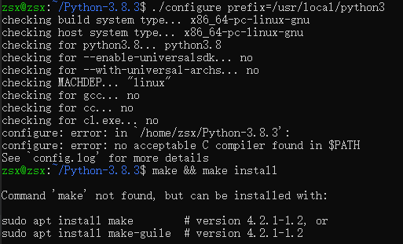

## Python编写RestApi

### 1.升级pip
* python3 -m pip install --upgrade pip

### 2.安装flask
* pip3 install flask

### 3.编写脚本
* [hello_world_page](../../my-python/helloworld_page.py)

### 4.查看请求
* 打开浏览器：http://127.0.0.1:5000/

### 5.简单RestApi编写
* [rest_api](../../my-python/rest_api.py)

### curl转python
* [curl转python在线工具](https://curl.trillworks.com/)

## 命令

### 安装redis
* pip3 install redis

### ubuntu安装python3
* 1.下载
    * wget https://www.python.org/ftp/python/3.8.3/Python-3.8.3.tar.xz
* 2.解压
    * 先解压成tar包：
        * xz -d Python-3.8.3.tar.xz
    * 再解压tar包：
        * tar xvf Python-3.8.3.tar
* 3.切换目录
    * cd Python-3.8.3
* 4.编译与安装（如果此步骤出现错误，那么执行5后再进行安装）
    * 复杂安装：
        * ./configure --prefix=/usr/local/python3.8 --enable-optimizations
            * --enable-optimizations选项通过运行多个测试来优化Python二进制文件，这会使构建过程变慢
        * sudo make -j 8 && sudo make install
            * 为了加快构建时间，请修改-j以使其对应于处理器中的内核数，你可以通过键入nproc查找编号
    * 简化安装：
        * ./configure --prefix=/usr/local/python3.8
        * sudo make && sudo make install
* 5.安装依赖（如果4安装成功，此步骤可跳过）

    * sudo apt-get update
    * sudo apt-get upgrade
    * sudo apt-get dist-upgrade
    * sudo apt install libbz2-dev libncurses5-dev libgdbm-dev libgdbm-compat-dev liblzma-dev libsqlite3-dev libssl-dev openssl tk-dev uuid-dev libreadline-dev
* 6.查看版本
    * python3.8 --version

