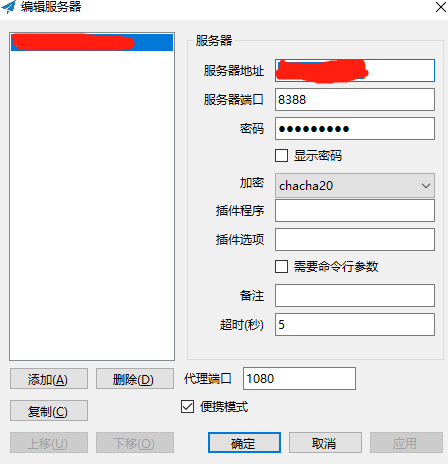
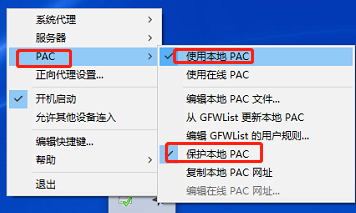
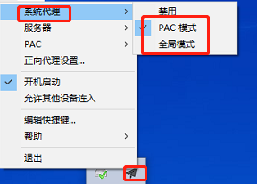
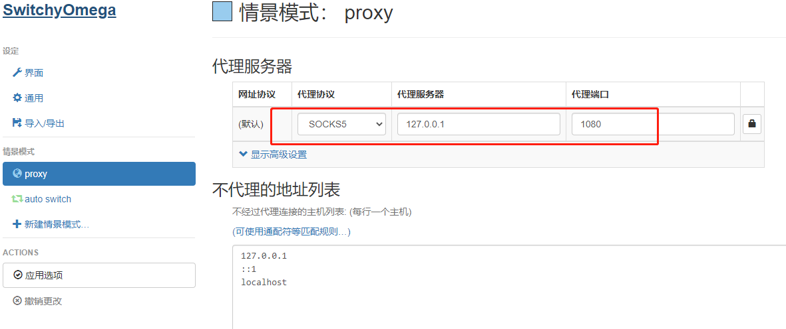
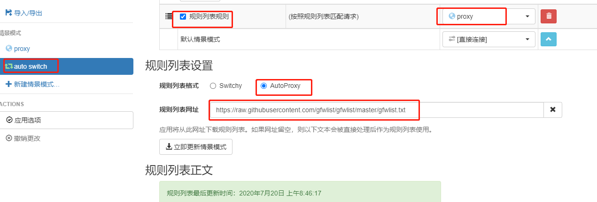

### 服务器配置
* docker pull shadowsocks/shadowsocks-libev
* docker run -e PASSWORD=<password> -p<server-port>:8388 -p<server-port>:8388/udp -d shadowsocks/shadowsocks-libev
    * docker run -e PASSWORD=123456 -e METHOD=chacha20 -p 8388:8388 -p 8388:8388/udp --name shadowsocks --restart always -d shadowsocks/shadowsocks-libev
```shadowsocks.yml
version: '3'

services:
  shadowsocks:
    image: shadowsocks/shadowsocks-libev
    container_name: shadowsocks
    restart: always
    environment:
      PASSWORD: 123456
      METHOD: chacha20
      SERVER_PORT: 8388
    ports:
      - 8388:8388
```

### 客户端设置
* 
* 
* 

### 浏览器配置
* 插件配置
    * Proxy SwitchyOmega
    * 
    * 
    * [gfwlist](https://raw.githubusercontent.com/gfwlist/gfwlist/master/gfwlist.txt)


### 服务地址
* [vultr](https://my.vultr.com/)
* [deploy](https://my.vultr.com/deploy/)


