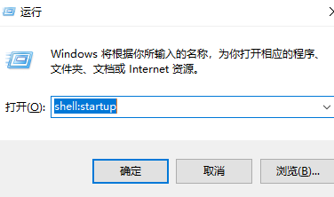
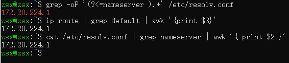

## 开机启动设置

### window下操作
* 1.通过WIN+R执行命令：
    * shell:startup

* 2.将[linux-start.vbs](../shell/wsl2/startup/linux-start.vbs)文件复制粘贴到启动目录

### ubuntu下操作
* 3.在etc目录下新建文件init.wsl，内容如[init.wsl](../shell/wsl2/startup/init.wsl)

### 获取wsl2的ip，三选一
* grep -oP '(?<=nameserver ).+' /etc/resolv.conf
* ip route | grep default | awk '{print $3}'
* cat /etc/resolv.conf | grep nameserver | awk '{ print $2 }'

## 相关命令
### 关闭wsl2|退出wsl2
* wsl --shutdown

## 参考链接

### wsl2访问
* [windows10(2004)主机访问wsl2](https://my.oschina.net/u/2473610/blog/4308035)
* [WSL2网络访问问题](https://lengthmin.me/posts/wsl2-network-tricks/)

### netstat参数
* [netstat参数](https://9oelm.github.io/2018-05-06--Listening,-Established,-Close_wait-and-Time_wait-in-netstat/)

### 重启wsl2
* [重启wsl2](https://www.hdboy.top/show/35)