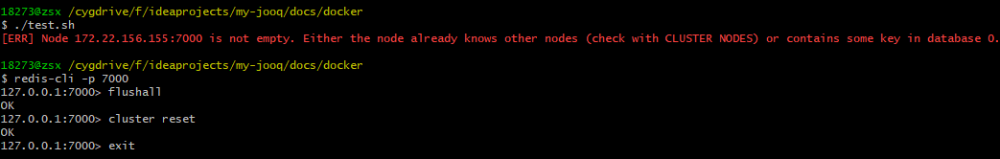

## 问题
### 问题1：OCI runtime exec failed: exec failed: container_linux.go:349: starting container process caused "exec: \"bash\": executable file not found in $PATH": unknown
* 背景：执行如下命令，进入容器内部报错
```
docker exec -it redis-container-id bash
```
* 原因：redis镜像是使用alpine制作
* 解决：修改命令
```
docker exec -it redis-container-id /bin/sh
```

### 问题2：Node zsx-2.local:7000 is not empty.
* 背景：创建redis集群，分配节点时报错

* 解决：
    * 1.redis-cli -p 7000
    * 2.flushall
    * 3.cluster reset
    * 4.exit

### 问题3： Not all 16384 slots are covered by nodes
* 背景：创建redis集群，分配节点时报错


## 命令

### windows、ubuntu下连接redis单机
* docker exec -it redis-7000 redis-cli -h 127.0.0.1 -p 7000

### cygwin下连接redis单机
* npm install -g redis-cli
* rdcli -h 127.0.0.1 -p 7000

### ubuntu下连接redis单机
* sudo apt install redis-tools
* redis-cli -h 127.0.0.1 -p 7000

### 创建集群，分配主从节点（容器已经创建的前提下）
* 1.如果不能执行redis-cli命令，需要进入容器内部
    * docker exec -it redis-7000 bash 
* 2.集群创建
    * redis-cli --cluster create 127.0.0.1:7000 127.0.0.1:7001 127.0.0.1:7002 127.0.0.1:7003 127.0.0.1:7004 127.0.0.1:7005 --cluster-replicas 1

### 查看主从信息
* redis-cli -c -p 7000
* info replication


## 参考链接

### 指标
* [redis监控指标](http://liangjf.top/2020/03/30/118.redis%E7%9B%91%E6%8E%A7%E6%8C%87%E6%A0%87/)
* [Redis监控](https://mp.weixin.qq.com/s?__biz=MzI4NTA1MDEwNg==&mid=2650788187&idx=1&sn=9363cc47966b4464e82f84904ac0b4b8&chksm=f3f964cec48eedd840c922263bfe39f31a8223d530cfac3a6bebd8b7bb0c0569712f087a65eb&scene=27#wechat_redirect)
* [如何监控Redis性能指标](https://www.datadoghq.com/blog/how-to-monitor-redis-performance-metrics/)
* [redis监控指标](https://www.jianshu.com/p/68485d5c7fb9)
* [Redis性能指标详解与监控](https://blog.csdn.net/z644041867/article/details/77965521)
* [metricbeat-module-redis](https://www.elastic.co/guide/en/beats/metricbeat/current/metricbeat-module-redis.html)

### 性能
* [Redis性能问题排查](https://www.cnblogs.com/mushroom/p/4738170.html)

### redis module
* [redis module](https://www.elastic.co/guide/en/beats/filebeat/current/filebeat-module-redis.html)