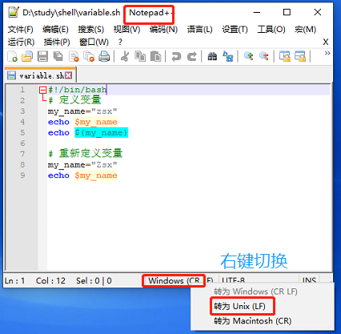

### 问题
#### 问题1：$'\r': 未找到命令
* 背景：win10下执行通过Cygwin64执行windows下编写的shell脚本
* 原因：window下的换行符多了‘\r’
* 解决：通过文本编辑工具Notepad++将文件格式转成Unix文件

## 命令

### cut [选项] 文件
* -f 列号        （ --field 提取第几列 ）
* -d 分隔符    （ --delimiter 按照指定分隔符分割列，默认的字段分隔符为"TAB"；）

## 查看shell版本
* bash --version